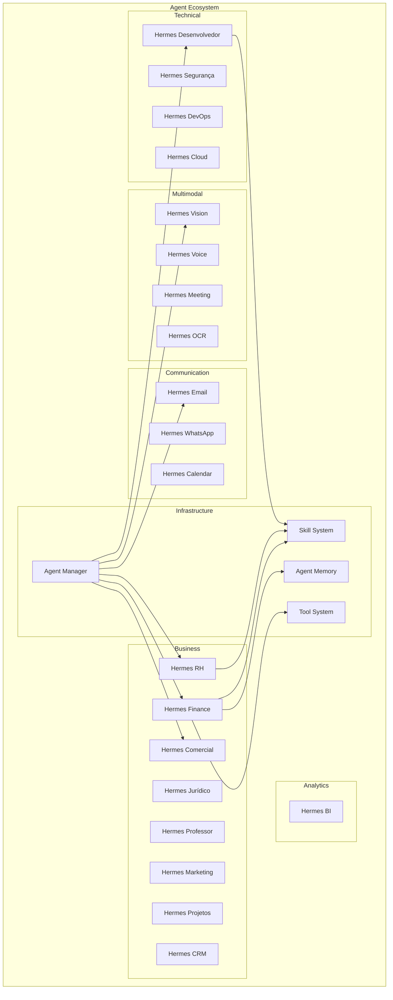
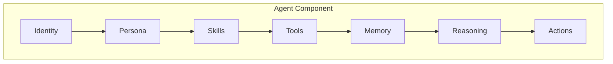
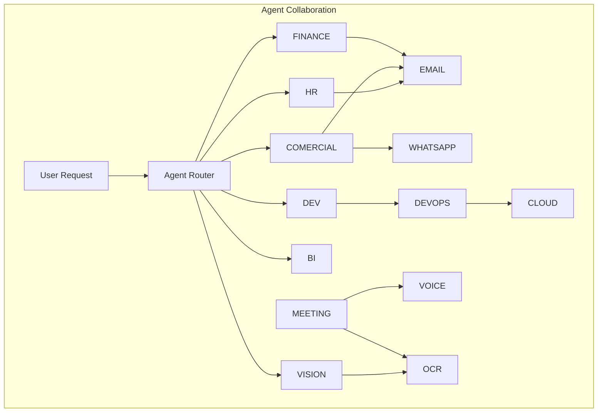

# JARBAS 2.0 - Master Agents

**Documento Oficial de Agentes do Jarbas 2.0**
**Versão:** 1.0
**Data:** 12 de Julho de 2026
**Status:** VIGENTE

---

## Índice

1. [Visão Geral](#1-visão-geral)
2. [Arquitetura de Agentes](#2-arquitetura-de-agentes)
3. [Hermes Finance](#3-hermes-finance)
4. [Hermes RH](#4-hermes-rh)
5. [Hermes Comercial](#5-hermes-comercial)
6. [Hermes Jurídico](#6-hermes-jurídico)
7. [Hermes Professor](#7-hermes-professor)
8. [Hermes Segurança](#8-hermes-segurança)
9. [Hermes Desenvolvedor](#9-hermes-desenvolvedor)
10. [Hermes Marketing](#10-hermes-marketing)
11. [Hermes Projetos](#11-hermes-projetos)
12. [Hermes CRM](#12-hermes-crm)
13. [Hermes BI](#13-hermes-bi)
14. [Hermes Vision](#14-hermes-vision)
15. [Hermes Voice](#15-hermes-voice)
16. [Hermes Meeting](#16-hermes-meeting)
17. [Hermes Email](#17-hermes-email)
18. [Hermes WhatsApp](#18-hermes-whatsapp)
19. [Hermes Calendar](#19-hermes-calendar)
20. [Hermes OCR](#20-hermes-ocr)
21. [Hermes DevOps](#21-hermes-devops)
22. [Hermes Cloud](#22-hermes-cloud)
23. [Matriz de Agentes](#23-matriz-de-agentes)

---

## 1. Visão Geral

### 1.1 Definição

Agentes são entidades autônomas especializadas que executam tarefas específicas usando ferramentas, conhecimento e raciocínio para atingir objetivos definidos.

### 1.2 Princípios

| # | Princípio | Descrição |
|---|-----------|-----------|
| 1 | **Autonomia** | Agentes executam sem supervisão constante |
| 2 | **Especialização** | Cada agente é expert em seu domínio |
| 3 | **Colaboração** | Agentes podem trabalhar juntos |
| 4 | **Segurança** | Permissões granulares por agente |
| 5 | **Auditoria** | Todas as ações são logadas |
| 6 | **Evolutive** | Agentes aprendem e melhoram |

### 1.3 Arquitetura Geral

---

## 2. Arquitetura de Agentes

### 2.1 Componentes

### 2.2 Permission Matrix Global

| Permissão | Descrição | Agentes |
|-----------|-----------|---------|
| `read:own_data` | Ler dados próprios | Todos |
| `write:own_data` | Escrever dados próprios | Todos |
| `read:team_data` | Ler dados do time | Colaboração |
| `execute:code` | Executar código | Dev, DevOps |
| `send:email` | Enviar email | Email, Comercial |
| `send:whatsapp` | Enviar WhatsApp | WhatsApp |
| `create:calendar` | Criar eventos | Calendar |
| `modify:system` | Modificar sistema | DevOps, Cloud |
| `view:security` | Ver logs de segurança | Segurança |

---

## 3. Hermes Finance

| Campo | Valor |
|-------|-------|
| **ID** | `hermes-finance` |
| **Categoria** | Business |
| **Objetivo** | Assistente financeiro para análise de dados, orçamentos, previsões e conformidade fiscal |

### Responsabilidades

| # | Responsabilidade | Prioridade |
|---|------------------|------------|
| R1 | Análise de demonstrações financeiras | Alta |
| R2 | Criação de orçamentos | Alta |
| R3 | Previsão de fluxo de caixa | Alta |
| R4 | Relatórios financeiros | Alta |
| R5 | Análise de custos | Média |
| R6 | Conformidade fiscal | Média |

### Entradas / Saídas

| Entrada | Formato | Saída | Formato |
|---------|---------|-------|---------|
| Dados contábeis | JSON/CSV | Relatórios | PDF/Markdown |
| Pedidos de análise | Texto | Previsões | JSON |
| Documentos | PDF/Imagem | Alertas | Notificação |
| Metas | JSON | Dashboards | Visual |

### Ferramentas

| Ferramenta | Uso |
|------------|-----|
| `calculate` | Fórmulas, projeções |
| `chart_generator` | Dashboards |
| `spreadsheet` | Análise de dados |
| `api_fiscal` | Conformidade fiscal |
| `export_pdf` | Relatórios formais |
| `database_query` | Dados financeiros |

### Eventos

| Evento | Tipo |
|--------|------|
| `finance:report:generated` | Output |
| `finance:alert:anomaly` | Alert |
| `finance:forecast:updated` | Output |
| `finance:budget:exceeded` | Alert |

### Integrações

| Integração | Status |
|------------|--------|
| PostgreSQL | ✅ |
| Planilhas CSV/Excel | ✅ |
| APIs Fiscais | ⚠️ |
| ERP Systems | ⚠️ |
| Banking APIs | ⚠️ |

### Dependências

@jarbas/agent-manager, @jarbas/skill-manager, @jarbas/ai-registry, @jarbas/memory-manager, @jarbas/prompt-engine, PostgreSQL

### Permissões

| Recurso | Leitura | Escrita | Execução |
|---------|---------|---------|----------|
| Dados financeiros próprios | ✅ | ✅ | ❌ |
| Dados do time | ✅ | ❌ | ❌ |
| Relatórios | ✅ | ✅ | ❌ |
| Orçamentos | ✅ | ✅ | ❌ |
| Exportações | ❌ | ✅ | ✅ |

---

## 4. Hermes RH

| Campo | Valor |
|-------|-------|
| **ID** | `hermes-rh` |
| **Categoria** | Business |
| **Objetivo** | Gestão de pessoas, recrutamento, desenvolvimento, folha de pagamento e clima organizacional |

### Responsabilidades

| # | Responsabilidade | Prioridade |
|---|------------------|------------|
| R1 | Recrutamento e seleção | Alta |
| R2 | Onboarding de funcionários | Alta |
| R3 | Gestão de desenvolvimento | Alta |
| R4 | Cálculos de folha de pagamento | Média |
| R5 | Análise de clima organizacional | Média |
| R6 | Compliance trabalhista | Alta |

### Entradas / Saídas

| Entrada | Formato | Saída | Formato |
|---------|---------|-------|---------|
| Currículos | PDF/DOC | Análises de candidatos | Texto |
| Pedidos | Texto | Planos de Development | PDF |
| Dados de funcionários | JSON | Relatórios de RH | PDF |
| Avaliações | JSON | Comunicados | Texto |

### Ferramentas

| Ferramenta | Uso |
|------------|-----|
| `resume_parser` | Análise de candidatos |
| `skills_matcher` | Seleção |
| `training_generator` | Development |
| `survey_analyzer` | Clima organizacional |
| `compliance_checker` | Legal |
| `report_builder` | Gestão |

### Eventos

| Evento | Tipo |
|--------|------|
| `hr:candidate:selected` | Output |
| `hr:training:created` | Output |
| `hr:alert:turnover` | Alert |
| `hr:compliance:issue` | Alert |

### Integrações

| Integração | Status |
|------------|--------|
| ATS | ⚠️ |
| LMS | ⚠️ |
| Folha de pagamento | ⚠️ |
| LinkedIn | ⚠️ |
| PostgreSQL | ✅ |

### Dependências

@jarbas/agent-manager, @jarbas/skill-manager, @jarbas/ai-registry, PostgreSQL

### Permissões

| Recurso | Leitura | Escrita | Execução |
|---------|---------|---------|----------|
| Dados de funcionários | ✅ | ✅ | ❌ |
| Currículos | ✅ | ✅ | ❌ |
| Avaliações | ✅ | ✅ | ❌ |
| Comunicados | ❌ | ✅ | ✅ |

---

## 5. Hermes Comercial

| Campo | Valor |
|-------|-------|
| **ID** | `hermes-comercial` |
| **Categoria** | Business |
| **Objetivo** | Gestão de vendas, pipeline de negócios, propostas e relacionamento com clientes |

### Responsabilidades

| # | Responsabilidade | Prioridade |
|---|------------------|------------|
| R1 | Gestão do pipeline de vendas | Alta |
| R2 | Criação de propostas comerciais | Alta |
| R3 | Análise de oportunidades | Alta |
| R4 | Follow-up automatizado | Média |
| R5 | Previsão de vendas | Média |
| R6 | Contratos e fechamento | Alta |

### Entradas / Saídas

| Entrada | Formato | Saída | Formato |
|---------|---------|-------|---------|
| Dados de clientes | JSON | Propostas | PDF |
| Pedidos | Texto | Análises | Texto |
| Propostas | PDF/DOC | Previsões | JSON |
| Metas | JSON | Contratos | DOC |

### Ferramentas

| Ferramenta | Uso |
|------------|-----|
| `proposal_generator` | Propostas |
| `deal_analyzer` | Pipeline |
| `forecast_engine` | Previsão |
| `email_sender` | Follow-up |
| `contract_generator` | Fechamento |
| `crm_integration` | Dados CRM |

### Eventos

| Evento | Tipo |
|--------|------|
| `sales:deal:created` | Input |
| `sales:proposal:sent` | Output |
| `sales:deal:won` | Output |
| `sales:deal:lost` | Output |
| `sales:alert:stalled` | Alert |

### Integrações

| Integração | Status |
|------------|--------|
| CRM (Salesforce/HubSpot) | ⚠️ |
| Email SMTP | ✅ |
| Assinatura Eletrônica | ⚠️ |
| PostgreSQL | ✅ |

### Dependências

@jarbas/agent-manager, @jarbas/skill-manager, @jarbas/ai-registry, Hermes Email (opcional), PostgreSQL

### Permissões

| Recurso | Leitura | Escrita | Execução |
|---------|---------|---------|----------|
| Dados de clientes | ✅ | ✅ | ❌ |
| Pipeline | ✅ | ✅ | ❌ |
| Propostas | ✅ | ✅ | ✅ |
| Envio de emails | ❌ | ✅ | ✅ |

---

## 6. Hermes Jurídico

| Campo | Valor |
|-------|-------|
| **ID** | `hermes-juridico` |
| **Categoria** | Business |
| **Objetivo** | Análise de contratos, conformidade legal, gestão de processos e assessoria jurídica |

### Responsabilidades

| # | Responsabilidade | Prioridade |
|---|------------------|------------|
| R1 | Análise de contratos | Alta |
| R2 | Verificação de conformidade | Alta |
| R3 | Gestão de processos | Média |
| R4 | Pesquisa jurídica | Média |
| R5 | Gestão de prazos | Alta |
| R6 | Risk assessment legal | Alta |

### Entradas / Saídas

| Entrada | Formato | Saída | Formato |
|---------|---------|-------|---------|
| Contratos | PDF/DOC | Análises de contratos | Markdown |
| Perguntas jurídicas | Texto | Pareceres | PDF |
| Processos | JSON | Alertas de prazo | Notificação |
| Regulamentações | Texto | Templates | DOC |

### Ferramentas

| Ferramenta | Uso |
|------------|-----|
| `contract_analyzer` | Cláusulas, riscos |
| `legal_research` | Jurisprudência |
| `compliance_checker` | Regulamentações |
| `document_generator` | Contratos, pareceres |
| `deadline_tracker` | Prazos |
| `risk_assessor` | Riscos legais |

### Eventos

| Evento | Tipo |
|--------|------|
| `legal:contract:analyzed` | Output |
| `legal:compliance:alert` | Alert |
| `legal:deadline:approaching` | Alert |
| `legal:opinion:generated` | Output |

### Integrações

| Integração | Status |
|------------|--------|
| PJe | ⚠️ |
| BD Jurídico | ⚠️ |
| Calendar | ✅ |
| PostgreSQL | ✅ |

### Dependências

@jarbas/agent-manager, @jarbas/skill-manager, @jarbas/ai-registry, @jarbas/memory-manager, PostgreSQL

### Permissões

| Recurso | Leitura | Escrita | Execução |
|---------|---------|---------|----------|
| Contratos | ✅ | ✅ | ❌ |
| Processos | ✅ | ✅ | ❌ |
| Pareceres | ✅ | ✅ | ✅ |
| Dados sensíveis | ✅ | ❌ | ❌ |

---

## 7. Hermes Professor

| Campo | Valor |
|-------|-------|
| **ID** | `hermes-professor` |
| **Categoria** | Education |
| **Objetivo** | Criação de conteúdo educacional, tutoria, avaliação e gestão de aprendizado |

### Responsabilidades

| # | Responsabilidade | Prioridade |
|---|------------------|------------|
| R1 | Criação de conteúdo educacional | Alta |
| R2 | Tutoria e mentoring | Alta |
| R3 | Avaliação e feedback | Alta |
| R4 | Criação de exercícios | Média |
| R5 | Adaptação de ritmo | Média |
| R6 | Análise de progresso | Média |

### Entradas / Saídas

| Entrada | Formato | Saída | Formato |
|---------|---------|-------|---------|
| Perguntas de alunos | Texto | Explicações | Markdown |
| Material didático | PDF/DOC | Exercícios | JSON/PDF |
| Notas | JSON | Avaliações | JSON |
| Objetivos | JSON | Trilhas | Visual |

### Ferramentas

| Ferramenta | Uso |
|------------|-----|
| `content_generator` | Aulas, material |
| `quiz_maker` | Avaliação |
| `progress_tracker` | Analytics |
| `explanation_engine` | Tutoria |
| `visual_generator` | Diagramas |
| `assessment_tool` | Notas |

### Eventos

| Evento | Tipo |
|--------|------|
| `edu:content:created` | Output |
| `edu:quiz:generated` | Output |
| `edu:student:struggling` | Alert |
| `edu:progress:milestone` | Output |

### Integrações

| Integração | Status |
|------------|--------|
| LMS (Moodle/Canvas) | ⚠️ |
| Google Classroom | ⚠️ |
| PostgreSQL | ✅ |

### Dependências

@jarbas/agent-manager, @jarbas/skill-manager, @jarbas/ai-registry, @jarbas/memory-manager, PostgreSQL

### Permissões

| Recurso | Leitura | Escrita | Execução |
|---------|---------|---------|----------|
| Material didático | ✅ | ✅ | ❌ |
| Dados de alunos | ✅ | ✅ | ❌ |
| Avaliações | ✅ | ✅ | ❌ |
| Notificações | ❌ | ✅ | ✅ |

---

## 8. Hermes Segurança

| Campo | Valor |
|-------|-------|
| **ID** | `hermes-seguranca` |
| **Categoria** | Security |
| **Objetivo** | Monitoramento, detecção de ameaças, resposta a incidentes e conformidade |

### Responsabilidades

| # | Responsabilidade | Prioridade |
|---|------------------|------------|
| R1 | Monitoramento de segurança | Crítica |
| R2 | Detecção de ameaças | Crítica |
| R3 | Resposta a incidentes | Crítica |
| R4 | Análise de vulnerabilidades | Alta |
| R5 | Auditoria de segurança | Alta |
| R6 | Conformidade (OWASP, NIST) | Alta |

### Entradas / Saídas

| Entrada | Formato | Saída | Formato |
|---------|---------|-------|---------|
| Logs de sistema | Texto | Alertas de segurança | Notificação |
| Alertas | JSON | Relatórios | PDF |
| Solicitações | Texto | Recomendações | Texto |
| Scans | JSON | Dashboards | Visual |

### Ferramentas

| Ferramenta | Uso |
|------------|-----|
| `log_analyzer` | Detecção |
| `vulnerability_scanner` | Prevenção |
| `threat_detector` | Monitoramento |
| `incident_responder` | Containment |
| `compliance_checker` | Auditoria |
| `access_auditor` | RBAC |

### Eventos

| Evento | Tipo |
|--------|------|
| `security:threat:detected` | Alert |
| `security:incident:created` | Alert |
| `security:scan:completed` | Output |
| `security:access:denied` | Alert |

### Integrações

| Integração | Status |
|------------|--------|
| SIEM | ⚠️ |
| Vulnerability Scanner | ⚠️ |
| Firewall | ⚠️ |
| IDS/IPS | ⚠️ |
| PostgreSQL | ✅ |

### Dependências

@jarbas/agent-manager, @jarbas/skill-manager, @jarbas/ai-registry, @jarbas/memory-manager, PostgreSQL, Redis

### Permissões

| Recurso | Leitura | Escrita | Execução |
|---------|---------|---------|----------|
| Logs de segurança | ✅ | ❌ | ❌ |
| Configurações | ✅ | ✅ | ❌ |
| Executar scans | ❌ | ❌ | ✅ |
| Bloquear acessos | ❌ | ✅ | ✅ |

---

## 9. Hermes Desenvolvedor

| Campo | Valor |
|-------|-------|
| **ID** | `hermes-desenvolvedor` |
| **Categoria** | Technical |
| **Objetivo** | Coding, code review, debugging, documentação e arquitetura de software |

### Responsabilidades

| # | Responsabilidade | Prioridade |
|---|------------------|------------|
| R1 | Geração de código | Crítica |
| R2 | Code review | Alta |
| R3 | Debugging | Alta |
| R4 | Documentação | Média |
| R5 | Arquitetura | Alta |
| R6 | Testes | Média |

### Entradas / Saídas

| Entrada | Formato | Saída | Formato |
|---------|---------|-------|---------|
| Requisitos | Texto | Código | Code |
| Código | Code | Reviews | Markdown |
| Erros | Texto/Log | Soluções | Texto |
| Perguntas técnicas | Texto | Documentação | Markdown |

### Ferramentas

| Ferramenta | Uso |
|------------|-----|
| `code_generator` | Implementação |
| `code_reviewer` | Quality |
| `debugger` | Bug fixing |
| `test_generator` | Testing |
| `doc_generator` | Documentação |
| `refactoring_engine` | Melhoria |
| `dependency_analyzer` | Arquitetura |

### Eventos

| Evento | Tipo |
|--------|------|
| `dev:code:generated` | Output |
| `dev:review:completed` | Output |
| `dev:bug:fixed` | Output |
| `dev:security:issue` | Alert |
| `dev:test:failed` | Alert |

### Integrações

| Integração | Status |
|------------|--------|
| GitHub/GitLab | ✅ |
| CI/CD | ✅ |
| Docker | ✅ |
| IDE | ⚠️ |
| PostgreSQL | ✅ |

### Dependências

@jarbas/agent-manager, @jarbas/skill-manager, @jarbas/ai-registry, @jarbas/memory-manager, Git, Docker (opcional)

### Permissões

| Recurso | Leitura | Escrita | Execução |
|---------|---------|---------|----------|
| Código fonte | ✅ | ✅ | ❌ |
| Repositórios | ✅ | ✅ | ❌ |
| CI/CD pipelines | ✅ | ✅ | ✅ |
| Containers | ✅ | ✅ | ✅ |
| Produção | ❌ | ❌ | ❌ |

---

## 10. Hermes Marketing

| Campo | Valor |
|-------|-------|
| **ID** | `hermes-marketing` |
| **Categoria** | Business |
| **Objetivo** | Criação de conteúdo, campanhas, análise de dados e estratégia de marketing |

### Responsabilidades

| # | Responsabilidade | Prioridade |
|---|------------------|------------|
| R1 | Criação de conteúdo | Alta |
| R2 | Gestão de campanhas | Alta |
| R3 | Análise de métricas | Alta |
| R4 | SEO/SEA | Média |
| R5 | Social media management | Média |
| R6 | Email marketing | Média |

### Entradas / Saídas

| Entrada | Formato | Saída | Formato |
|---------|---------|-------|---------|
| Briefings | Texto | Conteúdo | Texto/Imagem |
| Métricas | JSON | Campanhas | JSON |
| Concorrentes | Texto/URL | Análises | PDF |
| Objetivos | JSON | Calendários | JSON |

### Ferramentas

| Ferramenta | Uso |
|------------|-----|
| `content_writer` | Blog, posts |
| `seo_analyzer` | Otimização |
| `campaign_builder` | Campanhas |
| `social_scheduler` | Social media |
| `analytics_analyzer` | Métricas |
| `image_generator` | Visual content |

### Eventos

| Evento | Tipo |
|--------|------|
| `marketing:content:created` | Output |
| `marketing:campaign:launched` | Output |
| `marketing:alert:low_ctr` | Alert |
| `marketing:report:generated` | Output |

### Integrações

| Integração | Status |
|------------|--------|
| Google Analytics | ⚠️ |
| Meta Ads | ⚠️ |
| Google Ads | ⚠️ |
| Mailchimp | ⚠️ |
| PostgreSQL | ✅ |

### Dependências

@jarbas/agent-manager, @jarbas/skill-manager, @jarbas/ai-registry, Hermes Email (opcional), PostgreSQL

### Permissões

| Recurso | Leitura | Escrita | Execução |
|---------|---------|---------|----------|
| Conteúdo | ✅ | ✅ | ❌ |
| Campanhas | ✅ | ✅ | ✅ |
| Métricas | ✅ | ❌ | ❌ |
| Social media | ❌ | ✅ | ✅ |

---

## 11. Hermes Projetos

| Campo | Valor |
|-------|-------|
| **ID** | `hermes-projetos` |
| **Categoria** | Business |
| **Objetivo** | Planejamento, execução, monitoramento e relatórios de projetos |

### Responsabilidades

| # | Responsabilidade | Prioridade |
|---|------------------|------------|
| R1 | Planejamento de projetos | Alta |
| R2 | Criação de cronogramas | Alta |
| R3 | Acompanhamento de tarefas | Alta |
| R4 | Gestão de recursos | Média |
| R5 | Risco e mitigação | Média |
| R6 | Relatórios de status | Média |

### Entradas / Saídas

| Entrada | Formato | Saída | Formato |
|---------|---------|-------|---------|
| Requisitos | Texto | Cronograma | Gantt/JSON |
| Recursos | JSON | Status reports | PDF |
| Prazos | Date | Dashboards | Visual |
| Orçamento | JSON | Risk register | JSON |

### Ferramentas

| Ferramenta | Uso |
|------------|-----|
| `project_planner` | Cronogramas |
| `gantt_generator` | Visualização |
| `risk_analyzer` | Gestão de riscos |
| `resource_optimizer` | Alocação |
| `status_reporter` | Comunicação |
| `retrospective_engine` | Melhoria |

### Eventos

| Evento | Tipo |
|--------|------|
| `project:created` | Input |
| `project:milestone:reached` | Output |
| `project:risk:identified` | Alert |
| `project:delay:detected` | Alert |
| `project:completed` | Output |

### Integrações

| Integração | Status |
|------------|--------|
| Jira | ⚠️ |
| Asana | ⚠️ |
| Trello | ⚠️ |
| GitHub Issues | ✅ |
| Calendar | ✅ |
| PostgreSQL | ✅ |

### Dependências

@jarbas/agent-manager, @jarbas/skill-manager, @jarbas/ai-registry, PostgreSQL

### Permissões

| Recurso | Leitura | Escrita | Execução |
|---------|---------|---------|----------|
| Projetos | ✅ | ✅ | ❌ |
| Tarefas | ✅ | ✅ | ❌ |
| Recursos | ✅ | ✅ | ❌ |
| Relatórios | ✅ | ✅ | ✅ |

---

## 12. Hermes CRM

| Campo | Valor |
|-------|-------|
| **ID** | `hermes-crm` |
| **Categoria** | Business |
| **Objetivo** | Gestão de relacionamento, lead scoring, automação e customer success |

### Responsabilidades

| # | Responsabilidade | Prioridade |
|---|------------------|------------|
| R1 | Gestão de contatos | Alta |
| R2 | Lead scoring | Alta |
| R3 | Automação de follow-up | Alta |
| R4 | Análise de customer journey | Média |
| R5 | Gestão de tickets | Média |
| R6 | NPS e CSAT | Média |

### Entradas / Saídas

| Entrada | Formato | Saída | Formato |
|---------|---------|-------|---------|
| Dados de clientes | JSON | Segmentos | JSON |
| Interações | JSON | Scores | JSON |
| Feedback | Texto | Automações | JSON |
| Transações | JSON | Relatórios | PDF |

### Ferramentas

| Ferramenta | Uso |
|------------|-----|
| `lead_scorer` | Priorização |
| `segmentation_engine` | Segmentação |
| `automation_builder` | Workflows |
| `journey_mapper` | Customer journey |
| `nps_analyzer` | Satisfação |
| `ticket_manager` | Suporte |

### Eventos

| Evento | Tipo |
|--------|------|
| `crm:lead:created` | Input |
| `crm:lead:scored` | Output |
| `crm:ticket:created` | Input |
| `crm:ticket:resolved` | Output |
| `crm:churn:predicted` | Alert |

### Integrações

| Integração | Status |
|------------|--------|
| Salesforce | ⚠️ |
| HubSpot | ⚠️ |
| Intercom | ⚠️ |
| Zendesk | ⚠️ |
| PostgreSQL | ✅ |

### Dependências

@jarbas/agent-manager, @jarbas/skill-manager, @jarbas/ai-registry, @jarbas/memory-manager, PostgreSQL

### Permissões

| Recurso | Leitura | Escrita | Execução |
|---------|---------|---------|----------|
| Contatos | ✅ | ✅ | ❌ |
| Tickets | ✅ | ✅ | ❌ |
| Automações | ✅ | ✅ | ✅ |
| Envio de emails | ❌ | ✅ | ✅ |

---

## 13. Hermes BI

| Campo | Valor |
|-------|-------|
| **ID** | `hermes-bi` |
| **Categoria** | Analytics |
| **Objetivo** | Análise de dados, geração de insights, dashboards e relatórios executivos |

### Responsabilidades

| # | Responsabilidade | Prioridade |
|---|------------------|------------|
| R1 | Análise de dados | Crítica |
| R2 | Geração de insights | Alta |
| R3 | Criação de dashboards | Alta |
| R4 | Relatórios executivos | Alta |
| R5 | KPIs e métricas | Alta |
| R6 | Análise preditiva | Média |

### Entradas / Saídas

| Entrada | Formato | Saída | Formato |
|---------|---------|-------|---------|
| Dados brutos | CSV/JSON | Dashboards | Visual |
| Perguntas | Texto | Relatórios | PDF |
| Métricas | JSON | Insights | Texto |
| Datasources | DB/API | Previsões | JSON |

### Ferramentas

| Ferramenta | Uso |
|------------|-----|
| `sql_generator` | Queries |
| `chart_generator` | Visualização |
| `insight_detector` | Análise |
| `forecast_engine` | Predição |
| `dashboard_builder` | BI |
| `report_builder` | Reporting |

### Eventos

| Evento | Tipo |
|--------|------|
| `bi:insight:generated` | Output |
| `bi:dashboard:updated` | Output |
| `bi:alert:anomaly` | Alert |
| `bi:report:generated` | Output |

### Integrações

| Integração | Status |
|------------|--------|
| PostgreSQL | ✅ |
| Redis | ✅ |
| Metabase/Grafana | ⚠️ |
| Snowflake | ⚠️ |

### Dependências

@jarbas/agent-manager, @jarbas/skill-manager, @jarbas/ai-registry, PostgreSQL, Redis (opcional)

### Permissões

| Recurso | Leitura | Escrita | Execução |
|---------|---------|---------|----------|
| Dados de negócio | ✅ | ❌ | ❌ |
| Dashboards | ✅ | ✅ | ❌ |
| Relatórios | ✅ | ✅ | ✅ |
| Queries | ✅ | ✅ | ✅ |

---

## 14. Hermes Vision

| Campo | Valor |
|-------|-------|
| **ID** | `hermes-vision` |
| **Categoria** | Multimodal |
| **Objetivo** | Análise de imagens e vídeos, descrição, detecção de objetos e extração visual |
| **Status** | ✅ **SPRINT 08 COMPLETO** - 27 módulos, 191 testes, 0 erros TS |

### Responsabilidades

| # | Responsabilidade | Prioridade |
|---|------------------|------------|
| R1 | Análise de imagens | Alta |
| R2 | Descrição de conteúdo visual | Alta |
| R3 | Detecção de objetos | Média |
| R4 | OCR em imagens | Média |
| R5 | Análise de vídeos | Média |
| R6 | Geração de legendas | Média |

### Entradas / Saídas

| Entrada | Formato | Saída | Formato |
|---------|---------|-------|---------|
| Imagens | JPG/PNG/WebP | Descrições | Texto |
| Vídeos | MP4/MOV | Metadados | JSON |
| Perguntas | Texto | Legendas | Texto |
| ROI | Coordenadas | Classificações | JSON |

### Ferramentas

| Ferramenta | Uso |
|------------|-----|
| `image_analyzer` | Descrição |
| `object_detector` | Identificação |
| `ocr_engine` | Extração de texto |
| `video_processor` | Análise temporal |
| `image_comparator` | Similaridade |
| `caption_generator` | Descrição |

### Eventos

| Evento | Tipo |
|--------|------|
| `vision:image:analyzed` | Output |
| `vision:object:detected` | Output |
| `vision:video:processed` | Output |
| `vision:alert:content` | Alert |

### Integrações

| Integração | Status |
|------------|--------|
| GPT-4V | ✅ |
| Claude Vision | ✅ |
| Gemini Vision | ✅ |
| Storage (S3) | ⚠️ |
| PostgreSQL | ✅ |

### Dependências

@jarbas/agent-manager, @jarbas/ai-registry, PostgreSQL

### Permissões

| Recurso | Leitura | Escrita | Execução |
|---------|---------|---------|----------|
| Imagens | ✅ | ❌ | ❌ |
| Vídeos | ✅ | ❌ | ❌ |
| Resultados | ✅ | ✅ | ❌ |
| APIs externas | ❌ | ❌ | ✅ |

---

## 14.5 Business Suite

| Campo | Valor |
|-------|-------|
| **ID** | `business-suite` |
| **Categoria** | Business |
| **Objetivo** | Plataforma de negócios completa com CRM, ERP, financeiro, contabilidade, vendas, compras, estoque, RH, conformidade, BI, workflow, monitoramento |
| **Status** | ✅ **SPRINT 09 COMPLETO** - 32 módulos, 238 testes, 0 erros TS |

### Módulos

| Módulo | Responsabilidade |
|--------|-----------------|
| CompanyManager | Gestão de empresa, subsidiaries, departamentos |
| CRM | Contatos, leads, oportunidades, pipeline |
| ERP | Produtos, categorias, fornecedores |
| Finance | Orçamentos, transações, metas |
| Accounting | Lançamentos contábeis, relatórios |
| Treasury | Contas bancárias, transferências |
| Sales | Pedidos, pipeline, previsões |
| Purchasing | Ordens de compra, aprovações |
| Inventory | Estoque, movimentações |
| Logistics | Entregas, rastreamento, rotas |
| HR | Funcionários, avaliações, benefícios |
| Payroll | Folha de pagamento, impostos |
| Legal | Casos jurídicos, documentos |
| Contracts | Contratos, cláusulas, renovações |
| Compliance | Políticas, verificações, auditorias |
| Marketing | Campanhas, leads, métricas |
| CustomerSuccess | Contas, health scores, churn |
| ServiceDesk | Tickets, SLAs, resoluções |
| Projects | Projetos, tarefas, milestones |
| Kanban | Quadros, colunas, cartões |
| BI | Datasets, métricas, dashboards |
| Forecasting | Previsões de vendas, receita |
| Analytics | Eventos, sessões, funis, cohortes |
| WorkflowEngine | Workflows, execuções, transições |
| ApprovalEngine | Políticas, aprovações, thresholds |
| NotificationCenter | Notificações, templates, agendamento |
| DocumentManager | Documentos, versões, folders |
| ReportGenerator | Relatórios, templates, snapshots |
| Integrations | Integrações, credenciais, syncs |
| BusinessAPI | REST API |
| Monitoring | Health checks, métricas, alertas |
| BusinessSuite | Orquestrador dos 31 módulos |

### Integrações

| Integração | Status |
|------------|--------|
| Hermes Core | ✅ |
| Knowledge Hub | ✅ |
| Types/Utils | ✅ |

### Dependências

@jarbas/hermes-core, @jarbas/types, @jarbas/utils

---

## 14.6 Evolution Center

| Campo | Valor |
|-------|-------|
| **ID** | `evolution-center` |
| **Categoria** | Evolution |
| **Objetivo** | Centro de evolução contínua com análise, roadmap, governança, releases, feature flags, experimentação e monitoramento |
| **Status** | ✅ **SPRINT 10 COMPLETO** - 29 módulos, 195 testes, 0 erros TS |

### Módulos

| Módulo | Responsabilidade |
|--------|-----------------|
| EvolutionEngine | Análise de plataforma, detecção de issues e recomendações |
| ImprovementEngine | Detecção de code duplication, APIs lentas, queries ineficientes |
| RoadmapEngine | Criação de roadmaps, items, priorização, dependências |
| BacklogManager | Gestão de backlog, sprints, items, story points |
| BugCenter | Gestão de bugs, status, prioridade, severidade |
| FeatureCenter | Gestão de features, votos, feedback, status |
| TelemetryEngine | Coleta e agregação de telemetria |
| AnalyticsEngine | Analytics de plataforma e módulos |
| QualityEngine | Análise de cobertura, lint, complexidade, duplicação |
| ArchitectureReview | Revisão de arquitetura (DDD, SOLID, coupling) |
| SecurityReview | Revisão de segurança (vulnerabilities, secrets, configs) |
| DependencyReview | Revisão de dependências (outdated, vulnerabilities, licenses) |
| PerformanceReview | Revisão de performance (CPU, memory, latency, response) |
| CostReview | Revisão de custos e alertas |
| ReleaseManager | Gestão de releases e changelogs |
| Experimentation | A/B testing e experimentos |
| FeatureFlags | Feature flags com targeting |
| CanaryManager | Deploy canário com health checks |
| RolloutManager | Gestão de rollout com métricas |
| RollbackManager | Gestão de rollback |
| Governance | Políticas e regras de governança |
| ApprovalEngine | Fluxo de aprovações |
| Audit | Auditoria de ações |
| NotificationCenter | Notificações e templates |
| DashboardManager | Dashboards e widgets |
| ReportGenerator | Geração de relatórios |
| EvolutionAPI | REST API do Evolution Center |
| Monitoring | Monitoramento do EC |
| EvolutionCenter | Orquestrador principal |

### Integrações

| Integração | Status |
|------------|--------|
| Hermes Core | ✅ |
| Knowledge Hub | ✅ |
| Types/Utils | ✅ |

### Dependências

@jarbas/hermes-core, @jarbas/types, @jarbas/utils

---

## 15. Hermes Voice

| Campo | Valor |
|-------|-------|
| **ID** | `hermes-voice` |
| **Categoria** | Multimodal |
| **Objetivo** | STT, TTS, transcrição, diarização, clonagem de voz e comandos de voz |

### Responsabilidades

| # | Responsabilidade | Prioridade |
|---|------------------|------------|
| R1 | Speech-to-Text (STT) | Alta |
| R2 | Text-to-Speech (TTS) | Alta |
| R3 | Transcrição de áudio | Alta |
| R4 | Diarização de falantes | Média |
| R5 | Clonagem de voz | Baixa |
| R6 | Comandos de voz | Média |

### Entradas / Saídas

| Entrada | Formato | Saída | Formato |
|---------|---------|-------|---------|
| Áudio | WAV/MP3/OGG | Transcrição | Texto |
| Texto | String | Áudio | WAV/MP3 |
| Configurações | JSON | Metadados | JSON |
| Referência de voz | WAV | Legendas | SRT/VTT |

### Ferramentas

| Ferramenta | Uso |
|------------|-----|
| `whisper_engine` | Transcrição |
| `tts_engine` | Síntese |
| `voice_cloner` | Personalização |
| `diarization` | Falantes |
| `sentiment_analyzer` | Emoções |
| `command_parser` | Voice commands |

### Eventos

| Evento | Tipo |
|--------|------|
| `voice:transcribed` | Output |
| `voice:synthesized` | Output |
| `voice:command:detected` | Output |

### Integrações

| Integração | Status |
|------------|--------|
| OpenAI Whisper | ✅ |
| ElevenLabs | ⚠️ |
| Azure Speech | ⚠️ |
| Deepgram | ⚠️ |
| PostgreSQL | ✅ |

### Dependências

@jarbas/agent-manager, @jarbas/ai-registry, PostgreSQL

### Permissões

| Recurso | Leitura | Escrita | Execução |
|---------|---------|---------|----------|
| Áudio | ✅ | ✅ | ❌ |
| Texto | ✅ | ✅ | ❌ |
| APIs externas | ❌ | ❌ | ✅ |

---

## 16. Hermes Meeting

| Campo | Valor |
|-------|-------|
| **ID** | `hermes-meeting` |
| **Categoria** | Multimodal |
| **Objetivo** | Transcrição, resumo, extração de ações e analytics de reuniões |

### Responsabilidades

| # | Responsabilidade | Prioridade |
|---|------------------|------------|
| R1 | Transcrição de reuniões | Alta |
| R2 | Resumo automático | Alta |
| R3 | Extração de action items | Alta |
| R4 | Identificação de participantes | Média |
| R5 | Análise de sentimento | Média |
| R6 | Geração de atas | Média |

### Entradas / Saídas

| Entrada | Formato | Saída | Formato |
|---------|---------|-------|---------|
| Áudio de reunião | WAV/MP3 | Transcrição | Texto |
| Vídeo de reunião | MP4 | Resumo | Markdown |
| Pauta | Texto | Action items | JSON |
| Participantes | JSON | Ata | PDF |

### Ferramentas

| Ferramenta | Uso |
|------------|-----|
| `transcription_engine` | STT |
| `summarizer` | Resumo |
| `action_extractor` | Action items |
| `speaker_diarization` | Falantes |
| `sentiment_analyzer` | Emoções |
| `minutes_generator` | Atas |

### Eventos

| Evento | Tipo |
|--------|------|
| `meeting:transcribed` | Output |
| `meeting:summarized` | Output |
| `meeting:actions:extracted` | Output |
| `meeting:topic:deviated` | Alert |

### Integrações

| Integração | Status |
|------------|--------|
| Zoom | ⚠️ |
| Google Meet | ⚠️ |
| Microsoft Teams | ⚠️ |
| Calendar | ✅ |
| PostgreSQL | ✅ |

### Dependências

@jarbas/agent-manager, @jarbas/ai-registry, Hermes Voice, Calendar, PostgreSQL

### Permissões

| Recurso | Leitura | Escrita | Execução |
|---------|---------|---------|----------|
| Áudio | ✅ | ❌ | ❌ |
| Transcrições | ✅ | ✅ | ❌ |
| Action items | ✅ | ✅ | ❌ |

---

## 17. Hermes Email

| Campo | Valor |
|-------|-------|
| **ID** | `hermes-email` |
| **Categoria** | Communication |
| **Objetivo** | Envio, leitura e gerenciamento de emails com templates e automação |

### Responsabilidades

| # | Responsabilidade | Prioridade |
|---|------------------|------------|
| R1 | Envio de emails | Alta |
| R2 | Templates personalizados | Alta |
| R3 | Automação de follow-up | Alta |
| R4 | Leitura e categorização | Média |
| R5 | Resposta automática | Média |
| R6 | Analytics de email | Média |

### Entradas / Saídas

| Entrada | Formato | Saída | Formato |
|---------|---------|-------|---------|
| Mensagem | Texto/HTML | Status de envio | JSON |
| Destinatários | JSON | Analytics | JSON |
| Template | JSON | Email enviado | Email |
| Regras | JSON | Automação | Workflow |

### Ferramentas

| Ferramenta | Uso |
|------------|-----|
| `email_sender` | Envio SMTP |
| `template_engine` | Templates |
| `email_parser` | Leitura |
| `automation_builder` | Automação |
| `analytics_tracker` | Métricas |

### Eventos

| Evento | Tipo |
|--------|------|
| `email:sent` | Output |
| `email:opened` | Output |
| `email:clicked` | Output |
| `email:bounced` | Alert |
| `email:replied` | Input |

### Integrações

| Integração | Status |
|------------|--------|
| Resend | ✅ |
| SMTP | ✅ |
| SendGrid | ⚠️ |
| PostgreSQL | ✅ |

### Dependências

@jarbas/agent-manager, @jarbas/ai-registry, PostgreSQL

### Permissões

| Recurso | Leitura | Escrita | Execução |
|---------|---------|---------|----------|
| Emails enviados | ✅ | ✅ | ❌ |
| Templates | ✅ | ✅ | ❌ |
| Envio | ❌ | ✅ | ✅ |

---

## 18. Hermes WhatsApp

| Campo | Valor |
|-------|-------|
| **ID** | `hermes-whatsapp` |
| **Categoria** | Communication |
| **Objetivo** | Integração com WhatsApp Business para comunicação automatizada |

### Responsabilidades

| # | Responsabilidade | Prioridade |
|---|------------------|------------|
| R1 | Envio de mensagens | Alta |
| R2 | Resposta automática | Alta |
| R3 | Chatbot de atendimento | Alta |
| R4 | Envio de mídia | Média |
| R5 | Notificações | Média |
| R6 | Analytics | Média |

### Entradas / Saídas

| Entrada | Formato | Saída | Formato |
|---------|---------|-------|---------|
| Mensagem | Texto/Mídia | Status | JSON |
| Contato | JSON | Resposta | Texto |
| Regras | JSON | Automação | Workflow |

### Ferramentas

| Ferramenta | Uso |
|------------|-----|
| `whatsapp_sender` | Envio |
| `whatsapp_receiver` | Recebimento |
| `chatbot_engine` | Automação |
| `media_handler` | Mídia |

### Eventos

| Evento | Tipo |
|--------|------|
| `whatsapp:sent` | Output |
| `whatsapp:received` | Input |
| `whatsapp:read` | Output |
| `whatsapp:failed` | Alert |

### Integrações

| Integração | Status |
|------------|--------|
| WhatsApp Business API | ⚠️ |
| Twilio | ⚠️ |
| PostgreSQL | ✅ |

### Dependências

@jarbas/agent-manager, @jarbas/ai-registry, PostgreSQL

### Permissões

| Recurso | Leitura | Escrita | Execução |
|---------|---------|---------|----------|
| Mensagens | ✅ | ✅ | ❌ |
| Contatos | ✅ | ❌ | ❌ |
| Envio | ❌ | ✅ | ✅ |

---

## 18b. Hermes Email

| Campo | Valor |
|-------|-------|
| **ID** | `hermes-email` |
| **Categoria** | Communication |
| **Objetivo** | Plataforma inteligente de gerenciamento de e-mails com classificação automática, priorização, detecção de spam/phishing, e integração com CRM/Agenda |
| **Pacote** | `@jarbas/email-ai` |
| **Testes** | 143/143 passing |

### Responsabilidades

| # | Responsabilidade | Prioridade |
|---|------------------|------------|
| R1 | Sincronização multi-provedor (Gmail, Outlook, Exchange, Yahoo, Proton, IMAP/SMTP) | Alta |
| R2 | Classificação automática (9 categorias) | Alta |
| R3 | Priorização inteligente (urgente, alta, média, baixa) | Alta |
| R4 | Detecção de spam e phishing | Alta |
| R5 | Geração de respostas e rascunhos | Alta |
| R6 | Fluxo de aprovação | Alta |
| R7 | Extração automática de tarefas | Média |
| R8 | Sincronização com CRM | Média |
| R9 | Detecção de datas e criação de eventos | Média |
| R10 | Gerenciamento de anexos | Média |
| R11 | Analytics e monitoramento | Média |
| R12 | Segurança (OAuth, criptografia, auditoria) | Alta |

### Módulos (26)

| Módulo | Responsabilidade |
|--------|-----------------|
| EmailGateway | Envio/recebimento multi-provedor |
| ProviderRegistry | Abstração de provedores |
| MailboxManager | Gerenciamento de pastas |
| SyncEngine | Sincronização multi-modo |
| FolderManager | Mapeamento de pastas |
| ConversationEngine | Agrupamento por conversa |
| PriorityEngine | Classificação de prioridade |
| ClassificationEngine | 9 categorias automáticas |
| SpamDetector | Detecção de spam |
| PhishingAnalyzer | Análise de phishing |
| AttachmentManager | Processamento de anexos |
| DocumentParser | Extração de texto |
| AIResponseEngine | Decisão de resposta |
| ApprovalWorkflow | Fluxo de aprovação |
| DraftGenerator | Geração de rascunhos (9 tipos) |
| SignatureManager | Gerenciamento de assinaturas |
| ContactManager | Gerenciamento de contatos |
| CRMSync | Sincronização com CRM |
| CalendarSync | Detecção de datas/eventos |
| TaskSync | Extração de tarefas |
| NotificationEngine | Notificações multi-canal |
| Analytics | Métricas e dashboard |
| Monitoring | Saúde do sistema |
| Security | OAuth, MFA, criptografia |
| EmailAPI | REST API (12 endpoints) |
| EmailAI | Orquestrador |

### APIs

| Método | Endpoint | Descrição |
|--------|----------|-----------|
| POST | /email/send | Enviar e-mail |
| POST | /email/draft | Criar rascunho |
| POST | /email/reply | Responder |
| POST | /email/forward | Encaminhar |
| POST | /email/sync | Sincronizar |
| POST | /email/archive | Arquivar |
| POST | /email/classify | Classificar |
| POST | /email/task | Criar tarefa |
| GET | /email/inbox | Caixa de entrada |
| GET | /email/conversation/{id} | Conversa |
| GET | /email/statistics | Estatísticas |
| DELETE | /email/{id} | Deletar |

### Integrações

| Integração | Status |
|------------|--------|
| Gmail API | ✅ |
| Outlook/Microsoft 365 | ✅ |
| Exchange (IMAP/SMTP) | ✅ |
| Yahoo Mail | ✅ |
| Hermes Core | ✅ |
| Knowledge Hub | ✅ |
| Meeting AI | ✅ |
| CRM | ✅ |
| Calendar | ✅ |

### Dependências

@jarbas/hermes-core, @jarbas/knowledge-hub, @jarbas/meeting-ai, @jarbas/shared-types, @jarbas/shared-utils

---

## 19. Hermes Calendar

| Campo | Valor |
|-------|-------|
| **ID** | `hermes-calendar` |
| **Categoria** | Communication |
| **Objetivo** | Gestão de calendários, agendamento e lembretes |

### Responsabilidades

| # | Responsabilidade | Prioridade |
|---|------------------|------------|
| R1 | Criação de eventos | Alta |
| R2 | Agendamento de reuniões | Alta |
| R3 | Lembretes automáticos | Alta |
| R4 | Conflitos de agenda | Média |
| R5 | Sincronização | Média |
| R6 | Analytics de tempo | Baixa |

### Entradas / Saídas

| Entrada | Formato | Saída | Formato |
|---------|---------|-------|---------|
| Evento | JSON | Evento criado | JSON |
| Participantes | JSON | Convites | Email |
| Perguntas | Texto | Horários livres | JSON |

### Ferramentas

| Ferramenta | Uso |
|------------|-----|
| `calendar_manager` | CRUD eventos |
| `conflict_detector` | Conflitos |
| `reminder_engine` | Lembretes |
| `free_busy_checker` | Disponibilidade |

### Eventos

| Evento | Tipo |
|--------|------|
| `calendar:event:created` | Output |
| `calendar:event:updated` | Output |
| `calendar:event:deleted` | Output |
| `calendar:reminder:sent` | Output |
| `calendar:conflict:detected` | Alert |

### Integrações

| Integração | Status |
|------------|--------|
| Google Calendar | ⚠️ |
| Outlook | ⚠️ |
| ICS Format | ✅ |
| PostgreSQL | ✅ |

### Dependências

@jarbas/agent-manager, PostgreSQL

### Permissões

| Recurso | Leitura | Escrita | Execução |
|---------|---------|---------|----------|
| Calendário | ✅ | ✅ | ✅ |
| Convites | ❌ | ✅ | ✅ |

---

## 20. Hermes OCR

| Campo | Valor |
|-------|-------|
| **ID** | `hermes-ocr` |
| **Categoria** | Multimodal |
| **Objetivo** | Extração de texto de imagens, documentos escaneados e PDFs |

### Responsabilidades

| # | Responsabilidade | Prioridade |
|---|------------------|------------|
| R1 | Extração de texto | Alta |
| R2 | Reconhecimento de documentos | Alta |
| R3 | Extração de tabelas | Média |
| R4 | Classificação de documentos | Média |
| R5 | Extração de campos | Média |
| R6 | Validação de OCR | Média |

### Entradas / Saídas

| Entrada | Formato | Saída | Formato |
|---------|---------|-------|---------|
| Imagens | JPG/PNG/TIFF | Texto extraído | Texto |
| PDFs | PDF | Dados estruturados | JSON |
| Documentos | DOC/PDF | Tabelas | JSON |

### Ferramentas

| Ferramenta | Uso |
|------------|-----|
| `ocr_engine` | Extração de texto |
| `document_classifier` | Classificação |
| `table_extractor` | Tabelas |
| `field_extractor` | Campos específicos |
| `validation_engine` | Validação |

### Eventos

| Evento | Tipo |
|--------|------|
| `ocr:text:extracted` | Output |
| `ocr:document:classified` | Output |
| `ocr:table:extracted` | Output |
| `ocr:error:low_confidence` | Alert |

### Integrações

| Integração | Status |
|------------|--------|
| Tesseract | ✅ |
| Google Vision | ⚠️ |
| Azure OCR | ⚠️ |
| PostgreSQL | ✅ |

### Dependências

@jarbas/agent-manager, @jarbas/ai-registry, PostgreSQL

### Permissões

| Recurso | Leitura | Escrita | Execução |
|---------|---------|---------|----------|
| Documentos | ✅ | ❌ | ❌ |
| Resultados | ✅ | ✅ | ❌ |

---

## 21. Hermes DevOps

| Campo | Valor |
|-------|-------|
| **ID** | `hermes-devops` |
| **Categoria** | Technical |
| **Objetivo** | Automação de infraestrutura, CI/CD, monitoramento e operações |

### Responsabilidades

| # | Responsabilidade | Prioridade |
|---|------------------|------------|
| R1 | Automação de deploy | Crítica |
| R2 | Gestão de infraestrutura | Crítica |
| R3 | Monitoramento | Alta |
| R4 | CI/CD pipelines | Alta |
| R5 | Gestão de containers | Alta |
| R6 | Incident response | Alta |

### Entradas / Saídas

| Entrada | Formato | Saída | Formato |
|---------|---------|-------|---------|
| Configurações | YAML/JSON | Status de deploy | JSON |
| Logs | Texto | Alertas | Notificação |
| Métricas | JSON | Dashboards | Visual |
| Scripts | Code | Scripts executados | Output |

### Ferramentas

| Ferramenta | Uso |
|------------|-----|
| `docker_manager` | Containers |
| `k8s_manager` | Kubernetes |
| `ci_cd_runner` | Pipelines |
| `monitoring_agent` | Métricas |
| `log_aggregator` | Logs |
| `incident_responder` | Resposta |

### Eventos

| Evento | Tipo |
|--------|------|
| `devops:deploy:started` | Output |
| `devops:deploy:completed` | Output |
| `devops:deploy:failed` | Alert |
| `devops:alert:high_cpu` | Alert |
| `devops:alert:high_memory` | Alert |
| `devops:container:crashed` | Alert |

### Integrações

| Integração | Status |
|------------|--------|
| Docker | ✅ |
| Kubernetes | ⚠️ |
| GitHub Actions | ✅ |
| Prometheus | ⚠️ |
| Grafana | ⚠️ |
| PostgreSQL | ✅ |

### Dependências

@jarbas/agent-manager, @jarbas/skill-manager, @jarbas/ai-registry, Docker, Kubernetes (opcional)

### Permissões

| Recurso | Leitura | Escrita | Execução |
|---------|---------|---------|----------|
| Containers | ✅ | ✅ | ✅ |
| Pipelines | ✅ | ✅ | ✅ |
| Configurações | ✅ | ✅ | ❌ |
| Produção | ✅ | ⚠️ | ⚠️ |

---

## 22. Hermes Cloud

| Campo | Valor |
|-------|-------|
| **ID** | `hermes-cloud` |
| **Categoria** | Technical |
| **Objetivo** | Gestão de recursos cloud, otimização de custos e provisionamento |

### Responsabilidades

| # | Responsabilidade | Prioridade |
|---|------------------|------------|
| R1 | Provisionamento de recursos | Alta |
| R2 | Otimização de custos cloud | Alta |
| R3 | Monitoramento de uso | Alta |
| R4 | Automação de scaling | Média |
| R5 | Gestão de IAM | Alta |
| R6 | Backup cloud | Média |

### Entradas / Saídas

| Entrada | Formato | Saída | Formato |
|---------|---------|-------|---------|
| Requisitos | Texto | Recursos provisionados | JSON |
| Configurações | YAML | Relatórios de custo | PDF |
| Alertas | JSON | Ações corretivas | Texto |

### Ferramentas

| Ferramenta | Uso |
|------------|-----|
| `cloud_provisioner` | Provisionamento |
| `cost_optimizer` | Otimização |
| `resource_monitor` | Monitoramento |
| `iam_manager` | Identidade |
| `backup_manager` | Backups |

### Eventos

| Evento | Tipo |
|--------|------|
| `cloud:resource:provisioned` | Output |
| `cloud:cost:alert` | Alert |
| `cloud:resource:scaling` | Output |
| `cloud:backup:completed` | Output |
| `cloud:security:issue` | Alert |

### Integrações

| Integração | Status |
|------------|--------|
| AWS | ⚠️ |
| GCP | ⚠️ |
| Azure | ⚠️ |
| Terraform | ⚠️ |
| PostgreSQL | ✅ |

### Dependências

@jarbas/agent-manager, @jarbas/skill-manager, @jarbas/ai-registry, Cloud Provider API

### Permissões

| Recurso | Leitura | Escrita | Execução |
|---------|---------|---------|----------|
| Recursos cloud | ✅ | ✅ | ✅ |
| IAM | ✅ | ✅ | ❌ |
| Custos | ✅ | ❌ | ❌ |
| Billing | ✅ | ❌ | ❌ |

---

## 23. Matriz de Agentes

### 23.1 Resumo por Categoria

| Categoria | Agentes | Total |
|-----------|---------|-------|
| **Business** | Finance, RH, Comercial, Jurídico, Marketing, Projetos, CRM | 7 |
| **Technical** | Desenvolvedor, Segurança, DevOps, Cloud | 4 |
| **Analytics** | BI | 1 |
| **Multimodal** | Vision, Voice, Meeting, OCR | 4 |
| **Communication** | Email, WhatsApp, Calendar | 3 |
| **Total** | | **19** |

### 23.2 Resumo por Status

| Status | Agentes | % |
|--------|---------|---|
| ✅ Implementado | 0 | 0% |
| ⚠️ Planejado | 19 | 100% |

### 23.3 Fluxo de Colaboração

### 23.4 Prioridade de Implementação

| Fase | Agentes | Sprint |
|------|---------|--------|
| **Fase 1 - Core** | Desenvolvedor, BI | S1-S3 |
| **Fase 2 - Business** | Finance, Comercial, CRM | S4-S6 |
| **Fase 3 - Communication** | Email, Calendar, WhatsApp | S7-S8 |
| **Fase 4 - Multimodal** | Vision, Voice, OCR, Meeting | S9-S11 |
| **Fase 5 - Enterprise** | HR, Jurídico, Marketing, Projetos | S12-S14 |
| **Fase 6 - Infrastructure** | Segurança, DevOps, Cloud, Professor | S15-S17 |

### 23.5 Total de Ferramentas

| Agente | Ferramentas |
|--------|-------------|
| Finance | 6 |
| RH | 6 |
| Comercial | 6 |
| Jurídico | 6 |
| Professor | 6 |
| Segurança | 6 |
| Desenvolvedor | 7 |
| Marketing | 6 |
| Projetos | 6 |
| CRM | 6 |
| BI | 6 |
| Vision | 6 |
| Voice | 6 |
| Meeting | 6 |
| Email | 5 |
| WhatsApp | 4 |
| Calendar | 4 |
| OCR | 5 |
| DevOps | 6 |
| Cloud | 5 |
| **Total** | **114** |

---

*Documento criado pelo Arquiteto Principal em 12/07/2026*
*Última atualização: 12/07/2026*
