# JARBAS 2.0 - Master AI Strategy

**Documento Oficial de Estratégia de IA do Jarbas 2.0**
**Versão:** 1.0
**Data:** 12 de Julho de 2026
**Status:** VIGENTE

---

## Índice

1. [Visão Geral da Estratégia AI](#1-visão-geral-da-estratégia-ai)
2. [Arquitetura de IA](#2-arquitetura-de-ia)
3. [Hermes Router](#3-hermes-router)
4. [Decision Engine](#4-decision-engine)
5. [Planner](#5-planner)
6. [Reasoning](#6-reasoning)
7. [Context Management](#7-context-management)
8. [Memory System](#8-memory-system)
9. [Prompt Engine](#9-prompt-engine)
10. [AI Registry](#10-ai-registry)
11. [Agents](#11-agents)
12. [Skills](#12-skills)
13. [Knowledge System](#13-knowledge-system)
14. [RAG](#14-rag)
15. [Embeddings](#15-embeddings)
16. [Vector Database](#16-vector-database)
17. [Modelos Suportados](#17-modelos-suportados)
18. [Estratégia por Uso](#18-estratégia-por-uso)

---

## 1. Visão Geral da Estratégia AI

### 1.1 Filosofia

O Jarbas 2.0 adota uma abordagem **multi-model, multi-provider** onde nenhum provedor de IA é único ponto de falha. O sistema inteligentemente seleciona o melhor modelo para cada tarefa baseado em custo, latência, qualidade e disponibilidade.

### 1.2 Princípios Fundamentais

| # | Princípio | Descrição |
|---|-----------|-----------|
| 1 | **Model Agnostic** | Nenhum modelo é fixo, todos são intercambiáveis |
| 2 | **Cost-Aware** | Cada decisão considera o custo |
| 3 | **Quality-First** | Qualidade não é comprometida por custo |
| 4 | **Fail-Safe** | Fallback automático em qualquer falha |
| 5 | **Context-Rich** | Contexto máximo para melhores respostas |
| 6 | **Learning Loop** | Sistema melhora com cada interação |

### 1.3 Pilares da IA

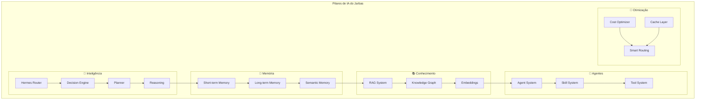

---

## 2. Arquitetura de IA

### 2.1 Diagrama de Alto Nível

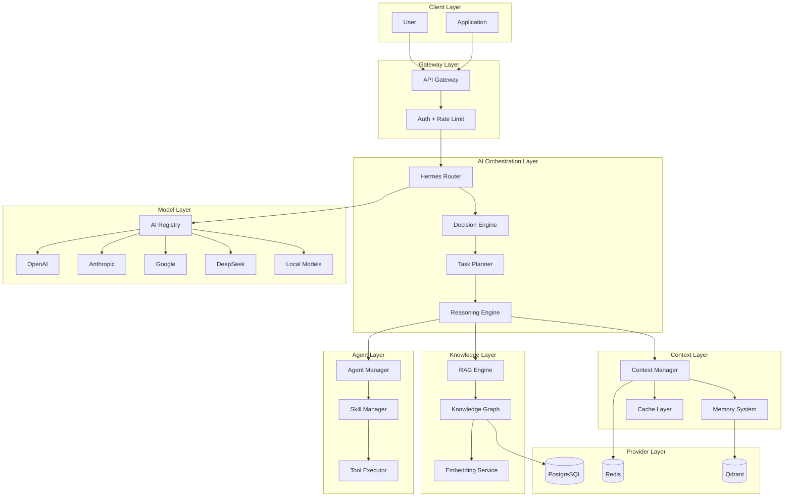

### 2.2 Pipeline de Processamento

```mermaid
sequenceDiagram
    participant U as User
    participant GW as Gateway
    participant H as Hermes
    participant D as Decision
    participant P as Planner
    participant R as Reasoning
    participant C as Context
    participant M as Model

    U->>GW: Request
    GW->>H: Route

    H->>D: Analyze Task
    D->>D: Classify Intent
    D->>D: Assess Complexity
    D->>D: Determine Strategy

    D->>P: Create Plan
    P->>P: Decompose Task
    P->>P: Select Approach

    P->>R: Execute Reasoning
    R->>C: Gather Context
    C->>C: Load Memory
    C->>C: Search Knowledge
    C->>C: Build Prompt
    C-->>R: Context Ready

    R->>M: Call Model
    M-->>R: Response
    R->>R: Validate Response
    R-->>GW: Final Answer

    par Async
        GW->>C: Store Interaction
        GW->>C: Update Memory
    end

    GW-->>U: Response
```

---

## 3. Hermes Router

### 3.1 Definição

Hermes é o sistema de roteamento inteligente que seleciona o melhor provedor e modelo para cada requisição.

### 3.2 Arquitetura

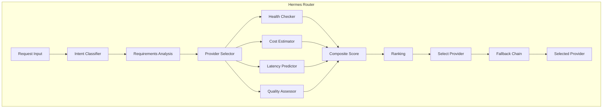

### 3.3 Estratégias de Roteamento

| Estratégia | Descrição | Quando Usar |
|-----------|-----------|-------------|
| `lowest-cost` | Menor custo por token | Tasks simples, altaVolume |
| `lowest-latency` | Menor latência histórica | Chat em tempo real |
| `highest-quality` | Maior qualidade (benchmark) | Tasks críticas |
| `balanced` | Equilíbrio entre fatores | Uso geral |
| `failover` | Chain de fallback | Alta disponibilidade |
| `provider-preferred` | Provider específico | User preference |

### 3.4 Algoritmo de Seleção

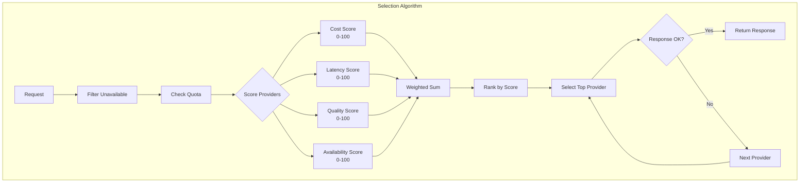

### 3.5 Fallback Chain

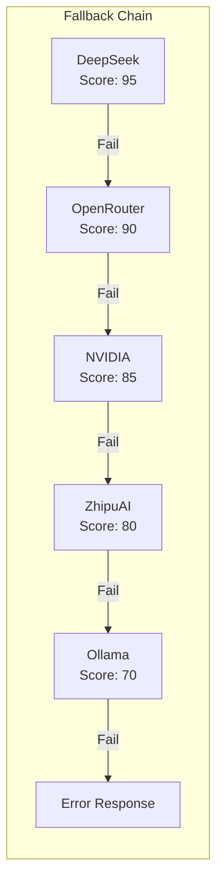

---

## 4. Decision Engine

### 4.1 Definição

O Decision Engine analisa a intenção do usuário e determina a melhor abordagem para processar a requisição.

### 4.2 Classificação de Intent

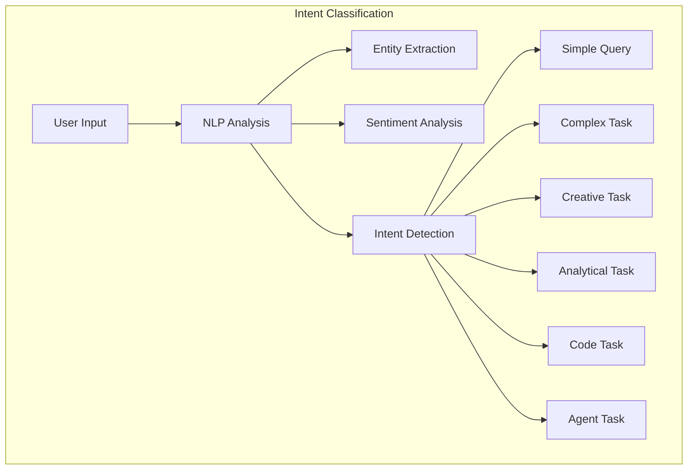

### 4.3 Taxonomia de Intents

| Intent | Descrição | Modelo Recomendado |
|--------|-----------|-------------------|
| `simple_qa` | Pergunta simples, resposta direta | DeepSeek, Qwen |
| `complex_reasoning` | Raciocínio multi-step | Claude, GPT-4 |
| `creative_writing` | Escrita criativa | Claude, Gemini |
| `code_generation` | Geração de código | DeepSeek Coder, Codex |
| `code_review` | Revisão de código | Claude, GPT-4 |
| `data_analysis` | Análise de dados | GPT-4, Claude |
| `summarization` | Resumo de texto | Claude, Gemini |
| `translation` | Tradução | DeepSeek, Qwen |
| `conversation` | Chat geral | DeepSeek, Qwen |
| `agent_task` | Tarefa de agente | Claude, GPT-4 |
| `embedding` | Geração de embeddings | text-embedding-3 |
| `vision` | Análise de imagem | GPT-4V, Claude Vision |
| `audio` | Processamento de áudio | Whisper |

### 4.4 Cadeia de Decisão

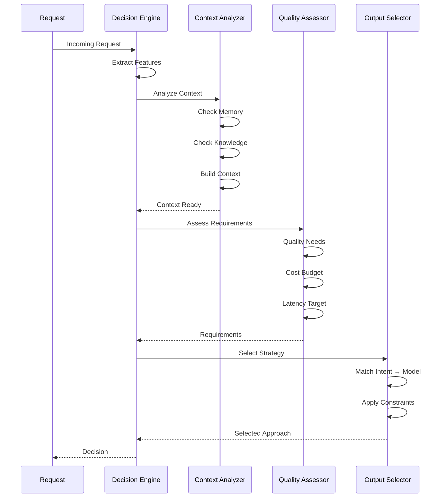

---

## 5. Planner

### 5.1 Definição

O Planner decompõe tasks complexas em subtarefas gerenciáveis e cria um plano de execução.

### 5.2 Tipos de Planejamento

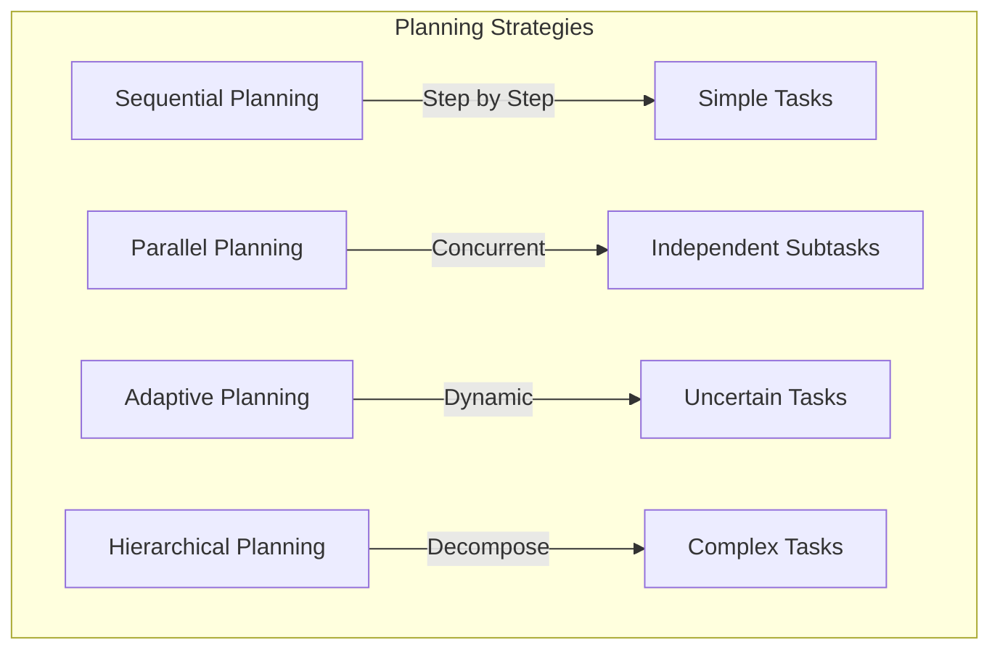

### 5.3 Task Decomposition

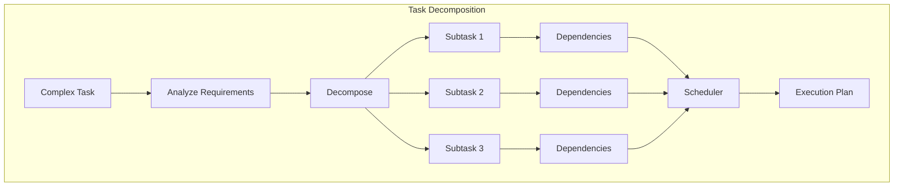

### 5.4 Execution Plan

| Campo | Descrição |
|-------|-----------|
| `task_id` | ID único da tarefa |
| `subtasks` | Lista de subtarefas |
| `dependencies` | Dependências entre subtarefas |
| `model_per_task` | Modelo recomendado por subtarefa |
| `estimated_cost` | Custo estimado total |
| `estimated_time` | Tempo estimado total |
| `parallel_groups` | Grupos que podem executar em paralelo |
| `fallback_plan` | Plano alternativo |

### 5.5 Planning Patterns

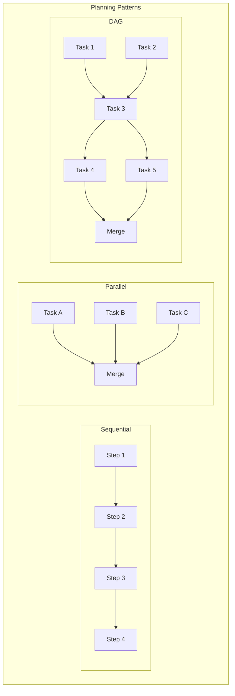

---

## 6. Reasoning

### 6.1 Definição

O Reasoning Engine implementa diferentes estratégias de raciocínio para resolver problemas complexos.

### 6.2 Padrões de Raciocínio

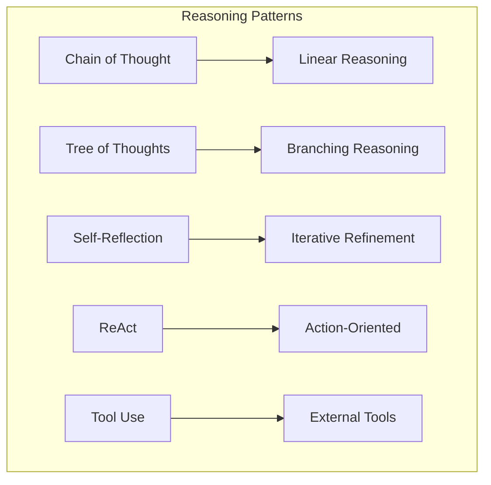

### 6.3 Chain of Thought (CoT)

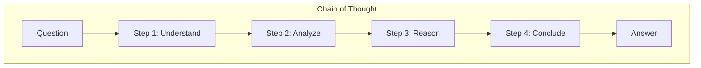

**Quando usar:** Perguntas que requerem raciocínio lógico, matemática, ou multi-step.

### 6.4 Tree of Thoughts (ToT)

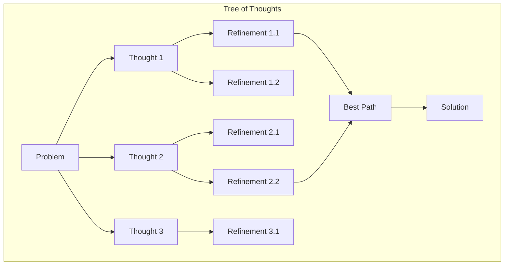

**Quando usar:** Problemas com múltiplas abordagens possíveis, criatividade.

### 6.5 ReAct (Reason + Act)

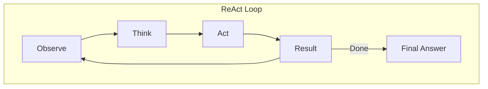

**Quando usar:** Tasks que requerem ações externas, tools, agentes.

### 6.6 Self-Reflection

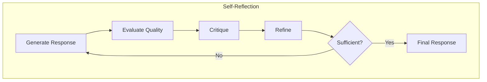

**Quando usar:** Tasks de alta qualidade, código, escrita.

---

## 7. Context Management

### 7.1 Definição

O Context Manager gerencia o contexto disponível para cada interação, maximizando a qualidade das respostas.

### 7.2 Hierarquia de Contexto

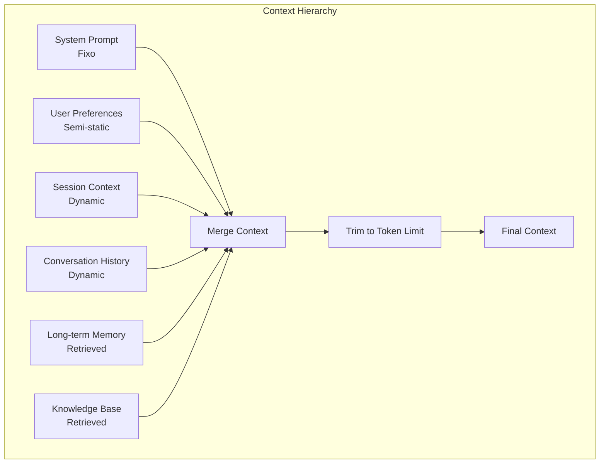

### 7.3 Context Window Management

| Componente | Tokens | Prioridade |
|------------|--------|------------|
| System Prompt | 500 | 🔴 Fixo |
| User Preferences | 200 | 🟡 Semi-fixe |
| Recent Messages (5) | 2,000 | 🟠 Alta |
| Memory Results | 1,000 | 🟡 Média |
| Knowledge Results | 1,500 | 🟡 Média |
| Current Message | 500 | 🔴 Alta |
| **Total** | **5,700** | - |

### 7.4 Context Strategies

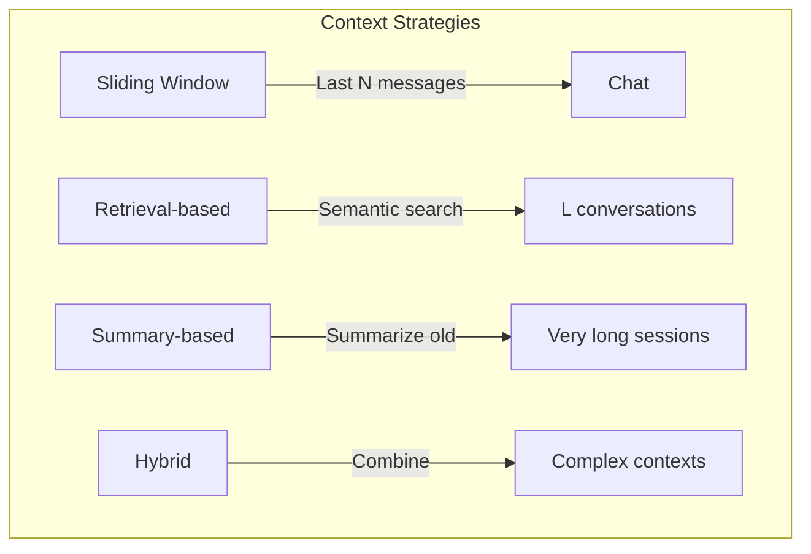

### 7.5 Context Flow

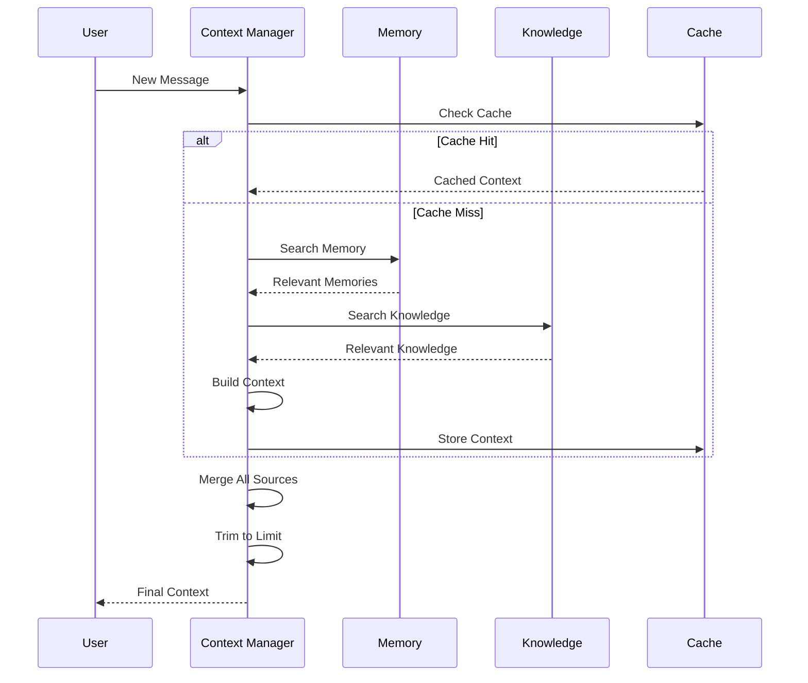

---

## 8. Memory System

### 8.1 Definição

O Memory System armazena e recupera informações de interações passadas, aprendendo com o histórico.

### 8.2 Tipos de Memória

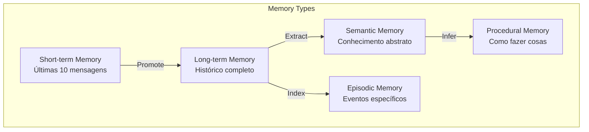

### 8.3 Arquitetura de Memória

```mermaid
graph TB
    subgraph "Memory Architecture"
        INPUT[New Interaction]

        INPUT --> ENCODE[Encode]
        ENCODE --> STORE短期[Short-term Store]
        ENCODE --> STORE长期[Long-term Store]
        ENCODE --> STORE语义[Semantic Store]

        STORE短期 --> CONSOLIDATE[Consolidation]
        CONSOLIDATE --> STORE长期

        QUERY[Memory Query]

        QUERY --> SEARCH短期[Search Short-term]
        QUERY --> SEARCH长期[Search Long-term]
        QUERY --> SEARCH语义[Search Semantic]

        SEARCH短期 --> RANK[Rank Results]
        SEARCH长期 --> RANK
        SEARCH语义 --> RANK

        RANK --> RETRIEVE[Retrieve Relevant]
    end
```

### 8.4 Memory Operations

| Operação | Descrição | Quando |
|----------|-----------|--------|
| `store` | Armazenar nova informação | Cada interação |
| `search` | Buscar memória relevante | Cada request |
| `consolidate` | Mover short → long term | Periódico |
| `forget` | Esquecer informação antiga | TTL-based |
| `summarize` | Resumir memória longa | Quando muito grande |
| `export` | Exportar memória | User request |
| `delete` | Deletar memória | User request / LGPD |

### 8.5 Memory Retrieval

```mermaid
sequenceDiagram
    participant Q as Query
    participant E as Embedder
    participant V as Vector DB
    participant R as Ranker
    participant F as Filter

    Q->>E: Embed Query
    E->>V: Vector Search
    V->>R: Candidate Results

    R->>R: Score by Similarity
    R->>R: Score by Recency
    R->>R: Score by Relevance

    R->>F: Apply Filters
    F->>F: Tenant Filter
    F->>F: User Filter
    F->>F: Type Filter

    F-->>Q: Top-K Results
```

---

## 9. Prompt Engine

### 9.1 Definição

O Prompt Engine gerencia templates de prompt, renderização e otimização.

### 9.2 Arquitetura

```mermaid
graph TB
    subgraph "Prompt Engine"
        TEMPLATES[Template Store]
        VARIABLES[Variable Resolver]
        RENDER[Renderer]
        OPTIMIZER[Prompt Optimizer]

        TEMPLATES --> RENDER
        VARIABLES --> RENDER
        RENDER --> OPTIMIZER
        OPTIMIZER --> FINAL[Final Prompt]
    end
```

### 9.3 Tipos de Prompt

| Tipo | Uso | Exemplo |
|------|-----|---------|
| `system` | Instruções do sistema | Personalidade, regras |
| `user` | Input do usuário | Pergunta, mensagem |
| `assistant` | Respostas anteriores | Histórico |
| `few-shot` | Exemplos | Input → Output |
| `chain-of-thought` | Raciocínio | Step-by-step |
| `context` | Contexto relevante | Memory + Knowledge |

### 9.4 Prompt Templates

```mermaid
graph TB
    subgraph "Template System"
        BASE[System Base Prompt]
        PERSONA[Persona Layer]
        TASK[Task Layer]
        CONTEXT[Context Layer]
        EXAMPLES[Examples Layer]
        OUTPUT[Output Format Layer]

        BASE --> MERGE[Merge]
        PERSONA --> MERGE
        TASK --> MERGE
        CONTEXT --> MERGE
        EXAMPLES --> MERGE
        OUTPUT --> MERGE

        MERGE --> RENDER[Render with Variables]
        RENDER --> FINAL[Final Prompt]
    end
```

### 9.5 Prompt Strategies

| Estratégia | Descrição | Quando Usar |
|-----------|-----------|-------------|
| **Zero-shot** | Sem exemplos | Tasks simples |
| **Few-shot** | Com exemplos | Tasks específicas |
| **Chain-of-Thought** | Raciocínio passo-a-passo | Problemas complexos |
| **Self-Consistency** | Múltiplas tentativas | Alta confiabilidade |
| **ReAct** | Reason + Act | Tasks com tools |
| **Tree-of-Thought** | Múltiplos caminhos | Criatividade |

### 9.6 Prompt Optimization

```mermaid
graph TB
    subgraph "Prompt Optimization"
        ORIGINAL[Original Prompt]
        ANALYZE[Analyze Performance]
        IDENTIFY[Identify Issues]
        SUGGEST[Suggest Improvements]
        TEST[Test Improvement]
        DEPLOY[Deploy]

        ORIGINAL --> ANALYZE
        ANALYZE --> IDENTIFY
        IDENTIFY --> SUGGEST
        SUGGEST --> TEST
        TEST -->|Better| DEPLOY
        TEST -->|Worse| SUGGEST
    end
```

---

## 10. AI Registry

### 10.1 Definição

O AI Registry gerencia todos os provedores de IA disponíveis, seus status e capacidades.

### 10.2 Arquitetura

```mermaid
graph TB
    subgraph "AI Registry"
        PROVIDERS[Provider Directory]
        HEALTH[Health Monitor]
        METRICS[Metrics Collector]
        MODELS[Model Catalog]

        PROVIDERS --> HEALTH
        PROVIDERS --> METRICS
        PROVIDERS --> MODELS

        HEALTH --> STATUS[Status Dashboard]
        METRICS --> ANALYTICS[Analytics]
        MODELS --> CAPABILITIES[Capabilities]
    end
```

### 10.3 Provider Interface

```typescript
interface AIProvider {
  id: string;
  name: string;
  type: 'cloud' | 'local' | 'hybrid';

  // Core Methods
  chat(messages: Message[], options?: ChatOptions): Promise<ChatResponse>;
  stream?(messages: Message[], options?: ChatOptions): AsyncGenerator<Chunk>;
  embed?(texts: string[]): Promise<number[][]>;

  // Metadata
  health(): Promise<HealthStatus>;
  listModels(): Promise<Model[]>;
  estimateCost(tokens: number): number;

  // Capabilities
  supportsStreaming: boolean;
  supportsEmbedding: boolean;
  supportsVision: boolean;
  supportsFunctionCalling: boolean;
}
```

### 10.4 Provider Status

| Provider | Status | Latência | Custo | Qualidade |
|----------|--------|----------|-------|-----------|
| DeepSeek | ✅ Healthy | 150ms | $0.14/M | 8.5/10 |
| OpenRouter | ⚠️ Degraded | 200ms | Varia | 9/10 |
| NVIDIA NIM | ✅ Healthy | 180ms | $0.20/M | 8/10 |
| Ollama | ✅ Healthy | 50ms | Free | 7/10 |
| OpenCode | ✅ Healthy | 100ms | Free | 7.5/10 |
| ZhipuAI | ✅ Healthy | 220ms | $0.15/M | 8/10 |
| Hermes | ✅ Healthy | 160ms | $0.18/M | 8.5/10 |

---

## 11. Agents

### 11.1 Definição

Sistema de agentes autônomos que executam tasks complexas usando tools e reasoning.

### 11.2 Arquitetura de Agentes

```mermaid
graph TB
    subgraph "Agent Architecture"
        MANAGER[Agent Manager]
        EXECUTOR[Agent Executor]
        PLANNER[Task Planner]
        REASONER[Reasoning Engine]
        TOOL_CALLER[Tool Caller]
        MEMORY[Agent Memory]

        MANAGER --> EXECUTOR
        EXECUTOR --> PLANNER
        PLANNER --> REASONER
        REASONER --> TOOL_CALLER
        TOOL_CALLER --> MEMORY
        MEMORY --> MANAGER
    end
```

### 11.3 Agent Lifecycle

```mermaid
stateDiagram-v2
    [*] --> Idle
    Idle --> Planning : Receive Task
    Planning --> Executing : Plan Ready
    Executing --> Thinking : Need Reasoning
    Thinking --> ToolCalling : Need Tool
    ToolCalling --> Executing : Tool Result
    Executing --> Evaluating : Subtask Done
    Evaluating --> Executing : More Work
    Evaluating --> Complete : Task Done
    Executing --> Failed : Error
    Failed --> Retrying : Retry
    Retrying --> Executing : Retry
    Complete --> [*]
```

### 11.4 Agent Types

| Tipo | Descrição | Caso de Uso |
|------|-----------|-------------|
| **Conversational** | Chat geral | Assistente virtual |
| **Task** | Executa tarefa específica | Automação |
| **Research** | Coleta informações | Deep research |
| **Coding** | Gera/revisa código | Desenvolvimento |
| **Creative** | Gera conteúdo | Criação de conteúdo |
| **Analysis** | Analisa dados | Business intelligence |
| **Multi-modal** | Texto + imagem + áudio | Tarefas complexas |

### 11.5 Agent Communication

```mermaid
graph TB
    subgraph "Multi-Agent Communication"
        A1[Agent 1]
        A2[Agent 2]
        A3[Agent 3]

        A1 -->|Message| A2
        A2 -->|Message| A3
        A3 -->|Message| A1

        subgraph "Communication Patterns"
            BROADCAST[Broadcast]
            REQUEST[Request-Response]
            PIPELINE[Pipeline]
        end

        A1 --> BROADCAST
        A2 --> REQUEST
        A3 --> PIPELINE
    end
```

---

## 12. Skills

### 12.1 Definição

Skills são capacidades especializadas que os agentes podem usar para executar tarefas.

### 12.2 Arquitetura de Skills

```mermaid
graph TB
    subgraph "Skill System"
        REGISTRY[Skill Registry]
        DISCOVER[Skill Discovery]
        SELECT[Skill Selection]
        EXECUTE[Skill Execution]
        VALIDATE[Result Validation]

        REGISTRY --> DISCOVER
        DISCOVER --> SELECT
        SELECT --> EXECUTE
        EXECUTE --> VALIDATE
        VALIDATE --> RESULT[Result]
    end
```

### 12.3 Built-in Skills

| Skill | Descrição | Input | Output |
|-------|-----------|-------|--------|
| `web_search` | Busca na web | query | results |
| `code_exec` | Executa código | language, code | output |
| `file_read` | Lê arquivo | path | content |
| `file_write` | Escreve arquivo | path, content | success |
| `api_call` | Chama API | url, method, body | response |
| `database_query` | Query DB | query | results |
| `image_analyze` | Analisa imagem | image_url | description |
| `text_to_speech` | Converte texto | text | audio_url |
| `translate` | Traduz texto | text, target_lang | translated |
| `calculate` | Calcula | expression | result |

### 12.4 Skill Selection

```mermaid
graph TB
    subgraph "Skill Selection Algorithm"
        TASK[Task Description]

        TASK --> PARSE[Parse Requirements]
        PARSE --> MATCH[Match Skills]
        MATCH --> RANK[Rank by Suitability]
        RANK --> SELECT[Select Best]
        SELECT --> VALIDATE[Validate Can Execute]
        VALIDATE --> EXECUTE[Execute]
    end
```

---

## 13. Knowledge System

### 13.1 Definição

O Knowledge System gerencia a base de conhecimento estruturada do sistema.

### 13.2 Arquitetura

```mermaid
graph TB
    subgraph "Knowledge System"
        INGEST[Ingestion Pipeline]
        EXTRACT[Entity Extraction]
        GRAPH[Knowledge Graph]
        STORE[Knowledge Store]
        QUERY[Query Engine]

        INGEST --> EXTRACT
        EXTRACT --> GRAPH
        GRAPH --> STORE
        STORE --> QUERY
    end
```

### 13.3 Knowledge Graph

```mermaid
graph TB
    subgraph "Knowledge Graph Structure"
        ENT1[Entity: User]
        ENT2[Entity: Document]
        ENT3[Entity: Concept]
        ENT4[Entity: Tool]

        REL1[Relationship: owns]
        REL2[Relationship: contains]
        REL3[Relationship: related_to]
        REL4[Relationship: uses]

        ENT1 --> REL1 --> ENT2
        ENT2 --> REL2 --> ENT3
        ENT3 --> REL3 --> ENT4
        ENT4 --> REL4 --> ENT1
    end
```

### 13.4 Knowledge Sources

| Fonte | Tipo | Atualização |
|-------|------|-------------|
| User Conversations | Explícito | Tempo real |
| Documents | Importado | Sob demanda |
| External APIs | Integrado | Periódico |
| Web Crawl | Coletado | Diário |
| Manual Entry | Explícito | Sob demanda |

---

## 14. RAG (Retrieval-Augmented Generation)

### 14.1 Definição

RAG combina recuperação de informações com geração de texto para respostas mais precisas e contextualizadas.

### 14.2 Arquitetura RAG

```mermaid
graph TB
    subgraph "RAG Pipeline"
        QUERY[User Query]

        QUERY --> EMBED_QUERY[Embed Query]
        EMBED_QUERY --> RETRIEVE[Retrieve Documents]
        RETRIEVE --> RERANK[Rerank Results]
        RERANK --> SELECT[Select Top-K]
        SELECT --> CONTEXT[Build Context]
        CONTEXT --> GENERATE[Generate Response]

        subgraph "Indexing Pipeline"
            DOCS[Documents]
            CHUNK[Chunking]
            EMBED_DOC[Embedding]
            INDEX[Indexing]
            STORE[(Vector Store)]

            DOCS --> CHUNK
            CHUNK --> EMBED_DOC
            EMBED_DOC --> INDEX
            INDEX --> STORE
        end

        RETRIEVE -.-> STORE
    end
```

### 14.3 Chunking Strategies

| Estratégia | Descrição | Quando Usar |
|-----------|-----------|-------------|
| **Fixed Size** | Tamanho fixo | Docs uniformes |
| **Recursive** | Divide por semântica | Docs estruturados |
| **Semantic** | Divide por significado | Docs complexos |
| **Document** | Por documento | Docs pequenos |
| **Overlap** | Sobreposição | Contexto contínuo |

### 14.4 RAG Strategies

```mermaid
graph TB
    subgraph "RAG Strategies"
        NAIVE[Naive RAG]
        ADVANCED[Advanced RAG]
        MODULAR[Modular RAG]

        NAIVE -->|Simple| SIMPLE_QUERIES[Simple Queries]
        ADVANCED -->|Optimized| COMPLEX_QUERIES[Complex Queries]
        MODULAR -->|Custom| DOMAIN_SPECIFIC[Domain Specific]
    end
```

### 14.5 Retrieval Methods

| Método | Descrição | Quando Usar |
|--------|-----------|-------------|
| **Dense Retrieval** | Embedding similarity | Busca semântica |
| **Sparse Retrieval** | BM25/TF-IDF | Busca por termos |
| **Hybrid** | Combina ambos | Melhor cobertura |
| **Multi-query** | Múltiplas queries | Queries ambíguas |
| **Re-write** | Reescreve query | Queries vagas |

---

## 15. Embeddings

### 15.1 Definição

Embeddings são representações vetoriais de texto que capturam significado semântico.

### 15.2 Modelos de Embedding

| Modelo | Dimensão | Performance | Custo |
|--------|----------|-------------|-------|
| `text-embedding-3-small` | 1536 | 8/10 | $0.02/M tokens |
| `text-embedding-3-large` | 3072 | 9/10 | $0.13/M tokens |
| `nomic-embed-text` | 768 | 7.5/10 | Free (local) |
| `bge-large` | 1024 | 8/10 | Free (local) |
| `jina-embeddings-v2` | 1024 | 8.5/10 | $0.02/M tokens |

### 15.3 Embedding Pipeline

```mermaid
graph TB
    subgraph "Embedding Pipeline"
        TEXT[Input Text]

        TEXT --> PREPROCESS[Preprocess]
        PREPROCESS --> CLEAN[Clean Text]
        CLEAN --> CHUNK_TEXT[Chunk if Needed]
        CHUNK_TEXT --> EMBED[Generate Embedding]
        EMBED --> NORMALIZE[Normalize Vector]
        NORMALIZE --> STORE[(Store)]
    end
```

### 15.4 Embedding Operations

| Operação | Descrição | Complexidade |
|----------|-----------|--------------|
| `embed` | Gerar embedding | O(1) |
| `similarity` | Calcular similaridade | O(n) |
| `search` | Buscar similares | O(log n) |
| `cluster` | Agrupar embeddings | O(n²) |
| `dimreduce` | Reduzir dimensionalidade | O(n*d²) |

---

## 16. Vector Database

### 16.1 Definição

Banco de dados vetorial para armazenar e buscar embeddings.

### 16.2 Arquitetura

```mermaid
graph TB
    subgraph "Vector Database Architecture"
        CLIENT[Client]
        INDEX[Vector Index]
        STORAGE[(Storage)]
        QUERY_ENGINE[Query Engine]

        CLIENT --> INDEX
        INDEX --> STORAGE
        QUERY_ENGINE --> INDEX
        QUERY_ENGINE --> STORAGE

        subgraph "Index Types"
            FLAT[Flat Index]
            IVF[IVF Index]
            HNSW[HNSW Index]
        end

        INDEX --> FLAT
        INDEX --> IVF
        INDEX --> HNSW
    end
```

### 16.3 Configuração Qdrant

| Parâmetro | Valor |
|-----------|-------|
| Collection | memories |
| Vector Size | 1536 (ou 768 local) |
| Distance | Cosine |
| Index Type | HNSW |
| M | 16 |
| efConstruction | 100 |
| efSearch | 50 |

### 16.4 Vector Operations

| Operação | Descrição | QPS |
|----------|-----------|-----|
| `upsert` | Inserir/atualizar | 1000+ |
| `search` | Busca por similaridade | 500+ |
| `delete` | Deletar vetor | 1000+ |
| `scroll` | Listar vetores | 1000+ |
| `count` | Contar vetores | 10000+ |

---

## 17. Modelos Suportados

### 17.1 OpenAI

| Modelo | Uso | Custo Input | Custo Output | Contexto |
|--------|-----|-------------|--------------|----------|
| `gpt-4o` | General purpose | $2.50/M | $10.00/M | 128K |
| `gpt-4o-mini` | Fast + cheap | $0.15/M | $0.60/M | 128K |
| `gpt-4-turbo` | Complex reasoning | $10.00/M | $30.00/M | 128K |
| `o1` | Reasoning | $15.00/M | $60.00/M | 128K |
| `o1-mini` | Fast reasoning | $1.10/M | $4.40/M | 128K |
| `o3` | Advanced reasoning | $10.00/M | $40.00/M | 128K |
| `o3-mini` | Fast advanced | $1.10/M | $4.40/M | 128K |
| `text-embedding-3-small` | Embeddings | $0.02/M | - | 8K |
| `text-embedding-3-large` | Embeddings | $0.13/M | - | 8K |
| `whisper` | Speech-to-Text | $0.006/min | - | - |
| `tts-1` | Text-to-Speech | $15/1M chars | - | - |
| `dall-e-3` | Image generation | $0.04/image | - | - |
| `gpt-4o-audio` | Audio | $2.50/M | $10.00/M | 128K |

**Quando usar OpenAI:**
- Tasks de raciocínio complexo (o1, o3)
- General purpose com boa qualidade (gpt-4o)
- Aplicações custo-sensíveis (gpt-4o-mini)
- Embeddings de alta qualidade (text-embedding-3-large)
- Speech-to-text (whisper)

### 17.2 Anthropic (Claude)

| Modelo | Uso | Custo Input | Custo Output | Contexto |
|--------|-----|-------------|--------------|----------|
| `claude-sonnet-4-20250514` | General purpose | $3.00/M | $15.00/M | 200K |
| `claude-opus-4-20250514` | Complex reasoning | $15.00/M | $75.00/M | 200K |
| `claude-3-5-haiku` | Fast + cheap | $0.80/M | $4.00/M | 200K |
| `claude-3-opus` | Legacy reasoning | $15.00/M | $75.00/M | 200K |
| `claude-3-sonnet` | Legacy general | $3.00/M | $15.00/M | 200K |

**Quando usar Claude:**
- Análise de documentos longos (200K context)
- Tasks que requerem safety (claude-sonnet-4)
- Raciocínio complexo (claude-opus-4)
- Coding assistance (claude-sonnet-4)
- Análise de dados extensa

### 17.3 Google (Gemini)

| Modelo | Uso | Custo Input | Custo Output | Contexto |
|--------|-----|-------------|--------------|----------|
| `gemini-2.5-pro` | Advanced reasoning | $1.25/M | $10.00/M | 1M |
| `gemini-2.5-flash` | Fast + multimodal | $0.15/M | $0.60/M | 1M |
| `gemini-2.0-flash` | Latest flash | $0.10/M | $0.40/M | 1M |
| `gemini-1.5-pro` | Legacy pro | $1.25/M | $5.00/M | 2M |
| `gemini-1.5-flash` | Legacy flash | $0.075/M | $0.30/M | 1M |
| `text-embedding-004` | Embeddings | $0.025/M | - | 2K |

**Quando usar Gemini:**
- Contextos muito longos (1-2M tokens)
- Multimodal (texto + imagem + vídeo)
- Tasks com código + visão
- Custo-eficiente em alta volume
- Embedding de texto

### 17.4 Qwen (Alibaba)

| Modelo | Uso | Custo | Contexto |
|--------|-----|-------|----------|
| `qwen-2.5-72b` | General purpose | $0.30/M | 128K |
| `qwen-2.5-32b` | Balanced | $0.15/M | 128K |
| `qwen-2.5-14b` | Efficient | $0.08/M | 128K |
| `qwen-2.5-7b` | Light | $0.04/M | 128K |
| `qwen-coder-plus` | Coding | $0.30/M | 128K |

**Quando usar Qwen:**
- Multi-idiomas (especialmente chinês)
- Custo-eficiente
- Locais sem necessidade de cloud
- Tasks de código

### 17.5 DeepSeek

| Modelo | Uso | Custo Input | Custo Output | Contexto |
|--------|-----|-------------|--------------|----------|
| `deepseek-chat` | General purpose | $0.14/M | $0.28/M | 128K |
| `deepseek-coder` | Coding | $0.14/M | $0.28/M | 128K |
| `deepseek-reasoner` | Reasoning | $0.55/M | $2.19/M | 128K |
| `deepseek-v3` | Latest | $0.27/M | $1.10/M | 128K |

**Quando usar DeepSeek:**
- **Default para tasks gerais** (melhor custo-benefício)
- Coding (deepseek-coder)
- Quando custo é prioridade
- Tradução multi-idiomas
- Tasks de raciocínio simples

### 17.6 Mistral

| Modelo | Uso | Custo Input | Custo Output | Contexto |
|--------|-----|-------------|--------------|----------|
| `mistral-large` | Advanced | $2.00/M | $6.00/M | 128K |
| `mistral-medium` | Balanced | $2.70/M | $8.10/M | 32K |
| `mistral-small` | Efficient | $0.10/M | $0.30/M | 128K |
| `codestral` | Coding | $0.30/M | $0.90/M | 256K |
| `pixtral` | Vision | $0.15/M | $0.15/M | 128K |
| `ministral-8b` | Light | $0.10/M | $0.10/M | 32K |

**Quando usar Mistral:**
- Enterprise (compliance)
- Coding (codestral)
- Vision (pixtral)
- European data residency
- Fine-tuning

### 17.7 Meta (Llama)

| Modelo | Uso | Custo | Contexto |
|--------|-----|-------|----------|
| `llama-3.3-70b` | General purpose | $0.10/M | 128K |
| `llama-3.1-8b` | Light | $0.02/M | 128K |
| `llama-3.1-405b` | Advanced | $1.00/M | 128K |
| `llama-4-maverick` | Latest | $0.20/M | 128K |

**Quando usar Llama:**
- Self-hosting (Ollama)
- Privacidade total
- Customização (fine-tuning)
- Custo zero (local)
- Development/testing

### 17.8 Google (Gemma)

| Modelo | Uso | Custo | Contexto |
|--------|-----|-------|----------|
| `gemma-2-27b` | Advanced | Free (local) | 8K |
| `gemma-2-9b` | Balanced | Free (local) | 8K |
| `gemma-2-2b` | Light | Free (local) | 8K |

**Quando usar Gemma:**
- Self-hosting leve
- Edge deployment
- Development
- Prototyping

---

## 18. Estratégia por Uso

### 18.1 Matriz de Decisão

```mermaid
graph TB
    subgraph "Decision Matrix"
        TASK[Task Type]

        TASK --> SIMPLE[Simples]
        TASK --> MODERATE[Moderado]
        TASK --> COMPLEX[Complexo]
        TASK --> CRITICAL[Crítico]

        SIMPLE --> DS_CHEAP[DeepSeek Chat]
        MODERATE --> CLAUDE_SONNET[Claude Sonnet]
        COMPLEX --> GPT4O[GPT-4o]
        CRITICAL --> CLAUDE_OPUS[Claude Opus]
    end
```

### 18.2 Chat Geral

| Cenário | Modelo Primário | Fallback |
|---------|-----------------|----------|
| Pergunta simples | DeepSeek Chat | Qwen 2.5-7B |
| Conversação | DeepSeek Chat | Claude Sonnet |
| Suporte técnico | Claude Sonnet | GPT-4o |
| Creative writing | Claude Sonnet | Gemini Pro |

### 18.3 Coding

| Cenário | Modelo Primário | Fallback |
|---------|-----------------|----------|
| Code generation | DeepSeek Coder | Codestral |
| Code review | Claude Sonnet | GPT-4o |
| Debugging | DeepSeek Reasoner | Claude Sonnet |
| Refactoring | Claude Sonnet | DeepSeek Coder |
| Documentation | Claude Sonnet | GPT-4o-mini |

### 18.4 Analysis

| Cenário | Modelo Primário | Fallback |
|---------|-----------------|----------|
| Data analysis | GPT-4o | Claude Sonnet |
| Document analysis | Claude Sonnet | Gemini Pro |
| Research | Claude Opus | GPT-4o |
| Summarization | Claude Sonnet | Gemini Flash |

### 18.5 Multimodal

| Cenário | Modelo Primário | Fallback |
|---------|-----------------|----------|
| Image analysis | GPT-4o | Claude Sonnet |
| Vision + Code | Gemini Pro | GPT-4o |
| Audio processing | Whisper | Gemini Flash |
| Video analysis | Gemini Pro | GPT-4o |

### 18.6 Cost Optimization

```mermaid
graph TB
    subgraph "Cost Optimization Strategy"
        TASK[Incoming Task]

        TASK --> CLASSIFY{Classify}
        CLASSIFY -->|Low Complexity| CHEAP[DeepSeek/Qwen]
        CLASSIFY -->|Medium Complexity| BALANCED[Claude Sonnet]
        CLASSIFY -->|High Complexity| PREMIUM[GPT-4o/Claude Opus]

        CHEAP --> COST_CHECK{Within Budget?}
        BALANCED --> COST_CHECK
        PREMIUM --> COST_CHECK

        COST_CHECK -->|Yes| EXECUTE[Execute]
        COST_CHECK -->|No| DOWNGRADE[Downgrade Model]
        DOWNGRADE --> EXECUTE
    end
```

### 18.7 Quality Optimization

| Métrica | Target | Ação se abaixo |
|---------|--------|----------------|
| User Satisfaction | >4.5/5 | Upgrade model |
| Response Accuracy | >95% | Improve prompts |
| Task Completion | >90% | Add context |
| Response Time | <2s | Faster model |

### 18.8 Model Selection Flow

```mermaid
graph TB
    subgraph "Model Selection Algorithm"
        INPUT[Task Input]

        INPUT --> ANALYZE[Analyze Task]
        ANALYZE --> COMPLEXITY[Complexity Score]
        ANALYZE --> COST_BUDGET[Cost Budget]
        ANALYZE --> LATENCY_REQ[Latency Requirements]
        ANALYZE --> QUALITY_REQ[Quality Requirements]

        COMPLEXITY --> SCORE[Composite Score]
        COST_BUDGET --> SCORE
        LATENCY_REQ --> SCORE
        QUALITY_REQ --> SCORE

        SCORE --> SELECT[Select Model]
        SELECT --> VALIDATE[Validate]
        VALIDATE -->|OK| EXECUTE[Execute]
        VALIDATE -->|Not OK| FALLBACK[Fallback]
        FALLBACK --> SELECT
    end
```

---

## Resumo da Estratégia AI

| Componente | Status | Próximos Passos |
|------------|--------|-----------------|
| **Hermes Router** | ✅ Implementado | Otimizar scoring |
| **Decision Engine** | ⚠️ Parcial | Classificação automática |
| **Planner** | ⚠️ Parcial | Decomposição automática |
| **Reasoning** | ⚠️ Parcial | CoT, ToT, ReAct |
| **Context Management** | ✅ Implementado | Optimizer |
| **Memory System** | ✅ Implementado | Consolidação |
| **Prompt Engine** | ⚠️ Parcial | Templates, otimização |
| **AI Registry** | ✅ Implementado | Métricas |
| **Agents** | ⚠️ Parcial | Lifecycle completo |
| **Skills** | ⚠️ Parcial | Mais built-in skills |
| **Knowledge System** | ⚠️ Parcial | Graph completo |
| **RAG** | ⚠️ Parcial | Pipeline completo |
| **Embeddings** | ✅ Implementado | Multi-modelo |
| **Vector DB** | ✅ Implementado | Otimização |
| **Hermes Email** | ✅ Implementado | 26 módulos, 143 tests |

---

## 19. Hermes Email - Arquitetura de IA

### 19.1 Definição

O Hermes Email é uma plataforma inteligente de gerenciamento de e-mails que utiliza IA para classificar, priorizar, detectar spam/phishing, gerar respostas automáticas e sincronizar com CRM/Agenda.

### 19.2 Módulos

| Módulo | Responsabilidade IA |
|--------|---------------------|
| ClassificationEngine | Classifica em 9 categorias (Comercial, Financeiro, Jurídico, etc.) |
| PriorityEngine | Define urgência (urgent, high, medium, low) |
| SpamDetector | Detecta spam com scoring |
| PhishingAnalyzer | Analisa ameaças em links e anexos |
| AIResponseEngine | Decide tipo de resposta necessária |
| DraftGenerator | Gera 9 tipos de rascunhos |
| TaskSync | Extrai tarefas automaticamente |
| CalendarSync | Detecta datas e cria eventos |

### 19.3 Integrações

- Hermes Core (orquestração)
- Knowledge Hub (contexto)
- Meeting AI (transcrição)
- CRM (sincronização)
- Calendar (eventos)

---

## 20. Hermes Vision - Arquitetura de IA

### 20.1 Definição

O Hermes Vision é um motor de visão computacional que utiliza IA para analisar imagens, documentos, vídeos, detectar objetos/faces/emocões, extrair texto via OCR, ler códigos de barras/QR, e interpretar diagramas/gráficos.

### 20.2 Módulos

| Módulo | Responsabilidade IA |
|--------|---------------------|
| ProviderRegistry | 9 provedores de visão (GPT Vision, Gemini Vision, Claude Vision, Qwen VL, Llama Vision, Florence, PaddleOCR, Tesseract, EasyOCR) |
| ImageAnalyzer | Análise de fotos, interfaces e diagramas |
| DocumentAnalyzer | Extração de PDF/DOCX/PPTX/XLSX |
| ScreenshotAnalyzer | Análise de interfaces web/mobile |
| DiagramAnalyzer | Interpretação de UML/BPMN/fluxogramas/ERD |
| ArchitectureAnalyzer | Análise de plantas, elétrica/hidráulica |
| VideoAnalyzer | Processamento de MP4/MOV/AVI/MKV |
| FrameExtractor | Extração de quadros-chave |
| ObjectDetection | Detecção de pessoas/veículos/computadores/documentos |
| SceneUnderstanding | Análise de contexto/riscos/atividades |
| OCREngine | OCR multi-idioma (PT/EN/ES/FR) |
| BarcodeReader | Leitura EAN/UPC/Code128 |
| QRReader | Parsing de URL/email/phone/WiFi |
| FaceDetector | Detecção de faces + atributos (sem identidade biométrica) |
| EmotionDetector | 8 emoções com detecção de microexpressões |
| HandwritingReader | Reconhecimento de texto manuscrito |
| TableExtractor | Conversão de tabelas para CSV/JSON |
| ChartReader | Interpretação de gráficos (barra/linha/pizza/scatter) |
| UIAnalyzer | Análise de acessibilidade/layout/componentes |
| PromptGenerator | 10 templates de prompt embutidos |
| ImageSearch | Busca de imagens por texto/tags |
| MetadataEngine | Extração EXIF/IPTC/XMP |
| Security | Detecção de PII, filtro de conteúdo, sanitização |
| Analytics | Métricas de requisição, custos, rastreamento de erros |
| Monitoring | Verificações de saúde, uptime, status do provedor |
| VisionAPI | REST API (analyze, search, health, metrics) |
| VisionAI | Orquestrador que conecta todos os 27 módulos |

### 20.3 Integrações

- Hermes Core (orquestração)
- Knowledge Hub (contexto)
- Meeting AI (transcrição)
- WhatsApp AI (mídia recebida)
- Email AI (anexos)

---

## 21. Business Suite - Arquitetura de IA

### 21.1 Definição

O Business Suite é uma plataforma de negócios completa que integra CRM, ERP, financeiro, contabilidade, vendas, compras, estoque, RH, conformidade, BI, workflow, monitoramento e API para gestão empresarial.

### 21.2 Módulos

| Módulo | Responsabilidade |
|--------|-----------------|
| CompanyManager | Gestão de empresa, subsidiaries, departamentos |
| CRM | Contatos, leads, oportunidades, pipeline |
| ERP | Produtos, categorias, fornecedores |
| Finance | Orçamentos, transações, metas |
| Accounting | Lançamentos contábeis, relatórios |
| Treasury | Contas bancárias, transferências |
| Sales | Pedidos, pipeline, previsões |
| Purchasing | Ordens de compra, aprovações |
| Inventory | Estoque, movimentações |
| Logistics | Entregas, rastreamento, rotas |
| HR | Funcionários, avaliações, benefícios |
| Payroll | Folha de pagamento, impostos |
| Legal | Casos jurídicos, documentos |
| Contracts | Contratos, cláusulas, renovações |
| Compliance | Políticas, verificações, auditorias |
| Marketing | Campanhas, leads, métricas |
| CustomerSuccess | Contas, health scores, churn |
| ServiceDesk | Tickets, SLAs, resoluções |
| Projects | Projetos, tarefas, milestones |
| Kanban | Quadros, colunas, cartões |
| BI | Datasets, métricas, dashboards |
| Forecasting | Previsões de vendas, receita |
| Analytics | Eventos, sessões, funis, cohortes |
| WorkflowEngine | Workflows, execuções, transições |
| ApprovalEngine | Políticas, aprovações, thresholds |
| NotificationCenter | Notificações, templates, agendamento |
| DocumentManager | Documentos, versões, folders |
| ReportGenerator | Relatórios, templates, snapshots |
| Integrations | Integrações, credenciais, syncs |
| BusinessAPI | REST API |
| Monitoring | Health checks, métricas, alertas |
| BusinessSuite | Orquestrador dos 31 módulos |

### 21.3 Integrações

- Hermes Core (orquestração)
- Knowledge Hub (contexto)
- Types/Utils (tipos compartilhados)

---

## 22. Evolution Center - Arquitetura de IA

### 22.1 Definição

O Evolution Center é o centro de evolução contínua da plataforma JARBAS, responsável por análise de plataforma, detecção de melhorias, geração de roadmaps, governança, releases, feature flags, experimentação e monitoramento.

### 22.2 Módulos

| Módulo | Responsabilidade |
|--------|-----------------|
| EvolutionEngine | Análise de plataforma, detecção de issues e recomendações |
| ImprovementEngine | Detecção de code duplication, APIs lentas, queries ineficientes |
| RoadmapEngine | Criação de roadmaps, items, priorização, dependências |
| BacklogManager | Gestão de backlog, sprints, items, story points |
| BugCenter | Gestão de bugs, status, prioridade, severidade |
| FeatureCenter | Gestão de features, votos, feedback, status |
| TelemetryEngine | Coleta e agregação de telemetria |
| AnalyticsEngine | Analytics de plataforma e módulos |
| QualityEngine | Análise de cobertura, lint, complexidade, duplicação |
| ArchitectureReview | Revisão de arquitetura (DDD, SOLID, coupling) |
| SecurityReview | Revisão de segurança (vulnerabilities, secrets, configs) |
| DependencyReview | Revisão de dependências (outdated, vulnerabilities, licenses) |
| PerformanceReview | Revisão de performance (CPU, memory, latency, response) |
| CostReview | Revisão de custos e alertas |
| ReleaseManager | Gestão de releases e changelogs |
| Experimentation | A/B testing e experimentos |
| FeatureFlags | Feature flags com targeting |
| CanaryManager | Deploy canário com health checks |
| RolloutManager | Gestão de rollout com métricas |
| RollbackManager | Gestão de rollback |
| Governance | Políticas e regras de governança |
| ApprovalEngine | Fluxo de aprovações |
| Audit | Auditoria de ações |
| NotificationCenter | Notificações e templates |
| DashboardManager | Dashboards e widgets |
| ReportGenerator | Geração de relatórios |
| EvolutionAPI | REST API do Evolution Center |
| Monitoring | Monitoramento do EC |
| EvolutionCenter | Orquestrador principal |

### 22.3 Integrações

- Hermes Core (orquestração)
- Knowledge Hub (contexto)
- Types/Utils (tipos compartilhados)

---

*Documento criado pelo Arquiteto Principal em 12/07/2026*
*Última atualização: 13/07/2026*
