# JARBAS 2.0 - Master Architecture

**Documento Oficial de Arquitetura do Jarbas 2.0**
**Versão:** 1.0
**Data:** 12 de Julho de 2026
**Status:** VIGENTE

---

## Índice

1. [Visão Geral da Arquitetura](#1-visão-geral-da-arquitetura)
2. [Princípios de Design](#2-princípios-de-design)
3. [Diagrama Arquitetura Geral](#3-diagrama-arquitetura-geral)
4. [Fluxo Hermes](#4-fluxo-hermes)
5. [Fluxo AI](#5-fluxo-ai)
6. [Fluxo Memory](#6-fluxo-memory)
7. [Fluxo Voice](#7-fluxo-voice)
8. [Fluxo Vision](#8-fluxo-vision)
9. [Fluxo Dashboard](#9-fluxo-dashboard)
10. [Fluxo API Gateway](#10-fluxo-api-gateway)
11. [Fluxo Segurança](#11-fluxo-segurança)
12. [Fluxo Eventos](#12-fluxo-eventos)
13. [Fluxo Agentes](#13-fluxo-agentes)
14. [Fluxo Business](#14-fluxo-business)
15. [Fluxo Deployment](#15-fluxo-deployment)
16. [Fluxo Kubernetes](#16-fluxo-kubernetes)
17. [Fluxo Docker](#17-fluxo-docker)
18. [Fluxo Banco de Dados](#18-fluxo-banco-de-dados)
19. [Fluxo Observabilidade](#19-fluxo-observabilidade)
20. [Decisões de Arquitetura](#20-decisões-de-arquitetura)

---

## 1. Visão Geral da Arquitetura

### 1.1 Definição

Jarbas 2.0 é uma plataforma monolítica modular de orquestração AI multi-provedor. A arquitetura segue o padrão **Modular Monolith** com separação clara por domínios (bounded contexts), comunicação via eventos internos, e dependências unidirecionais entre camadas.

### 1.2 Visão em Camadas

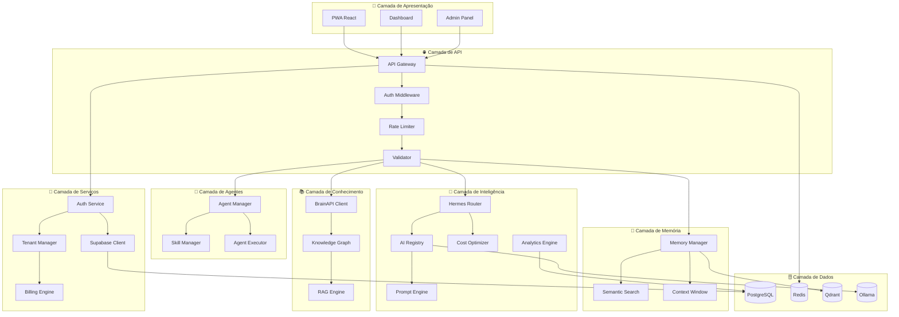

### 1.3 Dependências entre Packages

```mermaid
graph LR
    subgraph "📦 Shared"
        Types[@jarbas/types]
        Utils[@jarbas/utils]
        Config[@jarbas/config]
    end

    subgraph "📦 Core"
        AIReg[@jarbas/ai-registry]
        Router[@jarbas/hermes-router]
        CostOpt[@jarbas/cost-optimizer]
        Analytics[@jarbas/analytics-engine]
        MemMgr[@jarbas/memory-manager]
        Prompt[@jarbas/prompt-engine]
        SkillMgr[@jarbas/skill-manager]
        BrainAPI[@jarbas/brainapi-client]
    end

    subgraph "📦 Services"
        Gateway[@jarbas/api-gateway]
        AuthSvc[@jarbas/auth-service]
        SupaClient[@jarbas/supabase-client]
    end

    Types --> Utils
    Utils --> Config
    Config --> AIReg
    Types --> AIReg
    Utils --> AIReg
    AIReg --> Router
    AIReg --> CostOpt
    CostOpt --> Analytics
    Types --> MemMgr
    Utils --> MemMgr
    Types --> Prompt
    Types --> SkillMgr
    Types --> BrainAPI
    Router --> Gateway
    AIReg --> Gateway
    MemMgr --> Gateway
    CostOpt --> Gateway
    Analytics --> Gateway
    Types --> AuthSvc
    Config --> AuthSvc
    AuthSvc --> Gateway
    Config --> SupaClient
    SupaClient --> AuthSvc
    SkillMgr --> Gateway
    BrainAPI --> Gateway
```

---

## 2. Princípios de Design

| # | Princípio | Descrição |
|---|-----------|-----------|
| 1 | **Single Responsibility** | Cada package tem uma responsabilidade única |
| 2 | **Dependency Inversion** | Módulos dependem de abstrações, não concreções |
| 3 | **Open/Closed** | Aberto para extensão, fechado para modificação |
| 4 | **Interface Segregation** | Interfaces pequenas e específicas |
| 5 | **Event-Driven** | Comunicação desacoplada via eventos |
| 6 | **Fail-Safe** | Fallback automático em toda falha |
| 7 | **Zero-Trust** | Validação em todas as bordas |
| 8 | **12-Factor App** | Configuração via ambiente, logs em stdout |

---

## 3. Diagrama Arquitetura Geral

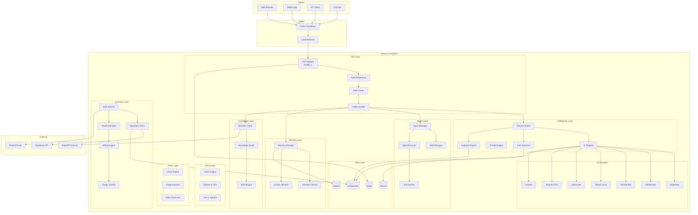

---

## 4. Fluxo Hermes

O Hermes Router é o coração do roteamento inteligente. Ele seleciona o melhor provedor AI baseado em múltiplos critérios.

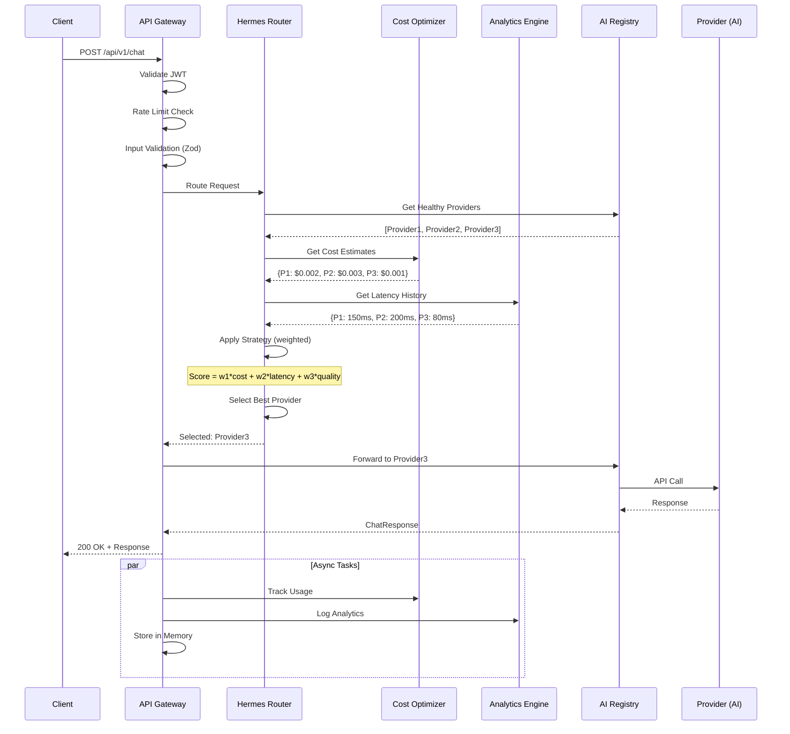

### Estratégias de Roteamento

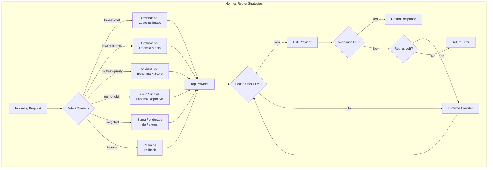

### Fallback Chain

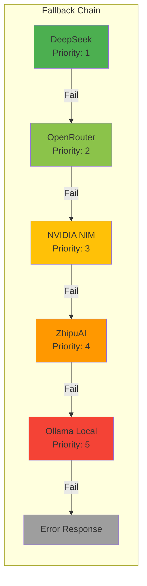

---

## 5. Fluxo AI

O fluxo AI cobre desde a recepção de uma mensagem até a resposta do provedor.

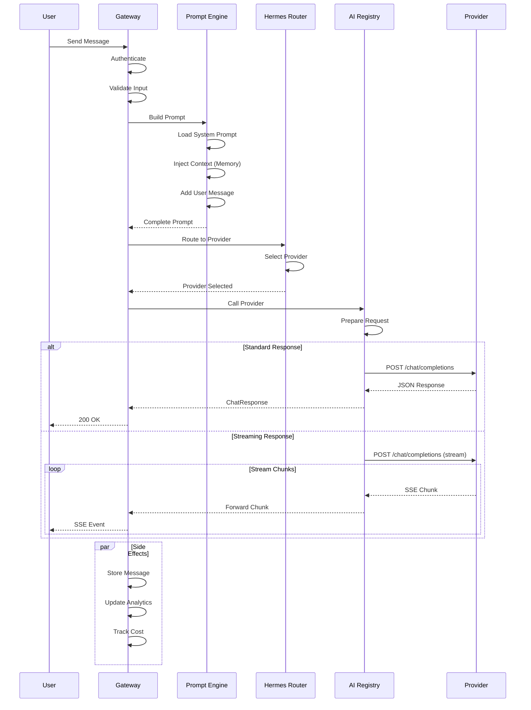

### Pipeline de Processamento AI

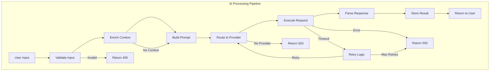

### Multi-Provider Support

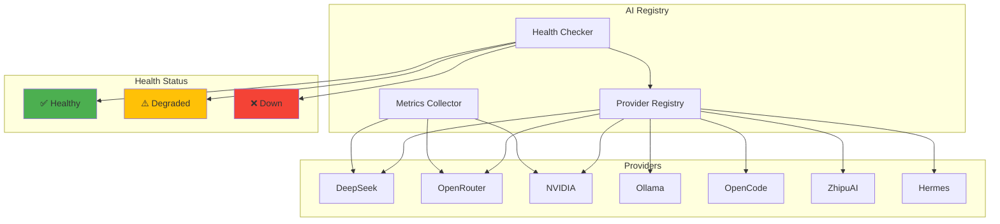

---

## 6. Fluxo Memory

O sistema de memória armazena e recupera contexto de conversas usando busca semântica vetorial.

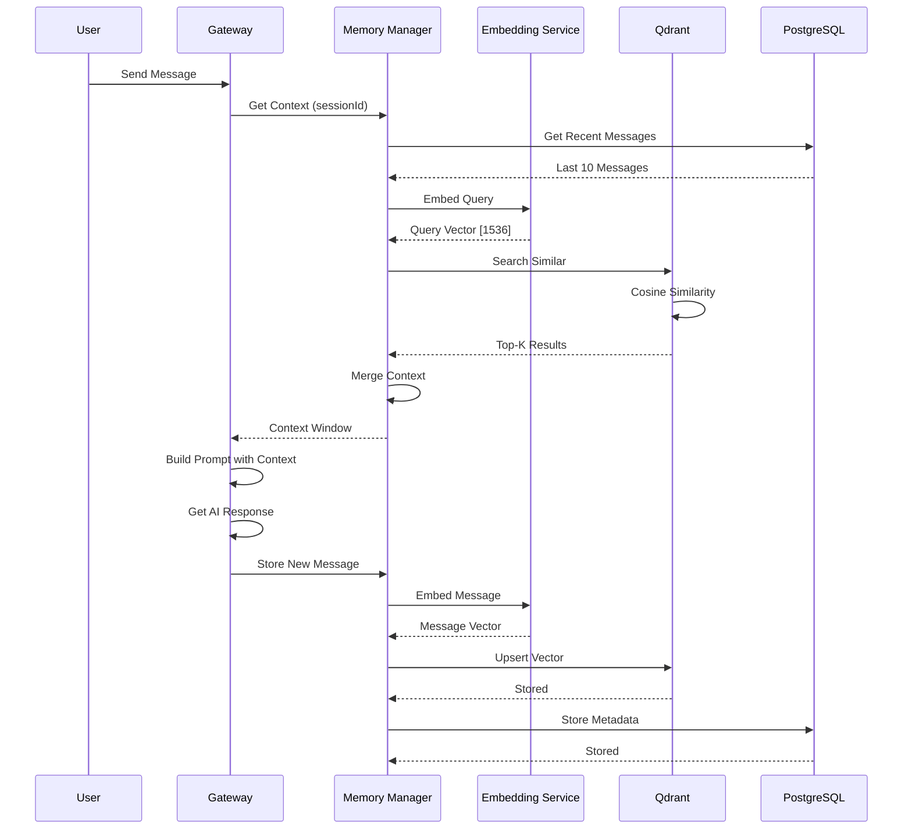

### Pipeline de Memória

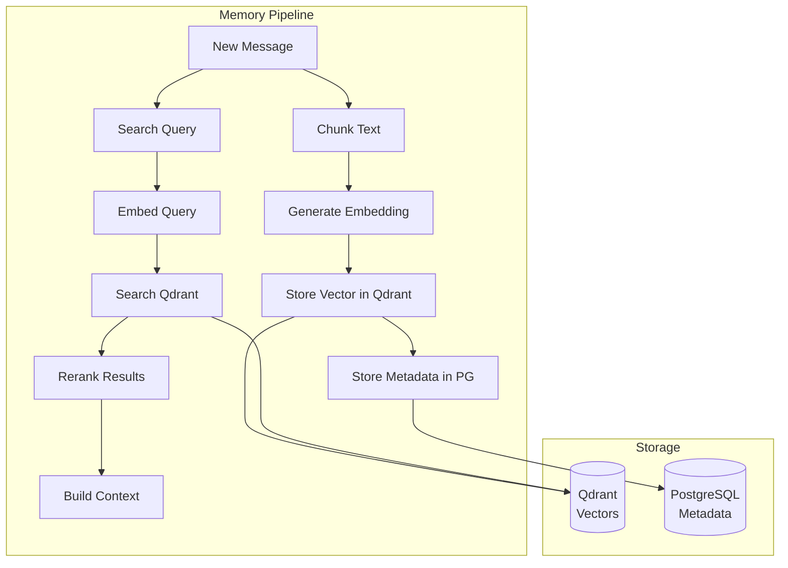

### Context Window

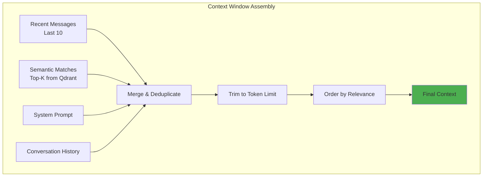

---

## 7. Fluxo Voice

O módulo de voz processa áudio para texto e texto para áudio.

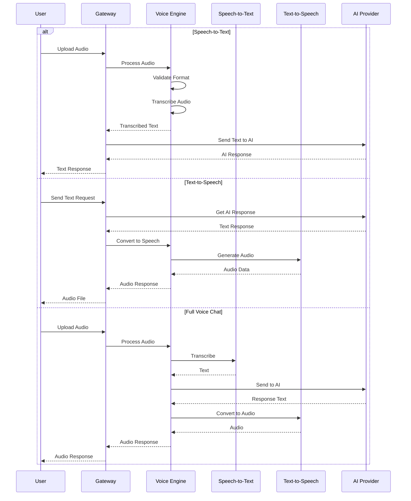

### Pipeline de Voice

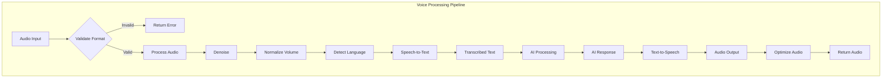

### Provider de Voz

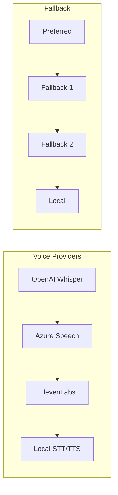

---

## 8. Fluxo Vision

O módulo de vision processa imagens e vídeos.

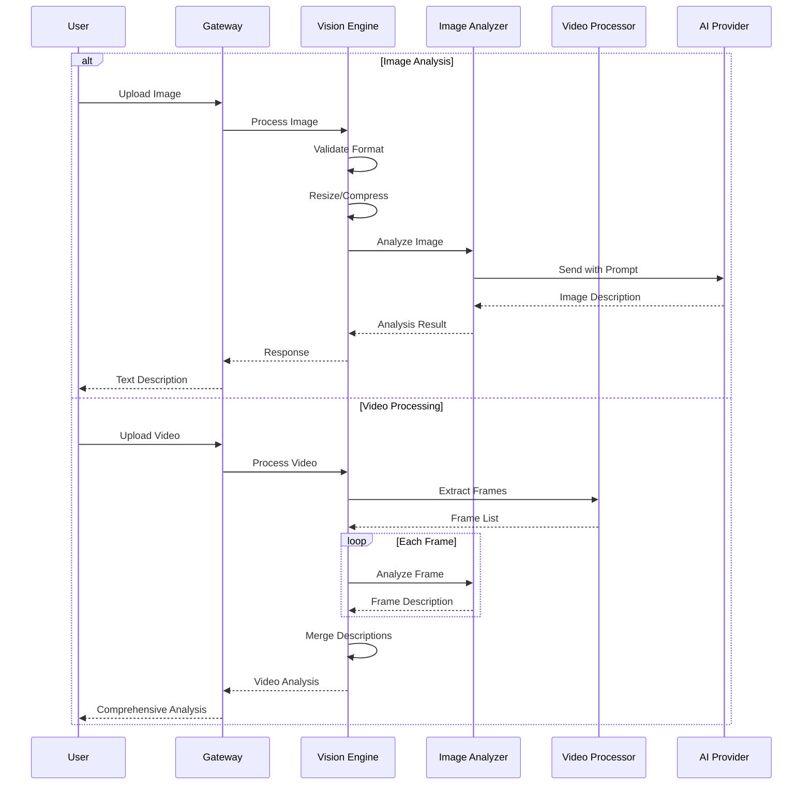

### Pipeline de Vision

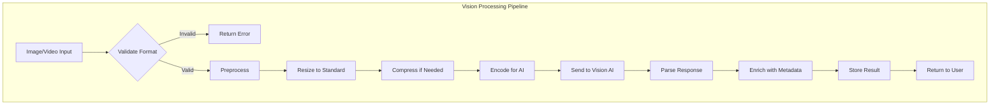

### Vision Models

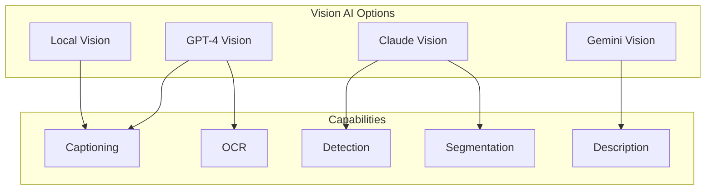

---

## 9. Fluxo Dashboard

O dashboard fornece analytics, custos, e monitoramento em tempo real.

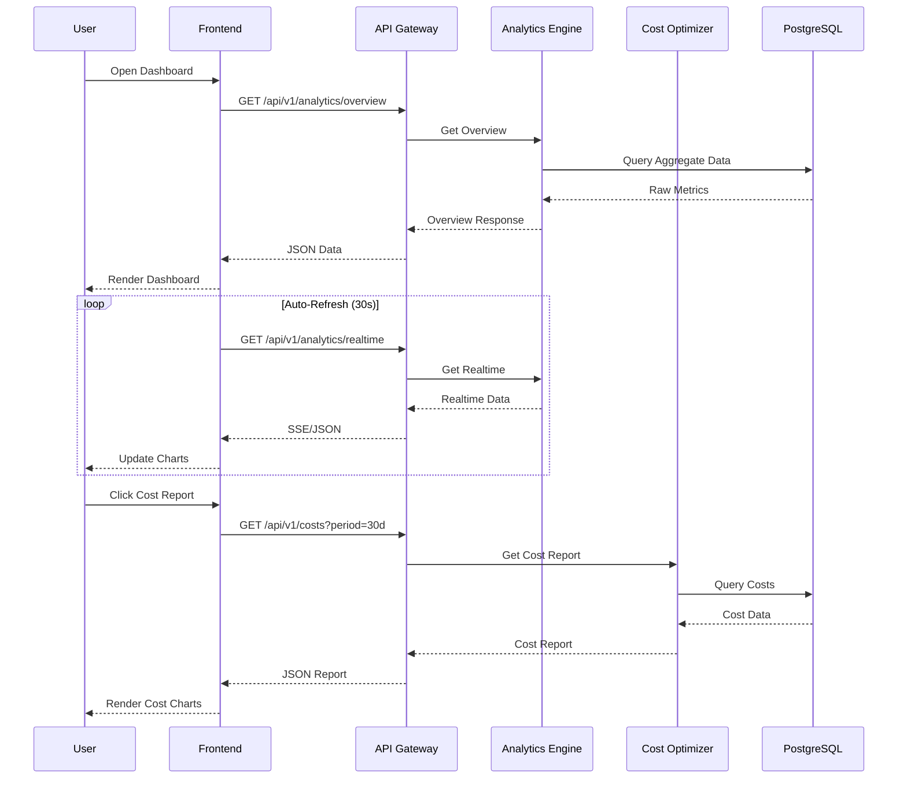

### Dashboard Views

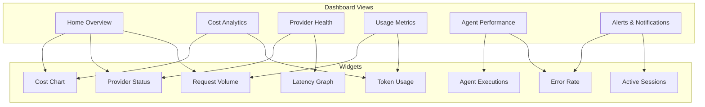

### Real-time Updates

```mermaid
graph LR
    subgraph "Real-time Architecture"
        CLIENT[Dashboard Client]
        SSE[SSE Connection]
        WS[WebSocket Future]
        API[API Gateway]
        EVENTS[Event Bus]
    end

    CLIENT -->|Subscribe| SSE
    SSE -->|Connect| API
    API -->|Listen| EVENTS
    EVENTS -->|Push| API
    API -->|Stream| SSE
    SSE -->|Update| CLIENT
```

---

## 10. Fluxo API Gateway

O API Gateway é o ponto de entrada único para todas as requisições.

```mermaid
sequenceDiagram
    participant C as Client
    participant GW as API Gateway
    participant AUTH as Auth Middleware
    participant RATE as Rate Limiter
    participant VALID as Validator
    participant ROUTE as Router
    participant HANDLER as Route Handler

    C->>GW: HTTP Request

    GW->>AUTH: Check Authentication
    alt No Token
        AUTH-->>C: 401 Unauthorized
    else Valid Token
        AUTH->>RATE: Check Rate Limit
        alt Rate Exceeded
            RATE-->>C: 429 Too Many Requests
        else Within Limit
            RATE->>VALID: Validate Input
            alt Invalid Input
                VALID-->>C: 400 Bad Request
            else Valid Input
                VALID->>ROUTE: Find Route
                ROUTE->>HANDLER: Execute Handler
                HANDLER-->>GW: Response
                GW-->>C: HTTP Response
            end
        end
    end
```

### Middleware Stack

```mermaid
graph TB
    subgraph "Middleware Pipeline"
        REQ[Incoming Request]

        REQ --> CORS[CORS Handler]
        CORS --> HELMET[Security Headers]
        HELMET --> BODY[Body Parser]
        BODY --> LOG[Request Logger]
        LOG --> AUTH[Auth Middleware]
        AUTH --> RATE[Rate Limiter]
        RATE --> VALID[Input Validator]
        VALID --> ROUTE[Route Handler]
        ROUTE --> ERROR[Error Handler]
        ERROR --> RESP[Response]
    end

    style CORS fill:#E3F2FD
    style HELMET fill:#E8F5E9
    style AUTH fill:#FFF3E0
    style RATE fill:#FCE4EC
    style VALID fill:#F3E5F5
```

### Rate Limiting

```mermaid
graph TB
    subgraph "Rate Limiting Logic"
        REQ[Request]
        KEY[Generate Key<br/>tenant:ip:endpoint]
        CHECK{Check Redis}

        CHECK -->|Below Limit| ALLOW[Allow Request]
        CHECK -->|At Limit| REJECT[Reject 429]

        ALLOW --> INCREMENT[Increment Counter]
        INCREMENT --> SET_TTL[Set TTL if New]

        RETRY{Retry After}
        RETRY -->|Has Retry-After| HEADER[Add Header]
        RETRY -->|No| SEND[Send Response]

        HEADER --> SEND
    end
```

### Route Matching

```mermaid
graph TB
    subgraph "Route Resolution"
        REQ[Incoming Request]
        MATCH[Route Matcher]

        REQ --> MATCH

        MATCH --> EXACT{Exact Match?}
        EXACT -->|Yes| HANDLER[Route Handler]
        EXACT -->|No| PARAM{Param Match?}

        PARAM -->|Yes| EXTRACT[Extract Params]
        PARAM -->|No| WILD{Wildcard?}

        EXTRACT --> HANDLER
        WILD -->|Yes| HANDLER
        WILD -->|No| 404[Return 404]
    end
```

---

## 11. Fluxo Segurança

```mermaid
sequenceDiagram
    participant C as Client
    participant GW as Gateway
    participant AUTH as Auth Service
    participant JWT as JWT Validator
    participant DB as Database
    participant REDIS as Redis

    Note over C,REDIS: Login Flow
    C->>GW: POST /auth/login
    GW->>AUTH: Authenticate
    AUTH->>DB: Query User
    DB-->>AUTH: User Record
    AUTH->>AUTH: Verify Password
    AUTH->>JWT: Generate JWT
    JWT-->>AUTH: Token
    AUTH-->>GW: AuthResult
    GW-->>C: {token, refreshToken}

    Note over C,REDIS: Authenticated Request
    C->>GW: GET /api/v1/sessions
    GW->>JWT: Validate Token
    JWT->>DB: Verify User Exists
    DB-->>JWT: User Active
    JWT-->>GW: TokenPayload
    GW->>REDIS: Check Rate Limit
    REDIS-->>GW: Within Limit
    GW->>GW: Execute Route
    GW-->>C: 200 OK + Data
```

### Security Layers

```mermaid
graph TB
    subgraph "Security Architecture"
        L1[L1: Network<br/>TLS/HTTPS]
        L2[L2: Authentication<br/>JWT + API Key]
        L3[L3: Authorization<br/>RBAC]
        L4[L4: Rate Limiting<br/>Per Tenant/IP]
        L5[L5: Input Validation<br/>Zod Schemas]
        L6[L6: Output Sanitization<br/>XSS Prevention]
        L7[L7: Audit Logging<br/>All Actions]
    end

    L1 --> L2
    L2 --> L3
    L3 --> L4
    L4 --> L5
    L5 --> L6
    L6 --> L7

    style L1 fill:#1565C0
    style L2 fill:#2E7D32
    style L3 fill:#F57F17
    style L4 fill:#C62828
    style L5 fill:#6A1B9A
    style L6 fill:#00838F
    style L7 fill:#4E342E
```

### JWT Flow

```mermaid
sequenceDiagram
    participant C as Client
    participant S as Server
    participant V as JWT Verify

    C->>S: Login Request
    S->>S: Validate Credentials
    S->>S: Generate JWT (RS256)
    S-->>C: Access Token + Refresh Token

    C->>S: API Request + Bearer Token
    S->>V: Verify JWT
    V->>V: Check Signature
    V->>V: Check Expiry
    V->>V: Check Claims
    V-->>S: Valid/Invalid

    alt Valid
        S->>S: Extract User Context
        S->>S: Process Request
        S-->>C: 200 OK
    else Invalid
        S-->>C: 401 Unauthorized
    end

    Note over C,S: Token Refresh
    C->>S: POST /auth/refresh
    S->>V: Verify Refresh Token
    V-->>S: Valid
    S->>S: Generate New JWT
    S-->>C: New Access Token
```

---

## 12. Fluxo Eventos

```mermaid
graph TB
    subgraph "Event Bus Architecture"
        EM[Event Emitter]

        subgraph "Producers"
            GW[API Gateway]
            AIR[AI Registry]
            AM[Agent Manager]
            MM[Memory Manager]
            AS[Auth Service]
            TM[Tenant Manager]
        end

        subgraph "Event Types"
            E1[chat:message]
            E2[chat:response]
            E3[provider:health]
            E4[agent:lifecycle]
            E5[memory:store]
            E6[auth:action]
            E7[cost:update]
        end

        subgraph "Consumers"
            AN[Analytics Engine]
            CO[Cost Optimizer]
            AL[Alert System]
            LG[Logger]
            DB[Database Writer]
        end

        GW --> EM
        AIR --> EM
        AM --> EM
        MM --> EM
        AS --> EM
        TM --> EM

        EM --> E1
        EM --> E2
        EM --> E3
        EM --> E4
        EM --> E5
        EM --> E6
        EM --> E7

        E1 --> AN
        E2 --> AN
        E2 --> CO
        E3 --> AL
        E4 --> AN
        E5 --> DB
        E6 --> LG
        E7 --> CO
        E7 --> AL
    end
```

### Event Flow Detail

```mermaid
sequenceDiagram
    participant P as Producer
    participant EB as Event Bus
    participant L1 as Listener 1
    participant L2 as Listener 2
    participant L3 as Listener 3

    P->>EB: emit('chat:message', data)

    par Parallel Processing
        EB->>L1: Handle Message
        L1->>L1: Store in Memory
    and
        EB->>L2: Track Analytics
        L2->>L2: Update Metrics
    and
        EB->>L3: Log Event
        L3->>L3: Write to Log
    end

    Note over EB: All listeners executed asynchronously
```

### Event Categories

```mermaid
graph TB
    subgraph "Event Taxonomy"
        CHAT[Chat Events]
        PROVIDER[Provider Events]
        AGENT[Agent Events]
        MEMORY[Memory Events]
        AUTH[Auth Events]
        COST[Cost Events]
        SYSTEM[System Events]

        CHAT --> C1[message]
        CHAT --> C2[response]
        CHAT --> C3[stream:chunk]
        CHAT --> C4[stream:end]

        PROVIDER --> P1[health:check]
        PROVIDER --> P2[health:down]
        PROVIDER --> P3[health:up]

        AGENT --> A1[created]
        AGENT --> A2[started]
        AGENT --> A3[completed]
        AGENT --> A4[failed]

        MEMORY --> M1[stored]
        MEMORY --> M2[searched]
        MEMORY --> M3[cleanup]

        AUTH --> AU1[login]
        AUTH --> AU2[logout]
        AUTH --> AU3[failed]

        COST --> CO1[updated]
        COST --> CO2[threshold]

        SYSTEM --> S1[startup]
        SYSTEM --> S2[shutdown]
        SYSTEM --> S3[error]
    end
```

---

## 13. Fluxo Agentes

```mermaid
sequenceDiagram
    participant U as User
    participant GW as Gateway
    participant AM as Agent Manager
    participant SM as Skill Manager
    participant AEX as Agent Executor
    participant AI as AI Provider
    participant TOOLS as Tool System

    U->>GW: POST /agents/:id/execute
    GW->>AM: Execute Agent
    AM->>AM: Load Agent Config
    AM->>AM: Set Status = running
    AM->>AEX: Start Execution

    AEX->>SM: Load Available Skills
    SM-->>AEX: [skill1, skill2, skill3]

    AEX->>AI: Initial Prompt + Tools
    AI-->>AEX: Tool Call Request

    loop Tool Execution Loop
        AEX->>TOOLS: Execute Tool
        TOOLS-->>AEX: Tool Result
        AEX->>AI: Tool Result
        AI-->>AEX: Next Action / Response
    end

    AI-->>AEX: Final Response
    AEX-->>AM: Execution Complete
    AM->>AM: Set Status = completed
    AM-->>GW: AgentResult
    GW-->>U: 200 OK + Result
```

### Agent Lifecycle

```mermaid
stateDiagram-v2
    [*] --> Draft

    Draft --> Ready : Configure
    Ready --> Running : Execute
    Running --> Completed : Success
    Running --> Failed : Error
    Running --> Retrying : Retry
    Retrying --> Running : Retry
    Failed --> Ready : Reset
    Completed --> Ready : Re-execute

    Running --> Paused : Pause
    Paused --> Running : Resume
    Paused --> Failed : Timeout

    state Running {
        [*] --> Processing
        Processing --> ToolCall : Need Tool
        ToolCall --> Processing : Tool Result
        Processing --> WaitingAI : Waiting AI
        WaitingAI --> Processing : AI Response
    }
```

### Tool Call Flow

```mermaid
sequenceDiagram
    participant AEX as Agent Executor
    participant AI as AI Provider
    participant PARSER as Tool Parser
    participant EXEC as Tool Executor
    participant TOOL as External Tool

    AEX->>AI: Send Context
    AI-->>AEX: {tool_call: "web_search", args: {...}}

    AEX->>PARSER: Parse Tool Call
    PARSER->>PARSER: Validate Arguments
    PARSER-->>AEX: Parsed Call

    AEX->>EXEC: Execute Tool
    EXEC->>EXEC: Check Permissions
    EXEC->>EXEC: Validate Params

    alt External Tool
        EXEC->>TOOL: HTTP Request
        TOOL-->>EXEC: Response
    else Internal Tool
        EXEC->>EXEC: Execute Logic
    end

    EXEC-->>AEX: Tool Result
    AEX->>AI: {role: "tool", content: result}
    AI-->>AEX: Next Response
```

### Skill System

```mermaid
graph TB
    subgraph "Skill Architecture"
        SM[Skill Manager]
        REGISTRY[Skill Registry]

        subgraph "Built-in Skills"
            S1[web-search]
            S2[code-exec]
            S3[file-read]
            S4[file-write]
            S5[api-call]
        end

        subgraph "Custom Skills"
            CS1[Custom Skill 1]
            CS2[Custom Skill 2]
        end

        SM --> REGISTRY
        REGISTRY --> S1
        REGISTRY --> S2
        REGISTRY --> S3
        REGISTRY --> S4
        REGISTRY --> S5
        REGISTRY --> CS1
        REGISTRY --> CS2
    end
```

---

## 14. Fluxo Business

```mermaid
sequenceDiagram
    participant U as User
    participant GW as Gateway
    participant AS as Auth Service
    participant TM as Tenant Manager
    participant BE as Billing Engine
    participant UT as Usage Tracker
    participant DB as Database

    U->>GW: Register Account
    GW->>AS: Create User
    AS->>DB: Insert User
    AS->>TM: Create Tenant
    TM->>DB: Insert Tenant
    TM->>BE: Initialize Billing
    BE->>DB: Insert Billing Account
    AS-->>GW: User + Tenant Created
    GW-->>U: Welcome Response

    Note over U,DB: Usage Tracking
    U->>GW: API Request
    GW->>UT: Track Usage
    UT->>DB: Log Usage Event
    UT->>BE: Update Usage
    BE->>BE: Check Quota
    BE-->>GW: Quota OK
    GW-->>U: Process Request
```

### Multi-Tenancy

```mermaid
graph TB
    subgraph "Multi-Tenancy Architecture"
        REQ[Incoming Request]

        REQ --> EXTRACT[Extract Tenant ID]
        EXTRACT --> VALIDATE{Validate Tenant}
        VALIDATE -->|Invalid| ERR[403 Forbidden]
        VALIDATE -->|Valid| CONTEXT[Set Tenant Context]

        CONTEXT --> PG[PostgreSQL<br/>RLS Policies]
        CONTEXT --> QD[Qdrant<br/>Tenant Filter]
        CONTEXT --> RD[Redis<br/>Tenant Namespace]

        PG --> DATA1[Tenant Data]
        QD --> DATA2[Tenant Vectors]
        RD --> DATA3[Tenant Cache]
    end
```

### Billing Flow

```mermaid
graph TB
    subgraph "Billing Pipeline"
        USAGE[Usage Event]
        QUOTA[Check Quota]
        CHARGE[Calculate Charge]
        INVOICE[Generate Invoice]
        PAY[Process Payment]

        USAGE --> QUOTA
        QUOTA -->|Within Quota| FREE[Free Tier]
        QUOTA -->|Exceeds Quota| CHARGE
        CHARGE --> INVOICE
        INVOICE --> PAY

        FREE --> ALLOW[Allow Usage]
        PAY -->|Success| ALLOW
        PAY -->|Fail| DENY[Deny Usage]
        DENY --> NOTIFY[Notify User]
    end
```

---

## 15. Fluxo Deployment

```mermaid
graph TB
    subgraph "Deployment Pipeline"
        CODE[Code Push]

        CODE --> LINT[Lint]
        LINT --> TYPECHECK[TypeCheck]
        TYPECHECK --> TEST[Test]
        TEST --> BUILD[Build]
        BUILD --> DOCKER[Docker Build]
        DOCKER --> PUSH[Push to Registry]
        PUSH --> DEPLOY_STAGING[Deploy Staging]
        DEPLOY_STAGING --> SMOKE[Smoke Tests]
        SMOKE --> DEPLOY_PROD[Deploy Production]
        DEPLOY_PROD --> VERIFY[Verify Health]

        LINT -->|Fail| FAIL1[Block]
        TYPECHECK -->|Fail| FAIL1
        TEST -->|Fail| FAIL1
        SMOKE -->|Fail| ROLLBACK[Rollback]
    end
```

### Environments

```mermaid
graph LR
    subgraph "Environment Flow"
        DEV[Development]
        STG[Staging]
        PROD[Production]

        DEV -->|PR Merge| STG
        STG -->|Manual Approval| PROD
        PROD -->|Issues| ROLLBACK[Rollback to STG]
    end

    subgraph "Environment Config"
        D_ENV[.env.development]
        S_ENV[.env.staging]
        P_ENV[.env.production]
    end

    DEV -.-> D_ENV
    STG -.-> S_ENV
    PROD -.-> P_ENV
```

### Release Process

```mermaid
sequenceDiagram
    participant DEV as Developer
    participant CI as CI/CD
    participant STG as Staging
    participant QA as QA
    participant PROD as Production

    DEV->>CI: Push to main
    CI->>CI: Run Tests
    CI->>CI: Build Docker
    CI->>STG: Deploy Staging

    STG->>QA: Notify
    QA->>QA: Smoke Tests
    QA->>QA: Manual Verification

    alt Pass
        QA->>PROD: Approve Deploy
        PROD->>PROD: Blue-Green Deploy
        PROD->>PROD: Health Check
        PROD-->>DEV: Deploy Success
    else Fail
        QA->>STG: Reject
        STG->>CI: Trigger Rollback
        CI-->>DEV: Deploy Failed
    end
```

---

## 16. Fluxo Kubernetes

```mermaid
graph TB
    subgraph "Kubernetes Architecture"
        LB[Load Balancer<br/>Cloud]

        subgraph "Ingress"
            ING[Ingress Controller<br/>nginx]
        end

        subgraph "Services"
            SVC1[Service: api-gateway]
            SVC2[Service: auth-service]
            SVC3[Service: worker]
        end

        subgraph "Deployments"
            DEP1[Deployment: api<br/>Replicas: 3]
            DEP2[Deployment: auth<br/>Replicas: 2]
            DEP3[Deployment: worker<br/>Replicas: 2]
        end

        subgraph "Pods"
            POD1[Pod 1]
            POD2[Pod 2]
            POD3[Pod 3]
        end

        subgraph "Config"
            CM[ConfigMap]
            SEC[Secret]
            PVC[PersistentVolume]
        end

        LB --> ING
        ING --> SVC1
        ING --> SVC2
        SVC1 --> DEP1
        SVC2 --> DEP2
        SVC3 --> DEP3
        DEP1 --> POD1
        DEP1 --> POD2
        DEP1 --> POD3
        POD1 --> CM
        POD1 --> SEC
        POD1 --> PVC
    end
```

### Pod Lifecycle

```mermaid
stateDiagram-v2
    [*] --> Pending
    Pending --> Running : Scheduled
    Running --> Succeeded : Complete
    Running --> Failed : Error
    Running --> Unknown : Unresponsive

    Running --> Terminating : Scale Down
    Terminating --> [*]

    state Running {
        [*] --> Init
        Init --> Ready : Init Containers Done
        Ready --> Running : Main Container Started
        Running --> LiveReady : Health Check Pass
    }

    LiveReady --> Running : Health Check Fail
```

### HPA (Horizontal Pod Autoscaler)

```mermaid
graph TB
    subgraph "Autoscaling Logic"
        METRICS[Metrics Server]
        HPA[HPA Controller]

        METRICS --> CPU[CPU Usage]
        METRICS --> MEM[Memory Usage]
        METRICS --> CUSTOM[Custom Metrics]

        CPU --> HPA
        MEM --> HPA
        CUSTOM --> HPA

        HPA --> SCALE{Scale Decision}

        SCALE -->|>70% CPU| UP[Scale Up]
        SCALE -->|<30% CPU| DOWN[Scale Down]
        SCALE -->|Normal| MAINTAIN[Maintain]

        UP --> ADD[Add Pod]
        DOWN --> REMOVE[Remove Pod]
    end
```

---

## 17. Fluxo Docker

```mermaid
graph TB
    subgraph "Docker Build Pipeline"
        subgraph "Stage 1: Builder"
            BASE1[Node 20 Alpine]
            DEPS[Install Dependencies]
            BUILD[Build TypeScript]
        end

        subgraph "Stage 2: Runner"
            BASE2[Node 20 Alpine]
            COPY[Copy Artifacts]
            MINIMIZE[Minimize Image]
        end

        BASE1 --> DEPS
        DEPS --> BUILD
        BUILD --> COPY
        BASE2 --> COPY
        COPY --> MINIMIZE
    end

    subgraph "Docker Compose"
        COMPOSE[docker-compose.yml]

        subgraph "Services"
            PG_SVC[PostgreSQL]
            REDIS_SVC[Redis]
            QDRANT_SVC[Qdrant]
            OLLAMA_SVC[Ollama]
            API_SVC[API Gateway]
        end

        COMPOSE --> PG_SVC
        COMPOSE --> REDIS_SVC
        COMPOSE --> QDRANT_SVC
        COMPOSE --> OLLAMA_SVC
        COMPOSE --> API_SVC
    end
```

### Multi-Stage Build

```mermaid
graph LR
    subgraph "Build Stages"
        subgraph "Stage 1: Dependencies"
            N1[node:20-alpine]
            P1[pnpm install]
        end

        subgraph "Stage 2: Build"
            N2[node:20-alpine]
            B1[pnpm build]
        end

        subgraph "Stage 3: Production"
            N3[node:20-alpine]
            C1[Copy dist]
            R1[Run node]
        end

        N1 --> P1
        P1 --> N2
        N2 --> B1
        B1 --> N3
        N3 --> C1
        C1 --> R1
    end
```

### Docker Networking

```mermaid
graph TB
    subgraph "Docker Network"
        NET[jarbas-network]

        subgraph "Containers"
            API[api-gateway]
            PG[postgres]
            RD[redis]
            QD[qdrant]
            OL[ollama]
        end

        NET --> API
        NET --> PG
        NET --> RD
        NET --> QD
        NET --> OL

        API -->|5432| PG
        API -->|6379| RD
        API -->|6333| QD
        API -->|11434| OL
    end
```

---

## 18. Fluxo Banco de Dados

```mermaid
graph TB
    subgraph "Database Architecture"
        subgraph "PostgreSQL"
            PG[(PostgreSQL 15)]
            POOL[Connection Pool]
            MIGRATIONS[Migrations]
            RLS[Row Level Security]
        end

        subgraph "Redis"
            RD[(Redis 7)]
            CACHE[Cache Layer]
            QUEUE[Queue System]
            RATE[Rate Limiting]
        end

        subgraph "Qdrant"
            QD[(Qdrant)]
            VECTORS[Vector Storage]
            SEARCH[Similarity Search]
            INDEX[Indexing]
        end
    end

    API[API Gateway] --> POOL
    POOL --> PG
    PG --> RLS
    PG --> MIGRATIONS

    API --> CACHE
    CACHE --> RD
    API --> QUEUE
    QUEUE --> RD
    API --> RATE
    RATE --> RD

    API --> VECTORS
    VECTORS --> QD
    QD --> SEARCH
    QD --> INDEX
```

### Connection Pool

```mermaid
sequenceDiagram
    participant APP as Application
    participant POOL as Connection Pool
    participant PG as PostgreSQL

    APP->>POOL: Get Connection
    POOL->>POOL: Check Available
    alt Available
        POOL-->>APP: Connection
    else All Busy
        POOL->>POOL: Wait (max 30s)
        POOL-->>APP: Connection
    end

    APP->>PG: Execute Query
    PG-->>APP: Result

    APP->>POOL: Release Connection
    POOL->>POOL: Return to Pool
```

### Migration Flow

```mermaid
graph TB
    subgraph "Migration Pipeline"
        DEV[Development]
        CREATE[Create Migration]
        TEST_M[Test Migration]
        APPLY[Apply to DB]
        VERIFY[Verify Schema]

        DEV --> CREATE
        CREATE --> TEST_M
        TEST_M -->|Pass| APPLY
        TEST_M -->|Fail| FIX[Fix Migration]
        FIX --> TEST_M
        APPLY --> VERIFY
        VERIFY -->|Pass| DONE[Complete]
        VERIFY -->|Fail| ROLLBACK_M[Rollback]
    end
```

---

## 19. Fluxo Observabilidade

```mermaid
graph TB
    subgraph "Observability Stack"
        subgraph "Metrics"
            PROM[Prometheus]
            GRAF[Grafana]
            CUSTOM[Custom Metrics]
        end

        subgraph "Logging"
            WINSTON[Winston Logger]
            ELK[ELK Stack]
            STRUCTURED[Structured Logs]
        end

        subgraph "Tracing"
            OTEL[OpenTelemetry]
            JAEGER[Jaeger]
            TRACES[Distributed Traces]
        end

        subgraph "Alerting"
            ALERTMGR[Alert Manager]
            SLACK[Slack]
            EMAIL[Email]
        end
    end

    APP[Application] --> CUSTOM
    CUSTOM --> PROM
    PROM --> GRAF

    APP --> STRUCTURED
    STRUCTURED --> WINSTON
    WINSTON --> ELK

    APP --> OTEL
    OTEL --> JAEGER
    OTEL --> TRACES

    GRAF --> ALERTMGR
    ALERTMGR --> SLACK
    ALERTMGR --> EMAIL
```

### Metrics Collection

```mermaid
sequenceDiagram
    participant APP as Application
    participant PROM as Prometheus
    participant GRAF as Grafana

    loop Every 15s
        APP->>APP: Collect Metrics
        APP->>APP: Update Counters
        APP->>APP: Update Histograms
    end

    loop Scrape Interval
        PROM->>APP: GET /metrics
        APP-->>PROM: Metrics Data
        PROM->>PROM: Store Time Series
    end

    loop Query
        GRAF->>PROM: PromQL Query
        PROM-->>GRAF: Metric Values
        GRAF->>GRAF: Render Dashboard
    end
```

### Log Levels

```mermaid
graph TB
    subgraph "Logging Architecture"
        ERROR[ERROR<br/>System errors]
        WARN[WARN<br/>Degraded operation]
        INFO[INFO<br/>Normal operation]
        DEBUG[DEBUG<br/>Detailed info]
        TRACE[TRACE<br/>Very detailed]

        ERROR --> CONSOLE[Console Output]
        WARN --> CONSOLE
        INFO --> CONSOLE
        DEBUG --> FILE[File Output]
        TRACE --> FILE

        ERROR --> ALERT[Alert Trigger]
        WARN --> ALERT

        CONSOLE --> STDOUT[stdout]
        FILE --> LOGFILE[logs/app.log]
    end
```

### Health Checks

```mermaid
graph TB
    subgraph "Health Check System"
        HC[Health Endpoint]

        HC --> PG_CHECK[PostgreSQL Check]
        HC --> RD_CHECK[Redis Check]
        HC --> QD_CHECK[Qdrant Check]
        HC --> OL_CHECK[Ollama Check]

        PG_CHECK --> PG_OK{PG OK?}
        RD_CHECK --> RD_OK{RD OK?}
        QD_CHECK --> QD_OK{QD OK?}
        OL_CHECK --> OL_OK{OL OK?}

        PG_OK -->|Yes| H1[✅ Healthy]
        PG_OK -->|No| H3[❌ Unhealthy]
        RD_OK -->|Yes| H1
        RD_OK -->|No| H3
        QD_OK -->|Yes| H1
        QD_OK -->|No| H3
        OL_OK -->|Yes| H1
        OL_OK -->|No| H3

        H1 --> STATUS[200 OK]
        H3 --> STATUS2[503 Service Unavailable]
    end
```

---

## 20. Decisões de Arquitetura

### 2.1 ADR-001: Modular Monolith vs Microservices

| Aspecto | Modular Monolith | Microservices |
|---------|-----------------|---------------|
| Complexidade | ✅ Menor | ❌ Maior |
| Deploy | ✅ Simples | ❌ Complexo |
| Latência | ✅ Zero network | ❌ Network overhead |
| Escalabilidade | ⚠️ Horizontal limitada | ✅ Ilimitada |
| Isolamento | ⚠️ Processo único | ✅ Processo separado |
| **Decisão** | **Escolhido** | Rejeitado |

**Rationale:** Para a fase atual, Modular Monolith oferece o melhor balance entre velocidade de desenvolvimento e capacidade de escalar. Microservices pode ser considerado na v3.0.

### 2.2 ADR-002: PostgreSQL como Database Principal

| Aspecto | PostgreSQL | MongoDB | MySQL |
|---------|------------|---------|-------|
| ACID | ✅ | ⚠️ | ✅ |
| JSONB | ✅ | ✅ | ❌ |
| Full-text Search | ✅ | ✅ | ⚠️ |
| RLS | ✅ | ❌ | ❌ |
| Ecosystem | ✅ | ✅ | ✅ |
| **Decisão** | **Escolhido** | Rejeitado | Rejeitado |

### 2.3 ADR-003: Qdrant para Vector Search

| Aspecto | Qdrant | Pinecone | Weaviate | pgvector |
|---------|--------|----------|----------|----------|
| Self-hosted | ✅ | ❌ | ✅ | ✅ |
| Performance | ✅ | ✅ | ⚠️ | ⚠️ |
| Filtering | ✅ | ⚠️ | ✅ | ⚠️ |
| Cost | ✅ Free | ❌ Paid | ✅ Free | ✅ Free |
| **Decisão** | **Escolhido** | Rejeitado | Alternativa | Alternativa |

### 2.4 ADR-004: Fastify vs Express

| Aspecto | Fastify | Express | Hono |
|---------|---------|---------|------|
| Performance | ✅ 2-3x faster | ⚠️ Baseline | ✅ Fast |
| TypeScript | ✅ Native | ⚠️ @types | ✅ Native |
| Schema Validation | ✅ Built-in | ❌ Manual | ✅ Built-in |
| Ecosystem | ✅ Good | ✅ Best | ⚠️ Growing |
| **Decisão** | **Escolhido** | Rejeitado | Alternativa |

### 2.5 ADR-005: pnpm + TurboRepo

| Aspecto | pnpm + Turbo | npm + Lerna | yarn + Nx |
|---------|-------------|-------------|-----------|
| Speed | ✅ Fastest | ⚠️ Slow | ✅ Fast |
| Disk Usage | ✅ Efficient | ❌ Duplicated | ✅ Efficient |
| Caching | ✅ Built-in | ❌ Manual | ✅ Built-in |
| DX | ✅ Good | ⚠️ OK | ✅ Good |
| **Decisão** | **Escolhido** | Rejeitado | Alternativa |

---

## Resumo Arquitetural

| Aspecto | Escolha |
|---------|---------|
| Padrão | Modular Monolith |
| Linguagem | TypeScript 5.x |
| Runtime | Node.js 20 |
| Web Framework | Fastify 5 |
| Database | PostgreSQL 15 |
| Cache | Redis 7 |
| Vector DB | Qdrant |
| ORM | Drizzle ORM |
| Validation | Zod |
| Monorepo | pnpm + TurboRepo |
| Container | Docker Multi-stage |
| Orchestration | Kubernetes |
| CI/CD | GitHub Actions |
| Monitoring | Prometheus + Grafana |
| Logging | Winston + ELK |
| Tracing | OpenTelemetry |

---

*Documento criado pelo Arquiteto Principal em 12/07/2026*
*Última atualização: 12/07/2026*
