# JARBAS 2.0 - Master Security

**Documento Oficial de Segurança do Jarbas 2.0**
**Versão:** 1.0
**Data:** 12 de Julho de 2026
**Classificação:** CONFIDENCIAL
**Status:** VIGENTE

---

## Índice

1. [Política de Segurança](#1-política-de-segurança)
2. [Zero Trust](#2-zero-trust)
3. [Controle de Acesso](#3-controle-de-acesso)
4. [Autenticação](#4-autenticação)
5. [Gerenciamento de Segredos](#5-gerenciamento-de-segredos)
6. [Criptografia](#6-criptografia)
7. [Rate Limiting](#7-rate-limiting)
8. [Auditoria e Logs](#8-auditoria-e-logs)
9. [Segurança de IA](#9-segurança-de-ia)
10. [Sandbox](#10-sandbox)
11. [LGPD - Proteção de Dados](#11-lgpd---proteção-de-dados)
12. [Compliance](#12-compliance)
13. [Threat Model](#13-threat-model)
14. [OWASP Top 10](#14-owasp-top-10)
15. [Backup e Recovery](#15-backup-e-recovery)
16. [Incident Response](#16-incident-response)

---

## 1. Política de Segurança

### 1.1 Declaração de Política

O Jarbas 2.0 adota uma postura de segurança **defense-in-depth** com múltiplas camadas de proteção. Todos os componentes são projetados com segurança como requisito fundamental, não como uma adição posterior.

### 1.2 Princípios Fundamentais

| # | Princípio | Descrição |
|---|-----------|-----------|
| P1 | **Least Privilege** | Cada entidade recebe apenas as permissões necessárias |
| P2 | **Defense in Depth** | Múltiplas camadas de segurança sobrepostas |
| P3 | **Zero Trust** | Nunca confiar, sempre verificar |
| P4 | **Security by Design** | Segurança incorporada desde o projeto |
| P5 | **Fail Secure** | Em caso de falha, o sistema rejeita acesso |
| P6 | **Complete Mediation** | Toda acesso é verificado |
| P7 | **Psychological Acceptability** | Segurança não deve impedir a usabilidade |
| P8 | **Economy of Mechanism** | Mecanismos de segurança simples |

### 1.3 Classificação de Dados

| Nível | Descrição | Exemplos | Proteção |
|-------|-----------|----------|----------|
| **Público** | Informação pública | Docs, APIs públicas | Nenhuma |
| **Interno** | Uso interno | Configurações, logs | Autenticação |
| **Confidencial** | Dados sensíveis | API keys, tokens | Criptografia + ACL |
| **Restrito** | Dados críticos | Senhas, PII | Criptografia forte + MFA |

### 1.4 Segurança por Camada

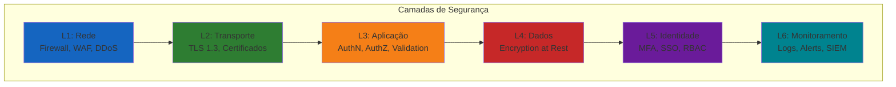

---

## 2. Zero Trust

### 2.1 Definição

Zero Trust é um modelo de segurança que opera sob o princípio "nunca confie, sempre verifique". Cada requisição, independentemente de origem, é tratada como não confiável até que a identidade seja verificada.

### 2.2 Pilares do Zero Trust

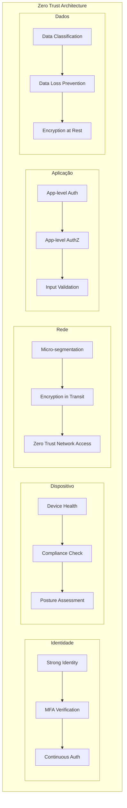

### 2.3 Implementação Zero Trust

| Componente | Implementação | Status |
|------------|---------------|--------|
| **Identidade** | JWT + API Key + Supabase Auth | ✅ Implementado |
| **MFA** | TOTP (Google Authenticator) | ⚠️ Pendente |
| **Dispositivo** | Device fingerprinting | ⚠️ Pendente |
| **Rede** | TLS everywhere + CORS | ✅ Implementado |
| **Micro-segmentation** | Tenant isolation + RLS | ✅ Implementado |
| **App Auth** | Middleware chain | ✅ Implementado |
| **App AuthZ** | RBAC + Tenant scoping | ⚠️ Parcial |
| **Data Encryption** | AES-256 at rest, TLS in transit | ⚠️ Parcial |
| **DLP** | Content scanning | ⚠️ Pendente |
| **Continuous Auth** | Token refresh + session validation | ✅ Implementado |

### 2.4 Princípios Zero Trust no Jarbas

| Princípio | Aplicação |
|-----------|-----------|
| Verify explicitly | Toda request valida JWT + tenant |
| Use least privilege | RBAC com permissões granulares |
| Assume breach | Logs completos, monitoring ativo |
| Micro-segmentation | Isolamento por tenant em DB |
| Encrypt everything | TLS + encryption at rest |
| Continuously monitor | Real-time analytics + alerts |

### 2.5 Fluxo Zero Trust

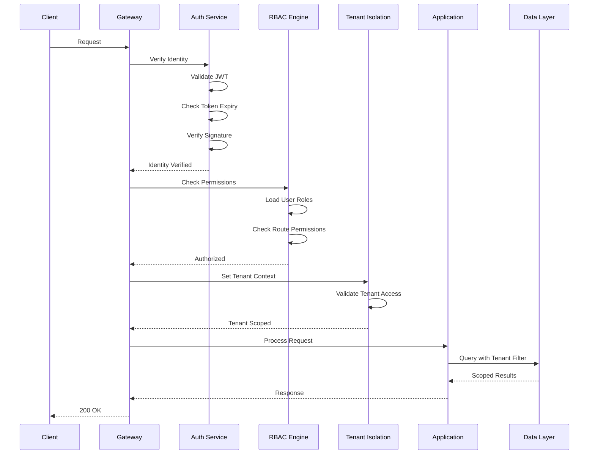

---

## 3. Controle de Acesso

### 3.1 RBAC (Role-Based Access Control)

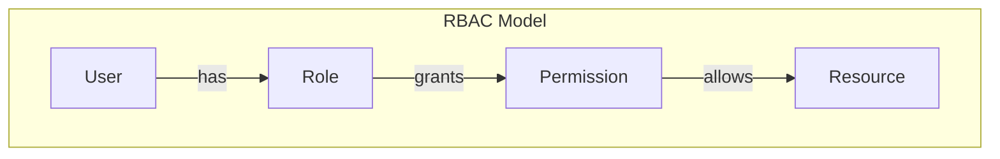

#### Roles Definidas

| Role | Descrição | Permissões |
|------|-----------|------------|
| `super_admin` | Administrador do sistema | Tudo |
| `admin` | Administrador do tenant | CRUD tenant, leitura global |
| `user` | Usuário padrão | CRUD próprio, leitura tenant |
| `viewer` | Somente leitura | Leitura apenas |
| `api` | Acesso via API key | Endpoints específicos |
| `agent` | Execução de agentes | Execução apenas |

#### Matriz de Permissões

| Recurso | super_admin | admin | user | viewer | api | agent |
|---------|-------------|-------|------|--------|-----|-------|
| users:read | ✅ | ✅ | ✅ | ✅ | ✅ | ❌ |
| users:write | ✅ | ✅ | ✅ | ❌ | ❌ | ❌ |
| users:delete | ✅ | ✅ | ❌ | ❌ | ❌ | ❌ |
| sessions:read | ✅ | ✅ | ✅ | ✅ | ✅ | ❌ |
| sessions:write | ✅ | ✅ | ✅ | ❌ | ✅ | ❌ |
| sessions:delete | ✅ | ✅ | ✅ | ❌ | ❌ | ❌ |
| messages:read | ✅ | ✅ | ✅ | ✅ | ✅ | ❌ |
| messages:write | ✅ | ✅ | ✅ | ❌ | ✅ | ❌ |
| agents:read | ✅ | ✅ | ✅ | ✅ | ✅ | ✅ |
| agents:write | ✅ | ✅ | ✅ | ❌ | ❌ | ❌ |
| agents:execute | ✅ | ✅ | ✅ | ❌ | ✅ | ✅ |
| analytics:read | ✅ | ✅ | ✅ | ✅ | ✅ | ❌ |
| costs:read | ✅ | ✅ | ✅ | ✅ | ✅ | ❌ |
| providers:read | ✅ | ✅ | ✅ | ✅ | ✅ | ❌ |
| providers:write | ✅ | ✅ | ❌ | ❌ | ❌ | ❌ |
| tenants:read | ✅ | ✅ | ❌ | ❌ | ❌ | ❌ |
| tenants:write | ✅ | ✅ | ❌ | ❌ | ❌ | ❌ |
| admin:all | ✅ | ❌ | ❌ | ❌ | ❌ | ❌ |

### 3.2 ABAC (Attribute-Based Access Control)

ABAC complementa RBAC com decisões baseadas em atributos.

#### Atributos Suportados

| Categoria | Atributos | Descrição |
|-----------|-----------|-----------|
| **Usuário** | user.id, user.role, user.tenant | Identidade e role |
| **Recurso** | resource.type, resource.owner | Tipo e proprietário |
| **Ação** | action.type, action.method | Tipo de operação |
| **Ambiente** | env.time, env.ip, env.device | Contexto da requisição |
| **Tenant** | tenant.id, tenant.plan, tenant.quota | Contexto do tenant |

#### Políticas ABAC

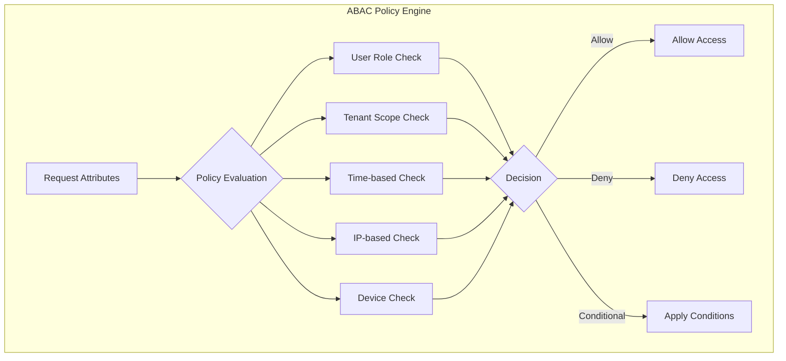

#### Exemplos de Políticas

| Política | Condição | Ação |
|----------|----------|------|
| `time_based` | Horário comercial (9-18) | Permitir |
| `ip_restricted` | IP whitelist do tenant | Permitir |
| `device_trusted` | Dispositivo registrado | Permitir |
| `quota_check` | Dentro da quota | Permitir |
| `high_risk` | Ação destrutiva | Requer MFA |

### 3.3 Hierarquia de Acesso

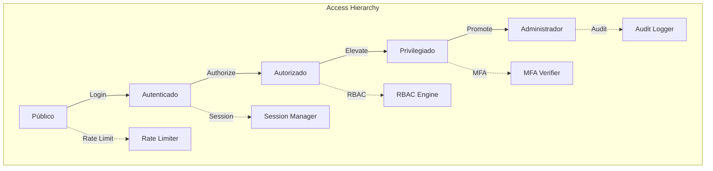

---

## 4. Autenticação

### 4.1 Métodos de Autenticação

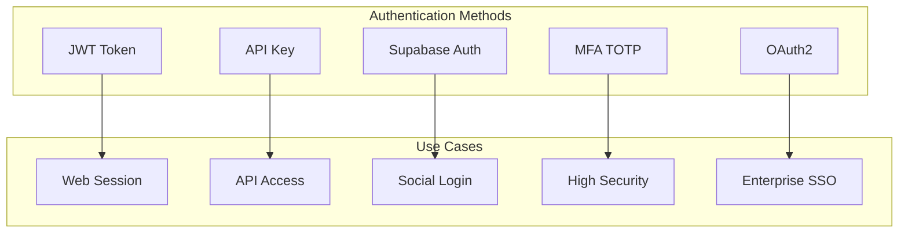

### 4.2 JWT (JSON Web Token)

#### Estrutura

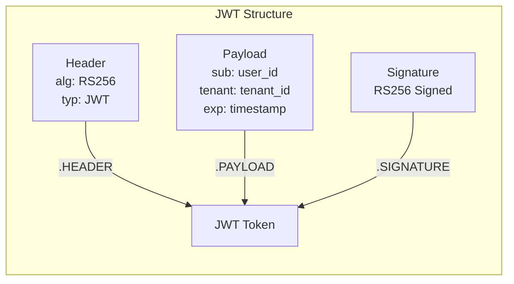

#### Configuração JWT

| Parâmetro | Valor | Descrição |
|-----------|-------|-----------|
| Algorithm | RS256 | RSA + SHA-256 |
| Expiry | 24h | Token de acesso |
| Refresh Expiry | 7d | Token de refresh |
| Issuer | jarbas-2.0 | Emissor |
| Audience | jarbas-api | Audiência |
| Clock Tolerance | 30s | Tolerância de relógio |

#### Claims do Token

| Claim | Tipo | Descrição |
|-------|------|-----------|
| `sub` | string | ID do usuário |
| `tenant` | string | ID do tenant |
| `role` | string | Role do usuário |
| `email` | string | Email do usuário |
| `iat` | number | Emitido em |
| `exp` | number | Expira em |
| `iss` | string | Emissor |
| `aud` | string | Audiência |
| `jti` | string | ID único do token |

### 4.3 API Key

#### Estrutura

```
jarb_live_[random_32_bytes_hex]
jarb_test_[random_32_bytes_hex]
```

#### Metadados da API Key

| Campo | Tipo | Descrição |
|-------|------|-----------|
| `id` | UUID | Identificador único |
| `key_hash` | string | Hash da chave (SHA-256) |
| `name` | string | Nome descritivo |
| `tenant_id` | UUID | Tenant associado |
| `user_id` | UUID | Usuário proprietário |
| `scopes` | string[] | Escopos permitidos |
| `expires_at` | timestamp | Data de expiração |
| `last_used_at` | timestamp | Último uso |
| `created_at` | timestamp | Criação |

### 4.4 Refresh Token Flow

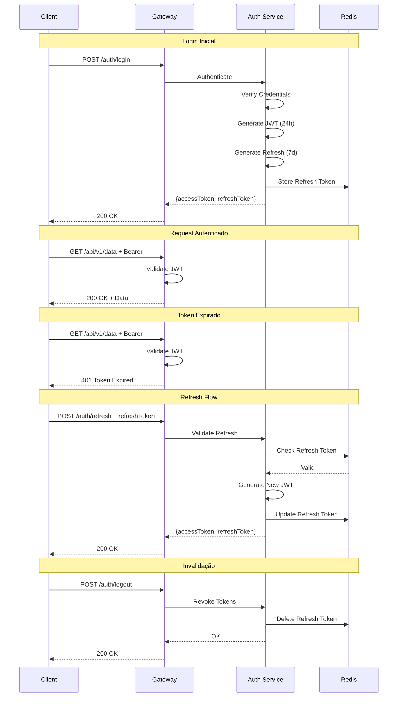

### 4.5 OAuth2

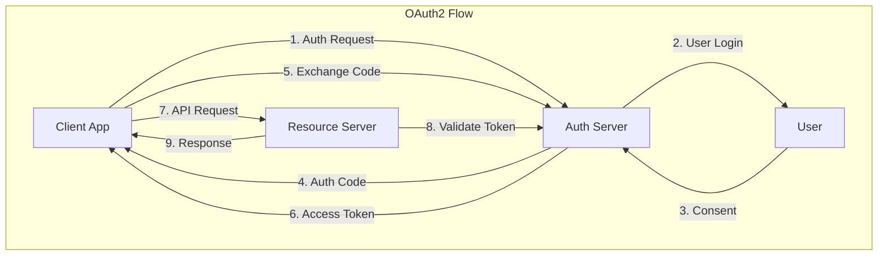

#### Providers Suportados

| Provider | Status | Escopos |
|----------|--------|---------|
| Google | ✅ | email, profile |
| GitHub | ✅ | user:email |
| Microsoft | ⚠️ Pendente | openid, email |
| Supabase | ✅ | email, profile |

### 4.6 MFA (Multi-Factor Authentication)

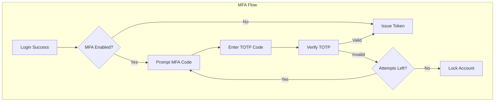

#### Configuração MFA

| Parâmetro | Valor |
|-----------|-------|
| Método | TOTP (RFC 6238) |
| Provider | Google Authenticator |
| Codes Backup | 10 códigos |
| Code Length | 6 dígitos |
| Window | ±1 intervalo |
| Max Attempts | 5 |
| Lockout Duration | 15 minutos |

### 4.7 Session Management

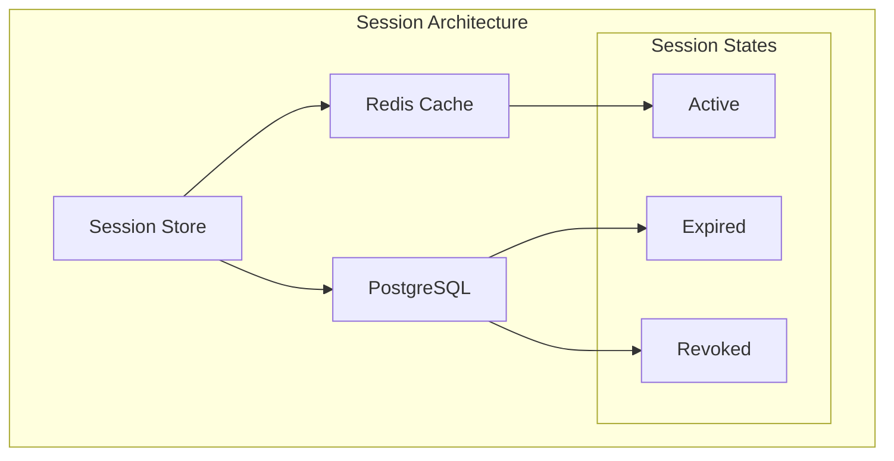

#### Configuração de Sessão

| Parâmetro | Valor |
|-----------|-------|
| Max Concurrent Sessions | 10 |
| Session Timeout | 24h |
| Idle Timeout | 30min |
| Absolute Timeout | 7d |
| Renewal Window | 1h |

---

## 5. Gerenciamento de Segredos

### 5.1 Hierarquia de Segredos

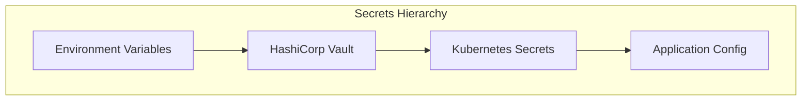

### 5.2 Classificação de Segredos

| Nível | Tipo | Exemplos | Acesso |
|-------|------|----------|--------|
| **Crítico** | Credenciais de DB | DATABASE_URL, passwords | Admin only |
| **Alto** | API Keys | AI provider keys | Service account |
| **Médio** | Tokens | JWT_SECRET | Application |
| **Baixo** | Configs | Non-sensitive config | Developer |

### 5.3 Vault (HashiCorp Vault)

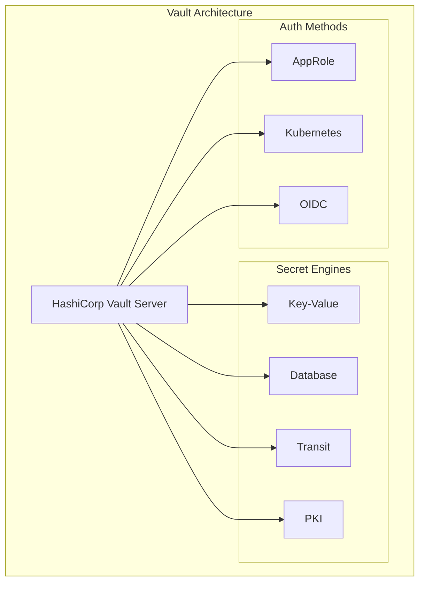

#### Vault Paths

| Path | Engine | Descrição |
|------|--------|-----------|
| `secret/jarbas/database` | KV | Credenciais de banco |
| `secret/jarbas/ai-providers` | KV | Chaves de API AI |
| `secret/jarbas/jwt` | Transit | Chaves JWT |
| `secret/jarbas/tls` | PKI | Certificados TLS |
| `database/jarbas/creds` | DB | Credenciais dinâmicas |

### 5.4 Kubernetes Secrets

```yaml
# kubernetes/secrets.yaml
apiVersion: v1
kind: Secret
metadata:
  name: jarbas-secrets
type: Opaque
data:
  DATABASE_URL: <base64>
  REDIS_URL: <base64>
  QDRANT_URL: <base64>
  JWT_SECRET: <base64>
  DEEPSEEK_API_KEY: <base64>
  OPENROUTER_API_KEY: <base64>
  NVIDIA_API_KEY: <base64>
  SUPABASE_URL: <base64>
  SUPABASE_ANON_KEY: <base64>
  SUPABASE_SERVICE_KEY: <base64>
```

### 5.5 Secrets Management Policy

| Regra | Descrição |
|-------|-----------|
| **No Code** | Secrets nunca no código fonte |
| **No Git** | Secrets nunca no repositório |
| **Rotation** | Rotação a cada 90 dias |
| **Audit** | Log de todo acesso a secrets |
| **Encryption** | Encryption at rest e in transit |
| **Access Control** | Acesso por necessidade |
| **Monitoring** | Alertas de acesso não autorizado |

### 5.6 Environment Variables

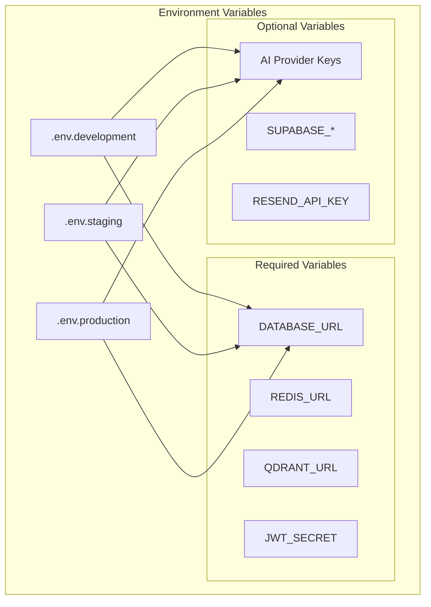

---

## 6. Criptografia

### 6.1 Algoritmos Utilizados

| Uso | Algoritmo | Tamanho | Status |
|-----|-----------|---------|--------|
| **At Rest** | AES-256-GCM | 256-bit | ✅ Implementado |
| **In Transit** | TLS 1.3 | 128/256-bit | ✅ Implementado |
| **JWT Signing** | RS256 | 2048-bit RSA | ✅ Implementado |
| **Password Hashing** | bcrypt | 12 rounds | ⚠️ Usando SHA-256 |
| **API Key Hash** | SHA-256 | 256-bit | ✅ Implementado |
| **Data Integrity** | HMAC-SHA256 | 256-bit | ✅ Implementado |

### 6.2 AES-256-GCM

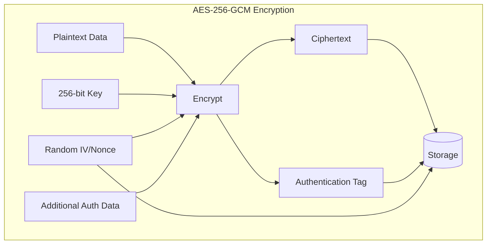

#### Configuração AES

| Parâmetro | Valor |
|-----------|-------|
| Algorithm | AES-256-GCM |
| Key Size | 256 bits |
| IV Size | 96 bits |
| Tag Size | 128 bits |
| AAD | Tenant ID + Resource ID |
| Key Rotation | A cada 90 dias |

### 6.3 TLS Configuration

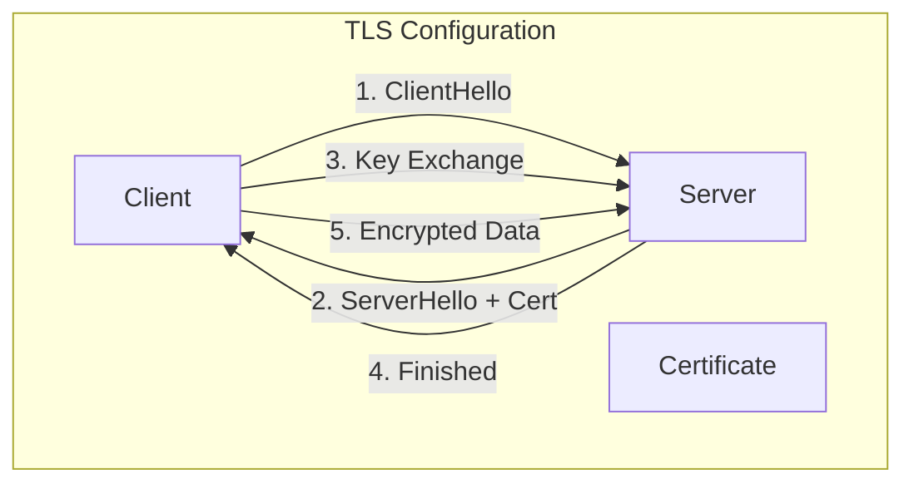

#### TLS Settings

| Parâmetro | Valor |
|-----------|-------|
| Protocol | TLS 1.3 |
| Ciphers | TLS_AES_256_GCM_SHA384 |
| | TLS_CHACHA20_POLY1305_SHA256 |
| | TLS_AES_128_GCM_SHA256 |
| HSTS | max-age=31536000; includeSubDomains |
| OCSP Stapling | Habilitado |
| Certificate | Let's Encrypt / Custom |

### 6.4 Password Hashing

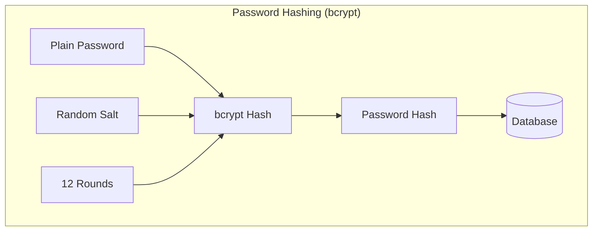

**⚠️ Estado Atual:** O sistema usa SHA-256, que NÃO é adequado para senhas. Deve ser migrado para bcrypt.

### 6.5 Key Management

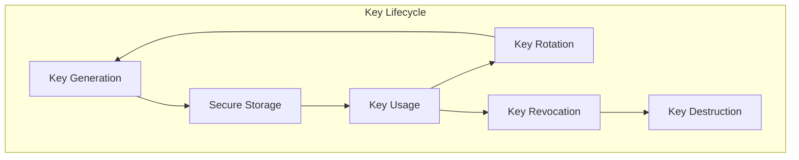

---

## 7. Rate Limiting

### 7.1 Estratégias de Rate Limiting

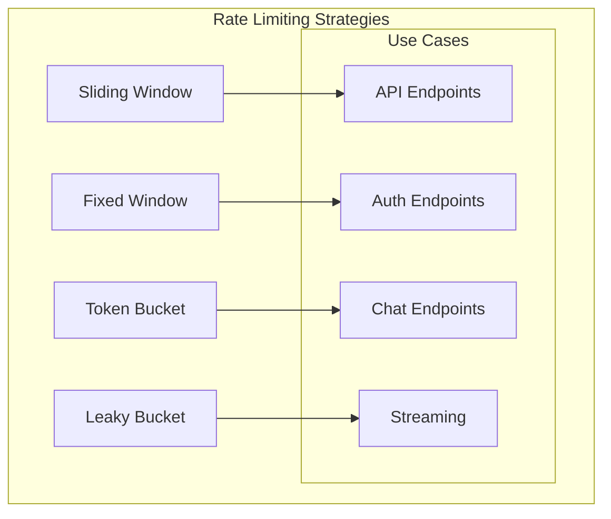

### 7.2 Limites por Endpoint

| Endpoint | Limite | Janela | Estratégia |
|----------|--------|--------|------------|
| `POST /auth/login` | 5 req | 1 min | Fixed Window |
| `POST /auth/register` | 3 req | 1 min | Fixed Window |
| `POST /auth/refresh` | 10 req | 1 min | Sliding Window |
| `GET /api/v1/*` | 100 req | 1 min | Sliding Window |
| `POST /api/v1/chat` | 60 req | 1 min | Token Bucket |
| `POST /api/v1/chat/stream` | 30 req | 1 min | Token Bucket |
| `POST /api/v1/agents/:id/execute` | 10 req | 1 min | Fixed Window |
| `GET /api/v1/memory/search` | 50 req | 1 min | Sliding Window |

### 7.3 Rate Limit por Tier

| Tier | Requests/min | Tokens/min | Concurrency |
|------|-------------|------------|-------------|
| Free | 10 | 10,000 | 2 |
| Pro | 100 | 100,000 | 10 |
| Enterprise | 1,000 | 1,000,000 | 50 |
| Unlimited | ∞ | ∞ | ∞ |

### 7.4 Implementação

```mermaid
sequenceDiagram
    participant C as Client
    participant GW as Gateway
    participant RL as Rate Limiter
    participant REDIS as Redis

    C->>GW: Request

    GW->>RL: Check Rate Limit
    RL->>RL: Generate Key (tenant:ip:endpoint)
    RL->>REDIS: GET key
    REDIS-->>RL: Current Count

    alt Within Limit
        RL->>REDIS: INCR key
        RL->>REDIS: EXPIRE key
        RL-->>GW: Allow
        GW->>GW: Process Request
        GW-->>C: Response
    else Exceeded Limit
        RL->>REDIS: TTL key
        RL-->>GW: Reject (429)
        GW-->>C: 429 Too Many Requests
    end
```

### 7.5 Headers de Rate Limit

| Header | Descrição |
|--------|-----------|
| `X-RateLimit-Limit` | Limite máximo |
| `X-RateLimit-Remaining` | Requests restantes |
| `X-RateLimit-Reset` | Timestamp do reset |
| `Retry-After` | Seconds until retry |

---

## 8. Auditoria e Logs

### 8.1 Tipos de Log

```mermaid
graph TB
    subgraph "Logging Architecture"
        ACCESS[Access Logs]
        APPLICATION[Application Logs]
        SECURITY[Security Logs]
        AUDIT[Audit Logs]
        ERROR[Error Logs]

        ACCESS --> REQUEST[HTTP Requests]
        ACCESS --> RESPONSE[HTTP Responses]

        APPLICATION --> BUSINESS[Business Logic]
        APPLICATION --> PERFORMANCE[Performance]

        SECURITY --> AUTH_LOG[Auth Events]
        SECURITY --> AUTHZ_LOG[AuthZ Events]

        AUDIT --> DATA_ACCESS[Data Access]
        AUDIT --> CONFIG_CHANGE[Config Changes]

        ERROR --> SYSTEM[System Errors]
        ERROR --> APPLICATION_ERR[App Errors]
    end
```

### 8.2 Eventos de Auditoria

| Evento | Severidade | Descrição |
|--------|------------|-----------|
| `auth.login.success` | INFO | Login bem-sucedido |
| `auth.login.failed` | WARN | Tentativa de login falhou |
| `auth.logout` | INFO | Logout realizado |
| `auth.token.refresh` | INFO | Token renovado |
| `auth.token.revoke` | INFO | Token revogado |
| `authz.denied` | WARN | Acesso negado |
| `user.created` | INFO | Usuário criado |
| `user.updated` | INFO | Usuário atualizado |
| `user.deleted` | CRIT | Usuário deletado |
| `tenant.created` | INFO | Tenant criado |
| `tenant.updated` | INFO | Tenant atualizado |
| `data.export` | WARN | Dados exportados |
| `data.delete` | CRIT | Dados deletados |
| `config.change` | WARN | Configuração alterada |
| `secret.access` | WARN | Segredo acessado |
| `api.key.create` | INFO | API key criada |
| `api.key.revoke` | INFO | API key revogada |

### 8.3 Estrutura de Log

```json
{
  "timestamp": "2026-07-12T10:30:00.000Z",
  "level": "INFO",
  "service": "api-gateway",
  "event": "auth.login.success",
  "userId": "user-123",
  "tenantId": "tenant-456",
  "ip": "192.168.1.100",
  "userAgent": "Mozilla/5.0...",
  "requestId": "req-789",
  "metadata": {
    "method": "POST",
    "path": "/auth/login",
    "duration": 45
  }
}
```

### 8.4 SIEM Integration

```mermaid
graph TB
    subgraph "SIEM Pipeline"
        APP[Application]
        COLLECT[Log Collector]
        NORMALIZE[Normalizer]
        ENRICH[Enricher]
        STORE[SIEM Storage]
        ANALYZE[Analyzer]
        ALERT[Alert Engine]

        APP --> COLLECT
        COLLECT --> NORMALIZE
        NORMALIZE --> ENRICH
        ENRICH --> STORE
        STORE --> ANALYZE
        ANALYZE --> ALERT
        ALERT --> NOTIFICATION[Notifications]
    end
```

### 8.5 Retenção de Logs

| Tipo | Retenção | Armazenamento |
|------|----------|---------------|
| Access Logs | 30 dias | Hot (Redis) |
| Application Logs | 90 dias | Warm (PostgreSQL) |
| Security Logs | 1 ano | Cold (S3) |
| Audit Logs | 5 anos | Archive (Glacier) |
| Error Logs | 1 ano | Warm (PostgreSQL) |

### 8.6 Monitoring e Alerting

```mermaid
graph TB
    subgraph "Monitoring Stack"
        APP[Application]
        PROM[Prometheus]
        GRAF[Grafana]
        ALERT[Alert Manager]

        APP --> METRICS[Metrics]
        METRICS --> PROM
        PROM --> GRAF
        PROM --> ALERT

        ALERT --> SLACK[Slack]
        ALERT --> EMAIL[Email]
        ALERT --> PAGERDUTY[PagerDuty]
    end
```

---

## 9. Segurança de IA

### 9.1 Threats de IA

```mermaid
graph TB
    subgraph "AI Security Threats"
        PI[Prompt Injection]
        JB[Jailbreak]
        EX[Data Exfiltration]
        HALLUCINATION[Hallucination]
        POISONING[Model Poisoning]
        THEFT[Model Theft]

        subgraph "Mitigations"
            M1[Input Validation]
            M2[Output Filtering]
            M3[Content Moderation]
            M4[Rate Limiting]
            M5[Audit Logging]
        end

        PI --> M1
        JB --> M2
        EX --> M3
        HALLUCINATION --> M4
        POISONING --> M5
    end
```

### 9.2 Prompt Injection

#### Definição

Prompt injection é um ataque onde o adversário insere texto malicioso que faz o modelo ignorar instruções anteriores.

#### Vetores de Ataque

| Vetor | Descrição | Risco |
|-------|-----------|-------|
| **Direct Injection** | Instrução direta para ignorar system prompt | Alto |
| **Indirect Injection** | Instrução em conteúdo externo | Alto |
| **Jailbreak** | Técnicas para bypass de segurança | Médio |
| **Data Extraction** | Extrair dados sensíveis | Crítico |

#### Mitigações

```mermaid
graph TB
    subgraph "Prompt Injection Defenses"
        INPUT[User Input]
        VALIDATE[Input Validation]
        SANITIZE[Sanitize Content]
        ISOLATE[Isolate Context]
        MONITOR[Monitor Output]

        INPUT --> VALIDATE
        VALIDATE --> SANITIZE
        SANITIZE --> ISOLATE
        ISOLATE --> MONITOR
        MONITOR --> OUTPUT[Safe Output]

        VALIDATE --> BLOCK_BLOCKED[Malicious Patterns]
        SANITIZE --> REMOVE[Remove Injection]
        ISOLATE --> SYSTEM[System Prompt Protected]
        MONITOR --> FILTER[Filter Sensitive Data]
    end
```

#### Regras de Proteção

| # | Regra | Implementação |
|---|-------|---------------|
| R1 | Separar system prompt de user input | Context isolation |
| R2 | Validar padrões suspeitos | Regex patterns |
| R3 | Filtrar conteúdo malicioso | Content filter |
| R4 | Monitorar respostas | Output validation |
| R5 | Rate limiting por usuário | Token bucket |
| R6 | Log de tentativas | Audit logging |

### 9.3 Jailbreak

#### Técnicas Conhecidas

| Técnica | Descrição | Status |
|---------|-----------|--------|
| **DAN** | "Do Anything Now" | ⚠️ Detectado |
| **Roleplay** | Simular personagem | ⚠️ Detectado |
| **Encoding** | Usar base64/rot13 | ⚠️ Detectado |
| **Translation** | Traduzir para outro idioma | ⚠️ Parcial |
| **Multi-turn** | Conversa gradual | ⚠️ Difícil detectar |

#### Defesas

```mermaid
graph TB
    subgraph "Jailbreak Defense"
        MONITOR[Monitor Conversations]
        DETECT[Detect Patterns]
        BLOCK[Block Attempts]
        EDUCATE[Educate Users]
        REPORT[Report Incidents]

        MONITOR --> DETECT
        DETECT --> BLOCK
        DETECT --> EDUCATE
        BLOCK --> REPORT
    end
```

### 9.4 Content Moderation

```mermaid
graph TB
    subgraph "Content Moderation Pipeline"
        INPUT[User Input]
        FILTER1[Toxicity Filter]
        FILTER2[Hate Speech Filter]
        FILTER3[PII Filter]
        FILTER4[Custom Policy Filter]

        INPUT --> FILTER1
        FILTER1 --> FILTER2
        FILTER2 --> FILTER3
        FILTER3 --> FILTER4
        FILTER4 --> ALLOW{Allowed?}

        ALLOW -->|Yes| PROCESS[Process]
        ALLOW -->|No| REJECT[Reject]
        ALLOW -->|Review| HUMAN[Human Review]
    end
```

---

## 10. Sandbox

### 10.1 Sandboxing de Código

```mermaid
graph TB
    subgraph "Code Sandbox Architecture"
        REQUEST[Code Execution Request]
        VALIDATE[Validate Code]
        SANDBOX[Sandbox Environment]
        EXECUTE[Execute Code]
        COLLECT[Collect Results]
        CLEANUP[Cleanup]

        REQUEST --> VALIDATE
        VALIDATE --> SANDBOX
        SANDBOX --> EXECUTE
        EXECUTE --> COLLECT
        COLLECT --> CLEANUP
        CLEANUP --> OUTPUT[Safe Output]
    end
```

### 10.2 Configuração de Sandbox

| Parâmetro | Valor | Descrição |
|-----------|-------|-----------|
| **Timeout** | 30s | Máximo de execução |
| **Memory Limit** | 256MB | Limite de memória |
| **CPU Limit** | 0.5 cores | Limite de CPU |
| **Network** | None | Sem acesso à rede |
| **Filesystem** | Read-only + tmpfs | Apenas leitura |
| **Processes** | 10 | Máximo de processos |
| **Syscalls** | Whitelist | Chamadas permitidas |

### 10.3 Container Isolation

```mermaid
graph TB
    subgraph "Container Isolation"
        HOST[Host System]

        subgraph "Container"
            NAMESPACE[Linux Namespace]
            CGROUP[cgroup Limits]
            CAPABILITIES[Dropped Capabilities]
            SECCOMP[Seccomp Profile]
            APPARMOR[AppArmor Profile]
        end

        HOST --> NAMESPACE
        HOST --> CGROUP
        HOST --> CAPABILITIES
        HOST --> SECCOMP
        HOST --> APPARMOR
    end
```

### 10.4 Sandboxed Operations

| Operação | Sandbox | Restrições |
|----------|---------|------------|
| Code Execution | Container | Timeout, memory, network |
| File Operations | Chroot | Read-only filesystem |
| API Calls | Proxy | Whitelist only |
| Database Queries | Transaction | Read-only replica |
| External URLs | Allowlist | Known domains only |

---

## 11. LGPD - Proteção de Dados

### 11.1 Princípios LGPD

| Princípio | Implementação |
|-----------|---------------|
| **Finalidade** | Dados coletados para finalidades específicas |
| **Adequação** | Compatível com finalidade declarada |
| **Necessidade** | Apenas dados necessários |
| **Livre acesso** | Usuário pode acessar seus dados |
| **Qualidade** | Dados precisos e atualizados |
| **Transparência** | Política clara e acessível |
| **Segurança** | Medidas técnicas e administrativas |
| **Prevenção** | Evitar danos |
| **Não discriminação** | Sem tratamento discriminatório |
| **Responsabilização** | Controlador responsável |

### 11.2 Direitos do Titular

| Direito | Implementação | Endpoint |
|---------|---------------|----------|
| **Acesso** | Exportar dados pessoais | `GET /api/v1/user/data` |
| **Correção** | Atualizar dados | `PUT /api/v1/user/profile` |
| **Anonimização** | Anonimizar dados | `POST /api/v1/user/anonymize` |
| **Portabilidade** | Exportar em formato aberto | `GET /api/v1/user/export` |
| **Eliminação** | Deletar conta e dados | `DELETE /api/v1/user/account` |
| **Informação** | Saber como dados são usados | `GET /api/v1/user/privacy` |
| **Revogação** | Revogar consentimento | `POST /api/v1/user/consent` |

### 11.3 Fluxo de Consentimento

```mermaid
sequenceDiagram
    participant U as User
    participant GW as Gateway
    participant AUTH as Auth Service
    participant DB as Database

    U->>GW: Register Account
    GW->>AUTH: Create User
    AUTH->>DB: Store User

    AUTH->>GW: Request Consent
    GW->>U: Privacy Policy + Consent

    U->>GW: Accept Consent
    GW->>AUTH: Record Consent
    AUTH->>DB: Store Consent

    Note over U,DB: Data Processing

    U->>GW: Request Data Export
    GW->>AUTH: Process Export
    AUTH->>DB: Query User Data
    AUTH-->>GW: Data Package
    GW-->>U: JSON/CSV Export

    U->>GW: Request Deletion
    GW->>AUTH: Process Deletion
    AUTH->>DB: Anonymize/Delete Data
    AUTH-->>GW: Confirmation
    GW-->>U: Account Deleted
```

### 11.4 Dados Pessoais

| Categoria | Dados | Base Legal |
|-----------|-------|------------|
| **Identificação** | Nome, email, telefone | Consentimento |
| **Autenticação** | Senha hash, MFA secrets | Obrigação legal |
| **Uso** | Logs de acesso, preferências | Legítimo interesse |
| **Pagamento** | Dados de faturamento | Obrigação contratual |
| ** Conteúdo** | Mensagens, documentos | Consentimento |

### 11.5 Data Processing Agreement

```mermaid
graph TB
    subgraph "DPA Framework"
        CONTROLLER[Data Controller<br/>Jarbas]
        PROCESSOR[Data Processor<br/>Supabase, etc.]
        SUB[Sub-processor<br/>AI Providers]

        CONTROLLER -->|DPA| PROCESSOR
        PROCESSOR -->|DPA| SUB

        subgraph "Obligations"
            O1[Process only on instruction]
            O2[Ensure confidentiality]
            O3[Implement security measures]
            O4[Assist with data subject rights]
            O5[Delete/return data]
        end

        CONTROLLER -.-> O1
        PROCESSOR -.-> O2
        SUB -.-> O3
    end
```

### 11.6 Transferência Internacional

| Destino | Mecanismo | Status |
|---------|-----------|--------|
| **UE** | adequação | ✅ |
| **EUA** | SCCs + supplementary measures | ⚠️ |
| **Outros** | Binding Corporate Rules | ⚠️ |

---

## 12. Compliance

### 12.1 ISO 27001

```mermaid
graph TB
    subgraph "ISO 27001 Controls"
        subgraph "Organizational"
            ORG1[ISMS Policy]
            ORG2[Risk Assessment]
            ORG3[Statement of Applicability]
        end

        subgraph "People"
            P1[Security Awareness]
            P2[Confidentiality Agreements]
            P3[Remote Working]
        end

        subgraph "Physical"
            PHY1[Equipment Security]
            PHY2[Secure Disposal]
        end

        subgraph "Technological"
            T1[Access Control]
            T2[Cryptography]
            T3[Operations Security]
            T4[Network Security]
            T5[Development Security]
        end

        ORG1 --> T1
        ORG2 --> T2
        ORG3 --> T3
        P1 --> T4
        P2 --> T5
    end
```

#### Controles Implementados

| Controle | ISO 27001 | Status |
|----------|-----------|--------|
| A.5.1 | Policies for information security | ✅ |
| A.6.1 | Screening | ⚠️ |
| A.7.1 | Equipment security | ✅ |
| A.8.1 | User endpoint devices | ✅ |
| A.8.2 | Privileged access rights | ✅ |
| A.8.3 | Information access restriction | ✅ |
| A.8.4 | Access to source code | ✅ |
| A.8.5 | Secure authentication | ✅ |
| A.8.6 | Capacity management | ✅ |
| A.8.7 | Protection against malware | ✅ |
| A.8.8 | Management of technical vulnerabilities | ⚠️ |
| A.8.9 | Configuration management | ✅ |
| A.8.10 | Information deletion | ✅ |
| A.8.11 | Data masking | ⚠️ |
| A.8.12 | Data leakage prevention | ⚠️ |
| A.8.13 | Information backup | ⚠️ |
| A.8.14 | Redundancy of information processing facilities | ⚠️ |
| A.8.15 | Logging | ✅ |
| A.8.16 | Monitoring activities | ✅ |
| A.8.17 | Clock synchronization | ✅ |
| A.8.18 | Use of privileged utility programs | ✅ |
| A.8.19 | Installation of software on operational systems | ✅ |
| A.8.20 | Networks security | ✅ |
| A.8.21 | Security of network services | ✅ |
| A.8.22 | Segregation of networks | ✅ |
| A.8.23 | Web filtering | ⚠️ |
| A.8.24 | Use of cryptography | ✅ |
| A.8.25 | Secure development life cycle | ✅ |
| A.8.26 | Application security requirements | ✅ |
| A.8.27 | Secure system architecture | ✅ |
| A.8.28 | Secure coding | ✅ |
| A.8.29 | Security testing in development | ⚠️ |
| A.8.30 | Outsourced development | N/A |
| A.8.31 | Separation of development, test and production environments | ✅ |
| A.8.32 | Change management | ⚠️ |
| A.8.33 | Test information | ✅ |
| A.8.34 | Protection of information systems during audit testing | ✅ |

### 12.2 NIST Cybersecurity Framework

```mermaid
graph TB
    subgraph "NIST CSF"
        IDENTIFY[Identify]
        PROTECT[Protect]
        DETECT[Detect]
        RESPOND[Respond]
        RECOVER[Recover]

        IDENTIFY --> PROTECT
        PROTECT --> DETECT
        DETECT --> RESPOND
        RESPOND --> RECOVER
        RECOVER --> IDENTIFY

        subgraph "Identify"
            I1[Asset Management]
            I2[Risk Assessment]
        end

        subgraph "Protect"
            P1[Access Control]
            P2[Data Security]
            P3[Maintenance]
        end

        subgraph "Detect"
            D1[Anomalies]
            D2[Security Events]
        end

        subgraph "Respond"
            R1[Response Planning]
            R2[Mitigation]
        end

        subgraph "Recover"
            RC1[Recovery Planning]
            RC2[Improvements]
        end
    end
```

#### Mapeamento NIST → Jarbas

| Função | Categoria | Implementação |
|--------|-----------|---------------|
| **Identify** | Asset Management | Inventory de componentes |
| **Identify** | Risk Assessment | Threat modeling |
| **Protect** | Access Control | RBAC + Zero Trust |
| **Protect** | Data Security | Encryption at rest/transit |
| **Protect** | Maintenance | Patches regulares |
| **Detect** | Anomalies | Rate limiting + monitoring |
| **Detect** | Security Events | Audit logging |
| **Respond** | Response Planning | Incident response plan |
| **Respond** | Mitigation | Containment procedures |
| **Recover** | Recovery Planning | Backup + DR plan |
| **Recover** | Improvements | Post-incident review |

### 12.3 OWASP Top 10

| # | Vulnerability | Mitigation | Status |
|---|---------------|------------|--------|
| A01 | Broken Access Control | RBAC + ABAC + RLS | ✅ |
| A02 | Cryptographic Failures | AES-256 + TLS 1.3 | ✅ |
| A03 | Injection | Input validation (Zod) | ✅ |
| A04 | Insecure Design | Threat modeling | ⚠️ |
| A05 | Security Misconfiguration | Hardened defaults | ✅ |
| A06 | Vulnerable Components | Dependency scanning | ⚠️ |
| A07 | Auth Failures | MFA + rate limiting | ⚠️ |
| A08 | Data Integrity Failures | Checksums + validation | ✅ |
| A09 | Logging Failures | Comprehensive logging | ✅ |
| A10 | SSRF | URL validation + allowlist | ✅ |

---

## 13. Threat Model

### 13.1 Asset Inventory

| Asset | Classificação | Ameaças |
|-------|---------------|---------|
| **User Data** | Confidencial | Acesso não autorizado, vazamento |
| **API Keys** | Restrito | Roubo, uso indevido |
| **Database** | Confidencial | SQL injection, backup leak |
| **AI Models** | Interno | Prompt injection, jailbreak |
| **Source Code** | Confidencial | Vazamento, backdoor |
| **Infrastructure** | Alto | DDoS, configuração incorreta |

### 13.2 Threat Agents

| Agent | Motivação | Capacidade | Ameaças |
|-------|-----------|------------|---------|
| **Attacker Externo** | Lucro, hacktivismo | Alta | SQL injection, XSS, DDoS |
| **Malicious User** | Abuso, fraude | Média | Prompt injection, quota abuse |
| **Insider Threat** | Lucro, vingança | Alta | Dados, backdoor |
| **Competitor** | Espionagem | Alta | Engenharia reversa |

### 13.3 STRIDE Analysis

| Ameaça | Descrição | Mitigação |
|--------|-----------|-----------|
| **Spoofing** | Falsificar identidade | MFA, JWT validation |
| **Tampering** | Modificar dados | Integrity checks, encryption |
| **Repudiation** | Negação de ações | Audit logging |
| **Information Disclosure** | Vazamento de dados | Encryption, access control |
| **Denial of Service** | Indisponibilidade | Rate limiting, DDoS protection |
| **Elevation of Privilege** | Escalação de privilégio | RBAC, least privilege |

### 13.4 Data Flow Diagram

```mermaid
graph TB
    subgraph "Trust Boundaries"
        TB1[External Network]
        TB2[DMZ]
        TB3[Internal Network]
        TB4[Data Zone]
    end

    subgraph "Data Flows"
        DF1[User Request] --> DF2[Gateway]
        DF2 --> DF3[Auth]
        DF3 --> DF4[Application]
        DF4 --> DF5[Database]
    end

    TB1 -.->|TLS| TB2
    TB2 -.->|Auth| TB3
    TB3 -.->|RLS| TB4
```

---

## 14. OWASP Top 10 (Detalhado)

### A01:2021 - Broken Access Control

```mermaid
graph TB
    subgraph "Access Control Defense"
        AUTH[Authentication]
        AUTHZ[Authorization]
        RLS[Row Level Security]
        AUDIT[Audit Logging]

        AUTH -->|Verify Identity| AUTHZ
        AUTHZ -->|Check Permissions| RLS
        RLS -->|Filter Data| AUDIT
        AUDIT -->|Log Access| STORE[(Log Store)]
    end
```

**Mitigações Específicas:**

| Medida | Implementação |
|--------|---------------|
| Deny by default | Todas as rotas requerem auth |
| CORS configuration | Whitelist de origins |
| IDOR protection | Tenant scoping em queries |
| JWT validation | Signature + expiry check |
| Rate limiting | Prevenir brute force |

### A02:2021 - Cryptographic Failures

| Dado | Encryption | Key Management |
|------|------------|----------------|
| Passwords | bcrypt (12 rounds) | N/A |
| PII | AES-256-GCM | Vault |
| API Keys | SHA-256 (hash) | Environment |
| Sessions | JWT (RS256) | Vault |
| Backups | AES-256 | Vault |
| TLS | TLS 1.3 | Let's Encrypt |

### A03:2021 - Injection

```mermaid
graph TB
    subgraph "Injection Defense"
        INPUT[User Input]

        INPUT --> VALIDATE[Zod Schema]
        VALIDATE --> SANITIZE[Sanitize]
        SANITIZE --> PARAMETERIZE[Parameterized Query]
        PARAMETERIZE --> EXECUTE[Safe Execution]

        VALIDATE -->|Invalid| REJECT[Reject 400]
        SANITIZE -->|XSS| ESCAPE[HTML Escape]
        PARAMETERIZE -->|SQL| PREPARE[Prepared Statement]
    end
```

### A04:2021 - Insecure Design

| Princípio | Implementação |
|-----------|---------------|
| Threat modeling | STRIDE analysis |
| Secure patterns | Defense in depth |
| Defense in depth | Múltiplas camadas |
| Resource modeling | Rate limiting per resource |

### A05:2021 - Security Misconfiguration

| Configuração | Valor Seguro |
|--------------|--------------|
| Debug mode | `false` em produção |
| Default credentials | Removidas |
| Error messages | Genéricas (sem stack trace) |
| Headers de segurança | Habilitados |
| TLS | 1.3 obrigatório |
| CORS | Whitelist |

### A06:2021 - Vulnerable and Outdated Components

| Medida | Implementação |
|--------|---------------|
| Dependency scanning | Dependabot / Snyk |
| Version pinning | lockfile |
| Regular updates | Weekly review |
| CVE monitoring | Alertas automáticos |

### A07:2021 - Identification and Authentication Failures

| Controle | Status |
|----------|--------|
| Multi-factor auth | ⚠️ Pendente |
| Password policy | ⚠️ Pendente |
| Session management | ✅ Implementado |
| Rate limiting | ✅ Implementado |
| Credential stuffing defense | ✅ Implementado |

### A08:2021 - Software and Data Integrity Failures

| Medida | Implementação |
|--------|---------------|
| Input validation | Zod schemas |
| Signed packages | pnpm lockfile |
| CI/CD integrity | Signed commits |
| Checksums | SHA-256 |

### A09:2021 - Security Logging and Monitoring Failures

| Log Type | Coverage |
|----------|----------|
| Auth events | ✅ 100% |
| Access control | ✅ 100% |
| Input validation | ✅ 100% |
| Data changes | ⚠️ Parcial |
| System errors | ✅ 100% |

### A10:2021 - Server-Side Request Forgery (SSRF)

| Medida | Implementação |
|--------|---------------|
| URL validation | Whitelist |
| Network segmentation | Isolation |
| Disable redirects | Config |
| Response filtering | Proxy |

---

## 15. Backup e Recovery

### 15.1 Estratégia de Backup

```mermaid
graph TB
    subgraph "Backup Strategy"
        FULL[Full Backup<br/>Semanal]
        INCR[Incremental<br/>Diário]
        WAL[WAL Archiving<br/>Contínuo]

        FULL --> STORE_FULL[(Backup Full)]
        INCR --> STORE_INCR[(Backup Incremental)]
        WAL --> STORE_WAL[(WAL Archive)]
    end
```

### 15.2 Cronograma de Backup

| Tipo | Frequência | Retenção | Armazenamento |
|------|------------|----------|---------------|
| Full Database | Domingo 02:00 | 30 dias | S3 + Local |
| Incremental | Diário 02:00 | 7 dias | S3 |
| WAL Archive | Contínuo | 7 dias | S3 |
| Redis Snapshot | A cada hora | 24 horas | S3 |
| Qdrant Snapshot | Diário 03:00 | 14 dias | S3 |
| Config Backup | A cada mudança | Indefinido | Git |

### 15.3 Recovery Procedures

```mermaid
graph TB
    subgraph "Recovery Flow"
        INCIDENT[Incident Detected]
        ASSESS[Assess Damage]
        DECIDE{Recovery Type}

        INCIDENT --> ASSESS
        ASSESS --> DECIDE

        DECIDE -->|Point-in-Time| PITR[Point-in-Time Recovery]
        DECIDE -->|Full Restore| FULL_RESTORE[Full Restore]
        DECIDE -->|Partial| PARTIAL[Partial Recovery]

        PITR --> RESTORE[Restore from WAL]
        FULL_RESTORE --> RESTORE_FULL[Restore Full + WAL]
        PARTIAL --> RESTORE_TABLE[Restore Specific Tables]

        RESTORE --> VERIFY[Verify Data]
        RESTORE_FULL --> VERIFY
        RESTORE_TABLE --> VERIFY

        VERIFY --> DONE[Recovery Complete]
    end
```

### 15.4 RTO e RPO

| Métrica | Target | Descrição |
|---------|--------|-----------|
| **RPO** (Recovery Point Objective) | 1 hora | Máximo de dados perdidos |
| **RTO** (Recovery Time Objective) | 4 horas | Tempo para restaurar |
| **MTTR** (Mean Time To Repair) | 2 horas | Tempo médio de reparo |
| **MTBF** (Mean Time Between Failures) | 30 dias | Intervalo entre falhas |

### 15.5 Disaster Recovery

```mermaid
graph TB
    subgraph "Disaster Recovery Tiers"
        TIER1[Tier 1: Critical<br/>RTO: 1h, RPO: 15min]
        TIER2[Tier 2: Important<br/>RTO: 4h, RPO: 1h]
        TIER3[Tier 3: Normal<br/>RTO: 24h, RPO: 24h]

        subgraph "Tier 1 Components"
            DB[PostgreSQL]
            AUTH_SVC[Auth Service]
            API[API Gateway]
        end

        subgraph "Tier 2 Components"
            REDIS_SVC[Redis]
            QDRANT_SVC[Qdrant]
        end

        subgraph "Tier 3 Components"
            LOGS[Logs]
            ANALYTICS[Analytics]
        end

        TIER1 --> DB
        TIER1 --> AUTH_SVC
        TIER1 --> API
        TIER2 --> REDIS_SVC
        TIER2 --> QDRANT_SVC
        TIER3 --> LOGS
        TIER3 --> ANALYTICS
    end
```

### 15.6 Backup Testing

| Teste | Frequência | Responsável |
|-------|------------|-------------|
| Restore Test | Mensal | DBA |
| Full DR Test | Trimestral | SRE |
| Chaos Engineering | Semanal | DevOps |
| Backup Integrity | Diário | Automated |

---

## 16. Incident Response

### 16.1 Classificação de Incidentes

| Severidade | Descrição | Response Time |
|------------|-----------|---------------|
| **P0 - Crítico** | Dados expostos, sistema down | 15 minutos |
| **P1 - Alto** | Funcionalidade comprometida | 1 hora |
| **P2 - Médio** | Degradção de performance | 4 horas |
| **P3 - Baixo** | Issue não-urgente | 24 horas |

### 16.2 Fluxo de Resposta

```mermaid
sequenceDiagram
    participant DETECT as Detection
    participant TRIAGE as Triage
    participant CONTAIN as Containment
    participant ERADICATE as Eradication
    participant RECOVER as Recovery
    participant LESSONS as Lessons Learned

    DETECT->>TRIAGE: Incident Detected
    TRIAGE->>TRIAGE: Classify Severity
    TRIAGE->>CONTAIN: Escalate

    CONTAIN->>CONTAIN: Isolate Affected Systems
    CONTAIN->>CONTAIN: Preserve Evidence
    CONTAIN->>ERADICATE: Contained

    ERADICATE->>ERADICATE: Remove Threat
    ERADICATE->>ERADICATE: Patch Vulnerability
    ERADICATE->>RECOVER: Eradicated

    RECOVER->>RECOVER: Restore Systems
    RECOVER->>RECOVER: Verify Integrity
    RECOVER->>LESSONS: Recovered

    LESSONS->>LESSONS: Post-mortem
    LESSONS->>LESSONS: Update Procedures
```

### 16.3 Playbooks

| Playbook | Trigger | Steps |
|----------|---------|-------|
| **Data Breach** | Dados expostos | Contain → Notify → Investigate → Report |
| **DDoS Attack** | Tráfego anormal | Mitigate → Scale → Monitor → Recover |
| **Unauthorized Access** | Login suspeito | Block → Investigate → Reset → Monitor |
| **Ransomware** | Arquivos criptografados | Isolate → Backup → Restore → Patch |
| **Insider Threat** | Atividade suspeita | Monitor → Collect → Investigate → Act |

### 16.4 Communication Plan

| Audiência | Canal | Timing |
|-----------|-------|--------|
| Internal Team | Slack #security | Imediato |
| Management | Email | 1 hora |
| Affected Users | Email | 24 horas |
| Regulators | Formal Report | 72 horas (LGPD) |
| Public | Press Release | Caso necessário |

### 16.5 Evidence Preservation

| Tipo | Coleta | Armazenamento |
|------|--------|---------------|
| Logs | Automated | Encrypted S3 |
| Snapshots | Automated | Encrypted S3 |
| Memory dumps | Manual | Encrypted S3 |
| Network captures | Manual | Encrypted S3 |

---

## Resumo de Segurança

| Área | Status | Próximos Passos |
|------|--------|-----------------|
| **Zero Trust** | ✅ Implementado | MFA |
| **RBAC** | ✅ Implementado | ABAC completo |
| **LGPD** | ⚠️ Parcial | DPO, DPIA |
| **JWT** | ✅ Implementado | Token rotation |
| **Refresh Token** | ✅ Implementado | - |
| **Vault** | ⚠️ Pendente | Integração |
| **Secrets** | ⚠️ Parcial | Migrar para Vault |
| **MFA** | ⚠️ Pendente | TOTP implementation |
| **Rate Limit** | ✅ Implementado | - |
| **Auditoria** | ✅ Implementado | SIEM |
| **Logs** | ✅ Implementado | Structured logging |
| **Prompt Injection** | ⚠️ Parcial | Content filtering |
| **Jailbreak** | ⚠️ Parcial | Detection patterns |
| **Sandbox** | ⚠️ Pendente | Container isolation |
| **Criptografia** | ✅ Implementado | Key rotation |
| **AES-256** | ✅ Implementado | - |
| **TLS** | ✅ Implementado | - |
| **Backup** | ⚠️ Pendente | Automation |
| **Recovery** | ⚠️ Pendente | DR plan |
| **Disaster Recovery** | ⚠️ Pendente | Multi-region |
| **Threat Model** | ✅ Implementado | Regular review |
| **OWASP Top 10** | ✅ Mitigado | A04, A06, A07 |
| **NIST** | ⚠️ Parcial | Full mapping |
| **ISO 27001** | ⚠️ Parcial | Certification |

---

*Documento criado pelo Arquiteto Principal em 12/07/2026*
*Última atualização: 12/07/2026*
*Classificação: CONFIDENCIAL*
